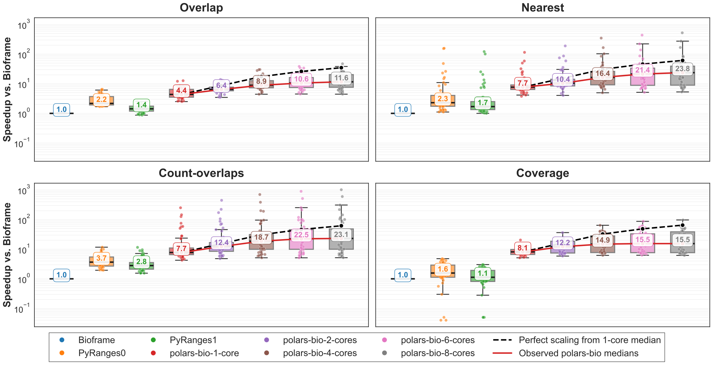
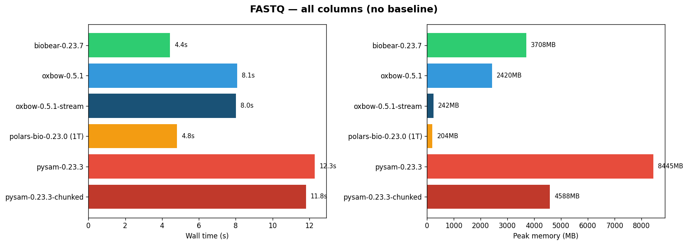
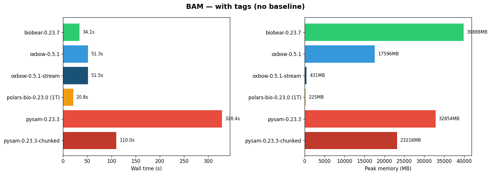
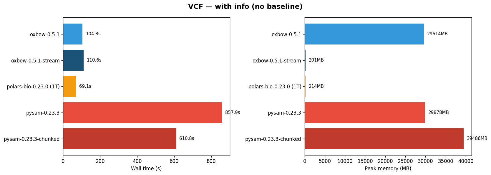
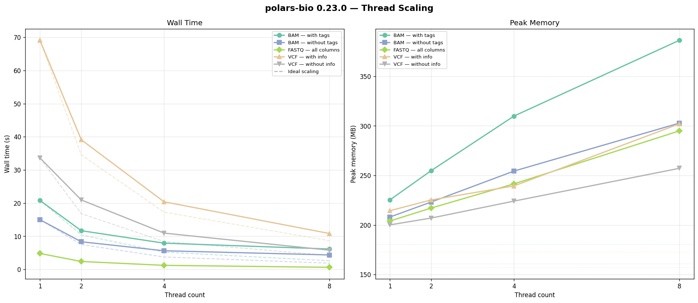

# polars-bio - Next-gen Python DataFrame operations for genomics!


[](https://discord.gg/bpxQ4Yxhk5)


<p align="center">
  <picture>
    <source media="(prefers-color-scheme: dark)" srcset="docs/assets/logo-large-dark.png">
    
  </picture>
</p>


[polars-bio](https://pypi.org/project/polars-bio/) is a Python library for genomics built on top of [polars](https://pola.rs/), [Apache Arrow](https://arrow.apache.org/) and [Apache DataFusion](https://datafusion.apache.org/).
It provides a DataFrame API for genomics data and is designed to be blazing fast, memory efficient and easy to use.


## 🎉 Join us at ECCB 2026 in Geneva!

We'll be presenting **polars-bio** at [ECCB 2026](https://eccb2026.org) — the 25th European Conference on Computational Biology, **31 August – 4 September 2026, Geneva, Switzerland**. Come and say hi!

[](https://eccb2026.org)

## Key Features
* optimized for [performance](https://biodatageeks.org/polars-bio/performance/) and memory [efficiency](https://biodatageeks.org/polars-bio/performance/#memory-characteristics) for large-scale genomics datasets analyses both when reading input data and performing operations
* popular genomics [operations](https://biodatageeks.org/polars-bio/features/#genomic-ranges-operations) with a DataFrame API (both [Pandas](https://pandas.pydata.org/) and [polars](https://pola.rs/))
* [SQL](https://biodatageeks.org/polars-bio/features/#sql-powered-data-processing)-powered bioinformatic data querying or manipulation
* native parallel engine powered by Apache DataFusion and [datafusion-bio-functions](https://github.com/biodatageeks/datafusion-bio-functions)
* [out-of-core/streaming](https://biodatageeks.org/polars-bio/features/#streaming) processing (for data too large to fit into a computer's main memory)  with [Apache DataFusion](https://datafusion.apache.org/) and [polars](https://pola.rs/)
* support for *federated* and *streamed* reading data from [cloud storages](https://biodatageeks.org/polars-bio/features/#cloud-storage) (e.g. S3, GCS) with [Apache OpenDAL](https://github.com/apache/opendal) enabling processing large-scale genomics data without materializing in memory
* zero-copy data exchange with [Apache Arrow](https://arrow.apache.org/)
* bioinformatics file [formats](https://biodatageeks.org/polars-bio/features/#file-formats-support) with [noodles](https://github.com/zaeleus/noodles)
* VCF Zarr support built on [Analysis-ready VCF at Biobank scale using Zarr](https://doi.org/10.1093/gigascience/giaf049), the [VCF Zarr specification](https://github.com/sgkit-dev/vcf-zarr-spec) and the [zarrs](https://crates.io/crates/zarrs) Rust crate
* fast overlap operations with [COITrees: Cache Oblivious Interval Trees](https://github.com/dcjones/coitrees)
* pre-built wheel packages for *Linux*, *Windows* and *MacOS* (*arm64* and *x86_64*) available on [PyPI](https://pypi.org/project/polars-bio/#files)

## Performance

polars-bio is optimized for both **genomic interval operations** and **reading genomic file formats**. See the full [performance results](https://biodatageeks.org/polars-bio/performance/#results-summary-).

**Genomic interval operations** — speedups vs. other Python libraries:



**Genomic file format readers** — single-threaded throughput vs. other Python readers ([full benchmark](https://biodatageeks.org/polars-bio/blog/2026/02/14/benchmarking-genomic-format-readers-in-python-with-polars/)):







**Multi-threaded scalability** of file-format reading (wall time & peak memory):



For developers: See [`benchmarks/README_BENCHMARKS.md`](benchmarks/README_BENCHMARKS.md) for information about running performance benchmarks via GitHub Actions.


## Citing

If you use **polars-bio** in your work, please cite:

```bibtex
@article{10.1093/bioinformatics/btaf640,
    author = {Wiewiórka, Marek and Khamutou, Pavel and Zbysiński, Marek and Gambin, Tomasz},
    title = {polars-bio—fast, scalable and out-of-core operations on large genomic interval datasets},
    journal = {Bioinformatics},
    pages = {btaf640},
    year = {2025},
    month = {12},
    abstract = {Genomic studies very often rely on computationally intensive analyses of relationships between features, which are typically represented as intervals along a one-dimensional coordinate system (such as positions on a chromosome). In this context, the Python programming language is extensively used for manipulating and analyzing data stored in a tabular form of rows and columns, called a DataFrame. Pandas is the most widely used Python DataFrame package and has been criticized for inefficiencies and scalability issues, which its modern alternative—Polars—aims to address with a native backend written in the Rust programming language.polars-bio is a Python library that enables fast, parallel and out-of-core operations on large genomic interval datasets. Its main components are implemented in Rust, using the Apache DataFusion query engine and Apache Arrow for efficient data representation. It is compatible with Polars and Pandas DataFrame formats. In a real-world comparison (107 vs. 1.2×106 intervals), our library runs overlap queries 6.5x, nearest queries 15.5x, count\_overlaps queries 38x, and coverage queries 15x faster than Bioframe. On equally-sized synthetic sets (107 vs. 107), the corresponding speedups are 1.6x, 5.5x, 6x, and 6x. In streaming mode, on real and synthetic interval pairs, our implementation uses 90x and 15x less memory for overlap, 4.5x and 6.5x less for nearest, 60x and 12x less for count\_overlaps, and 34x and 7x less for coverage than Bioframe. Multi-threaded benchmarks show good scalability characteristics. To the best of our knowledge, polars-bio is the most efficient single-node library for genomic interval DataFrames in Python.polars-bio is an open-source Python package distributed under the Apache License available for major platforms, including Linux, macOS, and Windows in the PyPI registry. The online documentation is https://biodatageeks.org/polars-bio/ and the source code is available on GitHub: https://github.com/biodatageeks/polars-bio and Zenodo: https://doi.org/10.5281/zenodo.16374290. Supplementary Materials are available at Bioinformatics online.},
    issn = {1367-4811},
    doi = {10.1093/bioinformatics/btaf640},
    url = {https://doi.org/10.1093/bioinformatics/btaf640},
    eprint = {https://academic.oup.com/bioinformatics/advance-article-pdf/doi/10.1093/bioinformatics/btaf640/65667510/btaf640.pdf},
}
```

Read the [documentation](https://biodatageeks.github.io/polars-bio/)
