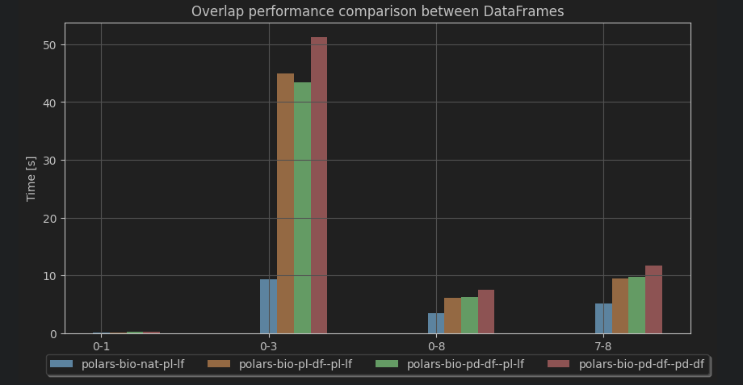

# polars_bio

## Features

## Genomic ranges operations

| Features     | Bioframe           | polars-bio          | PyRanges | Pybedtools         | PyGenomics |
|--------------|--------------------|---------------------|----------|--------------------|------------|
| overlap      | :white_check_mark: | :white_check_mark:  |          | :white_check_mark: |            |
| nearest      | :white_check_mark: | :white_check_mark:  |          |                    |            |
| cluster      | :white_check_mark: |                     |          |                    |            |
| merge        | :white_check_mark: |                     |          |                    |            |
| complement   | :white_check_mark: |                     |          |                    |            |
| select/slice | :white_check_mark: |                     |          |                    |            |
| coverage     | :white_check_mark: |                     |          |                    |            |
| expand       | :white_check_mark: |                     |          |                    |            |
| sort         | :white_check_mark: |                     |          |                    |            |

## Input/Output
| I/O              | Bioframe           | polars-bio             | PyRanges           | Pybedtools | PyGenomics |
|------------------|--------------------|------------------------|--------------------|------------|------------|
| Pandas DataFrame | :white_check_mark: | :white_check_mark:     | :white_check_mark: |            |            |
| Polars DataFrame |                    | :white_check_mark:     |                    |            |            |
| Polars LazyFrame |                    | :white_check_mark:     |                    |            |            |
| Native readers   |                    | :white_check_mark:     |                    |            |            |

## Genomic file format
| I/O            | Bioframe           | polars-bio | PyRanges           | Pybedtools | PyGenomics |
|----------------|--------------------|------------|--------------------|------------|------------|
| BED            | :white_check_mark: |            | :white_check_mark: |            |            |
| BAM            |                    |            |                    |            |            |
| VCF            |                    |            |                    |            |            |

## Performance

