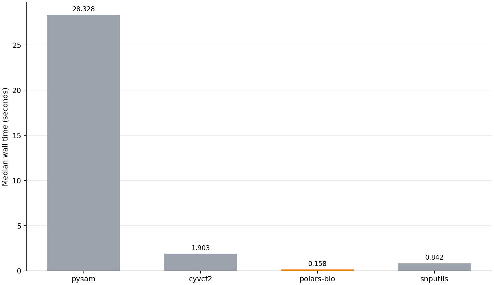
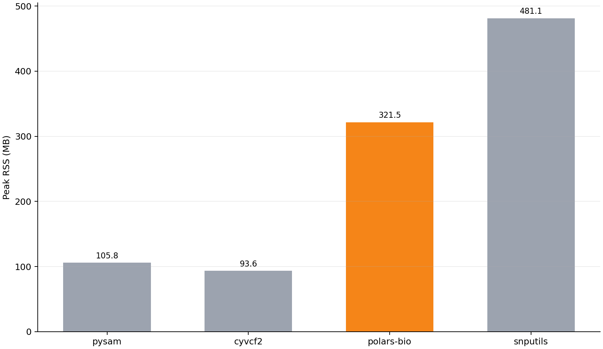
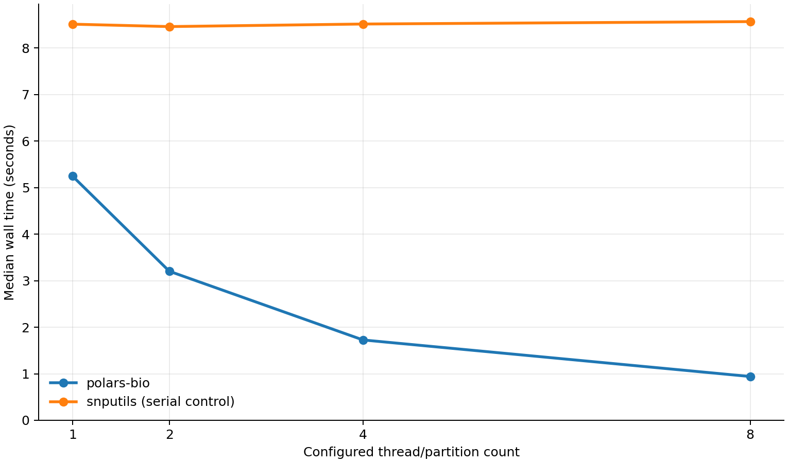

# BCF Genotype Readers in Python: Two Complementary Benchmarks

BCF reader benchmarks can compare unlike work: one library counts records,
another retains metadata, and a third materializes every genotype. We use two
tests with explicit—but different—output contracts. The first compares four
BCF readers on a 25,000-variant subset after normalizing every result to the
same NumPy matrix. The second measures full-chromosome genotype throughput and
parallel scaling for polars-bio against snputils while retaining each reader's
native output container.

polars-bio is fastest in both tests at one thread. It is 5.329× faster than
snputils in the standardized 25,000-row comparison and 1.622× faster on the
993,881-row full-chromosome workload. The different ratios are expected because
the tests answer different questions; their medians should not be compared as
if only the row count changed.

<!-- more -->

## Two tests, two questions

| | Test 1: standardized reader comparison | Test 2: full-chromosome scaling |
|---|---|---|
| Question | How do BCF readers compare when they must return exactly the same physical output? | How do polars-bio and snputils perform on a complete native genotype workload, and how does polars-bio scale? |
| Variants | 25,000 | 993,881 |
| Samples | 2,548 | 2,548 |
| Dosage cells | 63,700,000 | 2,532,408,788 |
| Readers | pysam, cyvcf2, polars-bio, snputils | polars-bio and snputils |
| Timed retained output | C-contiguous row-major NumPy `int8` matrix, positions, and sample IDs | Complete genotype dosage in each reader's native container |
| Concurrency | Every pool capped at one thread | polars-bio at `t=1,2,4,8`; snputils as a serial control |
| Repetitions | Two fresh-process runs | Three fresh-process runs per `t` |

Both tests read every requested genotype and use the same dosage semantics.
Test 1 proves equivalence by hashing its completed common outputs. Test 2 runs a
separate complete equivalence gate before timing because polars-bio retains an
Arrow `List(Int8)` column while snputils retains a NumPy `int8` matrix.

## Dataset and dosage semantics

The source is the phased, biallelic 1000 Genomes GRCh38 chromosome 22 callset.
Test 1 uses the inclusive region `chr22:10516173-16717478`; Test 2 restores the
entire chromosome:

| Property | Test 1 | Test 2 |
|---|---:|---:|
| BCF size | 4,666,229 bytes | 135,128,073 bytes |
| Variants | 25,000 | 993,881 |
| Samples | 2,548 | 2,548 |
| Dosage cells | 63,700,000 | 2,532,408,788 |

A genotype becomes the number of allele-index-1 calls: `0|0 → 0`, `0|1` and
`1|0 → 1`, and `1|1 → 2`. Missing calls use `-1` in the comparable output.
Variant and sample order must remain unchanged.

## Readers

| Reader | Version | Mode used in Test 1 |
|---|---:|---|
| pysam | 0.24.0 | native iterator, preallocated matrix |
| cyvcf2 | 0.31.4 | native iterator, vectorized per-record dosage |
| polars-bio | 0.34.0 | lazy scan, streaming collection |
| snputils | pinned development commit | specialized eager reader |

PyVCF3 is omitted because it does not support BCF input.

## Build and measurement controls

Each measurement runs in a fresh Python process. Module imports and thread-pool
configuration happen before the timer. The machine is a 16-core Apple M3 Max
MacBook Pro with 64 GiB RAM and macOS 15.6. Measurements use a warm filesystem
cache and a deterministically rotated reader order.

The polars-bio extension was built in release mode with native CPU
optimizations:

```bash
RUSTFLAGS="-C target-cpu=native" maturin develop --release --locked
```

For Test 1, the timer includes source opening, header/schema discovery, BCF
reading, GT decoding, dosage conversion, and final common NumPy materialization.
Positions and sample IDs are retained too. Polars, Rayon, OpenMP, OpenBLAS, MKL,
Accelerate, NumExpr, and DataFusion target partitions are all capped at one.

For Test 2, both readers project only `FORMAT/GT` and retain every dosage value.
polars-bio keeps its Arrow list column; snputils keeps its native NumPy matrix.
Position and sample metadata are checked by the equivalence gate but are not
part of either timed result. Peak RSS is measured after retaining the output.

## Test 1: standardized 25,000-variant comparison

### Wall time

| Reader | BCF median | Relative to polars-bio |
|---|---:|---:|
| pysam | 28.328 s | 179.291× |
| cyvcf2 | 1.903 s | 12.044× |
| **polars-bio** | **0.158 s** | **1.000×** |
| snputils | 0.842 s | 5.329× |

polars-bio is 5.329× faster than snputils at one thread, reducing wall time by
81.2%.



### Peak memory

| Reader | Peak RSS |
|---|---:|
| pysam | 105.8 MB |
| cyvcf2 | **93.6 MB** |
| **polars-bio** | 321.5 MB |
| snputils | 481.1 MB |

cyvcf2 has the smallest peak RSS. polars-bio uses 33.2% less peak RSS than
snputils while completing the standardized workload 5.329× faster.



## Test 2: full-chromosome throughput and scaling

The second test processes all 993,881 chromosome 22 variants and all 2,548
samples. polars-bio runs at 1, 2, 4, and 8 target partitions. The pinned
snputils BCF API has no worker-count option, so it is remeasured as a serial
control at each sweep point.

| `t` | polars-bio median | Scale-up | Peak RSS | snputils serial control | vs snputils |
|---:|---:|---:|---:|---:|---:|
| 1 | 5.248 s | 1.000× | 2,658.7 MB | 8.513 s / 10,067.4 MB | 1.622× faster |
| 2 | 3.203 s | 1.638× | 2,663.2 MB | 8.461 s / 10,065.9 MB | 2.642× faster |
| 4 | 1.727 s | 3.039× | 2,667.9 MB | 8.516 s / 10,067.7 MB | 4.931× faster |
| 8 | 0.941 s | 5.577× | 2,677.7 MB | 8.568 s / 10,066.6 MB | 9.105× faster |



At the one-thread point, polars-bio is 1.622× faster and uses 73.6% less peak
RSS. At eight threads it reaches a 5.577× scale-up over its own one-thread
result while memory stays near 2.68 GB.

Before every timed group, the full equivalence gate compares all 993,881
variant keys, all 2,548 sample IDs in order, and all 2,532,408,788 dosage cells
in bounded chunks. This correctness work is deliberately outside the timer for
both readers.

## Why the two one-thread ratios differ

The full-chromosome input contains 39.755× as many dosage cells as the subset,
but dataset size is not the only difference:

- Test 1 converts every reader to a common C-contiguous NumPy matrix and retains
  positions and sample IDs inside the timed workload.
- Test 2 requests genotypes only and retains each reader's efficient native
  container. It measures complete native BCF genotype throughput rather than
  cross-library container normalization.
- Fixed startup and schema costs are better amortized over the full chromosome.

For polars-bio, processing 39.755× more cells takes 33.215× longer at one
thread: 5.248 seconds instead of 0.158 seconds. The snputils subset/full timing
ratio should not be treated as pure row scaling because its Test 1 call also
returns and normalizes positions and sample IDs. Use Test 1 for standardized
cross-reader comparison and Test 2 for full-cohort native throughput, memory,
and scaling.

## Why direct typed BCF dosage is fast

BCF stores FORMAT series as typed binary values. polars-bio projects only
`FORMAT/GT` and sends the encoded allele bytes directly into a nullable Arrow
`Int8` dosage builder. It avoids intermediate genotype strings, dynamic FORMAT
value objects, and per-cell heap allocations. Batches remain bounded by the
shared 8 MB genotype-byte budget even for very large sample counts.

The optimization is a GT dosage representation, but the broader pattern
generalizes: project early, decode typed fields directly into their final Arrow
representation, and keep batches bounded. Other FORMAT fields need their own
semantics and output types; they should not be mislabeled as dosage.

## CSI pushdown and partition processing

The BCF reader auto-discovers a neighboring `.bcf.csi`. Coordinate predicates
are translated into CSI regions and exact record-intersection checks; full
indexed scans divide those regions across the configured target partitions.
The test suite covers indexed range-query equality against a sequential BCF
reference, physical partition counts at 1/2/4/8, stable results across partition
counts, unknown contigs, missing-index fallback, and local and remote range
reads.

This is not GT-only. CSI pruning and partition planning happen below projection,
so core columns, INFO, FORMAT strings, and typed GT dosage all benefit.

## Limitations

- Test 1 uses a 25,000-row slice so all four readers complete on a 64 GiB
  machine. Test 2 uses the complete 993,881-row callset.
- The callset is phased, diploid, and biallelic. Multiallelic dosage is rejected
  rather than collapsed into a misleading non-reference count.
- Results are warm-cache measurements on one Apple Silicon machine. Treat the
  ratios as workload evidence, not universal constants.
- Test 1 standardizes the physical output; Test 2 deliberately retains native
  containers. Timing and memory values are comparable within each test, not
  directly between the tests.

## Try it

Install the version used for this BCF API:

```bash
pip install polars-bio==0.34.0
```

BCF has its own public lazy entry point, `scan_bcf`; `scan_vcf` is reserved for
text VCF:

```python
import polars_bio as pb

dosage = (
    pb.scan_bcf(
        "cohort.bcf",
        info_fields=[],
        format_fields=["GT"],
        genotype_output="dosage",
    )
    .select("chrom", "start", "genotypes")
    .collect(engine="streaming")
)
```

For indexed range work, keep the scan lazy so predicates reach the CSI-backed
source:

```python
import polars as pl
import polars_bio as pb

region = (
    pb.scan_bcf("cohort.bcf", info_fields=["AF"], format_fields=[])
    .filter(
        (pl.col("chrom") == "chr22")
        & (pl.col("start") >= 20_000_000)
        & (pl.col("start") <= 21_000_000)
    )
    .collect(engine="streaming")
)
```

- [25,000-variant benchmark report and raw runs](https://github.com/biodatageeks/bioformats-benchmark/blob/5fa546e9212aaf49b985d53c0105153ae61eb917/GENOTYPE_READER_BENCHMARK.md)
- [Full-chromosome benchmark report and raw runs](https://github.com/biodatageeks/bioformats-benchmark/blob/5fa546e9212aaf49b985d53c0105153ae61eb917/BCF_BENCHMARK.md)
