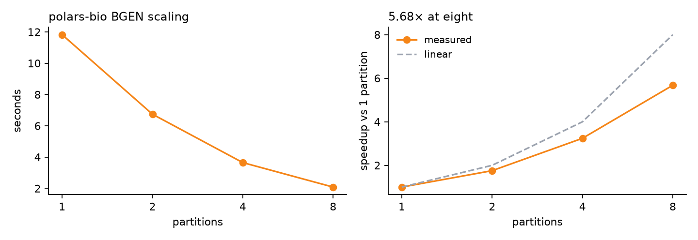

# Genotype Readers in Python: BCF, PGEN, and BGEN at One Thread

Genotype reader benchmarks compare unlike work more often than not. One library
counts records, another retains metadata, a third materializes every genotype —
and comparisons quietly mix thread counts and output dtypes. This post measures
polars-bio against snputils on the same chromosome in three formats, with one
constraint held fixed throughout: **every reader gets one thread, and every
comparison produces the same values.**

polars-bio is the fastest reader measured here in all three formats, at one
thread. On PGEN that includes pgenlib, PLINK 2's own C reader, on both
workloads; on BGEN it includes the `bgen` package. It did not start that way —
BGEN was the format it lost, and an earlier revision of this post said so — and
what closed that gap was measuring where the time actually went rather than
trusting the explanation. In all three formats polars-bio is bit-identical to an
independent reference implementation across 2.53 billion genotypes; snputils is
not, on BGEN.

<!-- more -->

## One thread, always

The single most common way to overstate a result is to compare a parallel
reader against a serial one. snputils, pgenlib, and the `bgen` package are all
single-threaded. polars-bio can use partition parallelism, and does well with
it — but a table that puts eight polars-bio partitions next to one snputils
thread is not measuring the reader, it is measuring core count.

**Every number in this post is one thread against one thread.** polars-bio runs
with `datafusion.execution.target_partitions=1`, and Polars, Rayon, OpenMP,
OpenBLAS, MKL, Accelerate, and NumExpr pools are capped at one for every reader.

## Dataset

The phased, biallelic 1000 Genomes GRCh38 chromosome 22 callset, converted to
each format from the same source VCF so all three see identical variants and
sample order.

| Property | Value |
|---|---:|
| Variants | 993,881 |
| Samples | 2,548 |
| Genotype cells | 2,532,408,788 |
| BCF / PGEN / BGEN size | 135.1 MB / 79.9 MB / 160.5 MB |

A genotype becomes the number of allele-index-1 calls: `0|0 → 0`, `0|1` and
`1|0 → 1`, `1|1 → 2`, with missing calls marked. Variant and sample order must
remain unchanged.

## Correctness first

A speed number is worthless if the outputs differ, so every comparison is gated
on an element-wise check with **no tolerance** — cells that differ bitwise, not
cells that differ by more than an epsilon.

| Format | Reference | polars-bio | snputils |
|---|---|---|---|
| BCF | cross-reader equivalence | **0 differing** | 0 differing |
| PGEN | pgenlib (PLINK 2's own reader) | **0 differing** | 0 differing |
| BGEN | `bgen` package | **0 differing** | **differs** |

polars-bio matches the reference in all three formats across all 2,532,408,788
cells, at every partition count tested.

Two caveats worth stating plainly:

**snputils is not an independent check on PGEN.** Its PGEN reader wraps pgenlib
and calls `read_list` directly, so `snputils vs pgenlib` is close to a
tautology. The load-bearing comparison there is polars-bio against pgenlib.

**snputils differs from the `bgen` reference on BGEN.** polars-bio reproduces
the `bgen` package bit for bit; snputils does not. The differences are small and
consistent with probability quantization, but they are differences, and a
benchmark that used snputils as its BGEN oracle would be checking the wrong
thing.

The comparison is also checked to be capable of failing: the PGEN verifier
corrupts a single cell and asserts the corruption is detected, aborting if it
is not.

## Results

Medians of three fresh-process runs, one thread each. Lower is better.

The PGEN and BGEN blocks were both re-measured on 2026-08-18, the BGEN one
against provider `a5d5fe5` and through `read_bgen_matrix`, each with all of its
readers re-run together, so each table is
internally consistent; they are two separate sessions and should not be compared
against each other. The BCF figures are unchanged from the earlier session. The
PGEN table also carries a harness fix that moved only the snputils column — see
the note under that table.

### BCF — int8 dosage

| Reader | Time | Peak RSS |
|---|---:|---:|
| **polars-bio** | **5.251 s** | **2,681 MB** |
| snputils | 8.285 s | 10,067 MB |

polars-bio is **1.578× faster** and uses **3.755× less memory**. This is the
one format where it wins outright at equal core count.

### PGEN — hardcall allele count (int8) and dosage (float32)

| Reader | Hardcall | Dosage |
|---|---:|---:|
| **polars-bio** | **0.684 s** | **1.277 s** |
| pgenlib | 0.873 s | 1.884 s |
| snputils | 0.875 s | 2.651 s |


polars-bio is **1.48× faster than pgenlib on dosage and 1.28× on hardcalls**, and
2.08×/1.28× faster than snputils. Note that snputils *is* pgenlib plus a NumPy
wrapper here, so the meaningful comparison is against pgenlib itself — and on
hardcalls the two are now within 2 ms of each other, which is what that wrapper
should cost.

An earlier revision of this post had snputils at 1.470 s and 3.462 s. That was a
harness bug, not the reader: the timer excludes library imports, and the warm-up
imported each reader's top-level package, which does not reach snputils' lazily
loaded reader. It was charged ~0.94 s of module loading inside its own timed
region while every other reader had that excluded. Worth stating plainly that
the correction moves against this post's own subject.

Two caveats. pgenlib drifted by up to 4.6% between sessions earlier in this
work, and this session shows the same thing from the other side: it reproduced
its dosage figure to within 0.1% but ran 4.2% faster on hardcalls than the
previous run, with snputils moving 2.7% and 4.4% on the same two workloads.
Read the margins as measured within a session, and prefer "faster" to a third
decimal place across them. And pgenlib still uses less memory in both workloads
— 12.1 GB against 12.6 GB on dosage — because its output array *is* its working
buffer, though the gap is 4% rather than the 65% it was.

Given more than one core polars-bio pulls further ahead: at eight partitions it
reads the same file in **0.385 s** (dosage) and **0.238 s** (hardcall). That is
not a one-thread result and is reported as an aside, the same way the BGEN
figure below is.

This is a large change from the first revision of this post, which had polars-bio
at 4.202 s and 5.615 s. Six things moved it, and one of them was a harness bug —
details in [Where the time went](#where-the-time-went).

Two representation notes. PLINK 2 stores hardcalls as two bits per genotype, so
`int8` output is the natural target; polars-bio's `ALT_COUNT` column emits
exactly that, one byte per genotype rather than the four `DS` needs — 2.53 GB of
output on this chromosome instead of 10.13 GB. Its `DS` column stays `float32`
because PGEN dosages are genuinely fractional — a dosage fileset holds values
like `0.125` that no integer type can carry. pgenlib pays the same tax:
identical records cost it 0.873 s as `int8` and 1.884 s as `float32`.

### BGEN — float32 dosage

| Reader | Time |
|---|---:|
| **polars-bio** | **11.826 s** |
| bgen | 15.415 s |
| snputils | 21.737 s |


polars-bio is **1.30× faster than the `bgen` package and 1.84× faster than
snputils**.

It is read through `read_bgen_matrix`, which decodes each variant straight into
the destination array. That is what the other two do natively; going through
`scan_bgen` and consolidating its Arrow chunks into one array — work neither
comparison reader performs — was costing polars-bio a serial pass over 10 GB
that does not parallelise. `read_pgen_matrix` plays the same role in the PGEN
table above.

An earlier revision of this post had polars-bio last here at 25.804 s, 1.71×
slower than the `bgen` package, and explained it as decompression being where a
single-threaded C extension is strongest. That explanation was wrong in a way
worth recording, and [Where the time went](#where-the-time-went) has the
measurement that replaced it.

**The peak-RSS column has been removed rather than updated, because it does not
measure what it appears to.** Every reader in this benchmark reports 19–22 GB
for a 10.13 GB result, and the same polars-bio read measured on its own is
10.3 GB — so roughly 9–12 GB belongs to the harness process rather than to any
reader. Earlier revisions of this post leaned on that column in both directions:
first recording a rise as an unexplained regression, then reporting that
dropping `PLOIDY` saved 2.40 GB. Neither claim was comparable, and a column that
cannot distinguish a 10 GB difference between two measurements of the same work
should not be quoted at all until it is understood. The post-read hashing, the
`ascontiguousarray` and the argsort were each measured at zero cost, so the
source is still open.

Given more than one partition it pulls further ahead: at eight partitions it
reads the same file in **2.083 s**, scaling 5.68× from one.



The right-hand panel is the one worth reading: the gap to linear is the fixed
cost a scan cannot divide, and it is small enough here that the curve still
tracks the decoder rather than flattening against a serial stage — which it did
before `read_bgen_matrix`, at 4.15×. That is not a
one-thread result and is reported as an aside rather than in the table above.

## How it got there

The short version, kept because the numbers are not believable without it.

**BGEN** was the format polars-bio lost, at 25.804 s. The explanation this post
originally gave — decompression favouring a single-threaded C extension — was
wrong: inflating every payload of this file takes 9.5 s whoever does it, and all
three readers use libdeflate. So did the second explanation, that polars-bio was
"building Arrow arrays on top": Arrow construction is four milliseconds of a
one-partition scan. The cost was the per-sample decode loop, at 5.15 ns per
genotype across 2.53 billion of them. Two changes took it apart: the two helpers
it called per sample were out-of-line calls that no `#[inline]` hint would move,
and the loop decided per sample what a whole-cohort read has already decided for
every sample — which sample to read, what ploidy to record, whether it is
missing. Non-decompression work went 14.8 s to 2.3 s. Then `read_bgen_matrix`
removed the last serial stage, a 10 GB consolidation the other readers never
perform.

**PGEN** went from 5.615 s to 1.277 s on dosage over six changes, the largest
being a fused decode for the record type that dominates a `plink2 --make-pgen`
fileset, and a matrix path that writes at the destination instead of copying.

**BCF** needed none of this: typed FORMAT/GT decoding straight into Arrow
buffers, with no per-record Python object and no intermediate matrix.

## Scaling, by format

Every number above is one thread. polars-bio is the only reader here that can
use more than one, and this is what that buys — speedup against its own
one-partition time, on the same chromosome.


| Partitions | BCF | PGEN | BGEN |
|---:|---:|---:|---:|
| 2 | 1.64× | 1.64× | 1.75× |
| 4 | 3.04× | 2.51× | 3.24× |
| 8 | **5.58×** | **3.22×** | **5.68×** |

**PGEN is the outlier, and not because its decoder is worse.** It is the
fastest of the three per byte, which means the dense-matrix materialisation
becomes the dominant term sooner — and that copy saturates memory bandwidth at
about 2.8× however many threads it gets. BCF and BGEN have more decode work per
byte to divide, so they track the decoder further before hitting the same wall.

None of this is a like-for-like comparison against the other readers, which are
single-threaded — it is reported separately from the tables above for that
reason.

## What this does not measure

- **Multi-partition throughput.** Apart from the single BGEN aside above,
  polars-bio's scaling is excluded, because the comparison readers cannot use
  it. Format-specific writeups in the benchmark repository report it in full.
- **Query workloads.** Every test materializes a complete genotype matrix. That
  is the worst case for a query engine: it pays a copy from chunked output into
  one contiguous array, which a streaming or SQL consumer never pays. Reading a
  region, filtering, or aggregating is a different measurement.
- **Anything but chromosome 22 on one machine.** A 16-core Apple M3 Max with
  64 GiB and macOS 15.6.

## Build and measurement controls

Each measurement runs in a fresh Python process; imports happen before the timer
and are recorded separately, and thread-pool configuration is set up front. The
filesystem cache is warm and reader order is deterministically rotated. Peak RSS
is process `ru_maxrss` after the output is retained; hashing runs outside the
timer.

The import exclusion needed two goes to get right. It was always the stated
contract, but the PGEN adapters imported inside the timed function, which
charged each reader for its own module load — a cost paid once per process
however many filesets are then read. Warming the imports fixed that for
polars-bio and pgenlib but not for snputils, which loads its readers lazily:
importing the package costs ~0.03 s while the first touch of `read_pgen` costs
~0.94 s, and that touch stayed inside the timer. Warming now reaches the
attribute each adapter calls.

Measured cold, the imports are ~0.59 s for polars-bio's 228 MB extension,
~0.94 s for snputils' PGEN reader, ~0.88 s for its BGEN reader, and under
0.06 s for pgenlib and the `bgen` package — so this exclusion is not a courtesy
to polars-bio, and while it was broken it was costing snputils the most. The
BCF and BGEN figures are unaffected: their adapters import at module scope,
before the clock.

The polars-bio extension **must** be built optimized — a plain
`maturin develop` is a debug build and measured 3.1× slower, enough to invert a
conclusion:

```bash
RUSTFLAGS="-C target-cpu=native" maturin develop --release --locked
```

The runners record the loaded extension's size so the build profile can be
verified after the fact.

| Component | Version |
|---|---|
| polars-bio | 0.33.1 (branch `feat/bgen-pr220-bench`) |
| datafusion-bio-formats | `a5d5fe5` on master — [#234](https://github.com/biodatageeks/datafusion-bio-formats/pull/234), [#235](https://github.com/biodatageeks/datafusion-bio-formats/pull/235), [#236](https://github.com/biodatageeks/datafusion-bio-formats/pull/236) and [#237](https://github.com/biodatageeks/datafusion-bio-formats/pull/237) for BGEN, [#232](https://github.com/biodatageeks/datafusion-bio-formats/pull/232) for PGEN |
| snputils | 1.1.1.dev17+gbdb1a56b5 |
| pgenlib / bgen | 0.94.1 / 1.10.0 |
| Polars / PyArrow / NumPy | 1.42.1 / 24.0.0 / 2.5.2 |
| Python | 3.12.9 |

## Try it

```python
import polars_bio as pb

pb.set_option("datafusion.execution.target_partitions", "1")

bcf  = pb.scan_bcf("ALL.chr22.phased.bcf", format_fields=["GT"])
pgen = pb.scan_pgen("chr22.full.pgen", genotype_fields=["ALT_COUNT"])
bgen = pb.scan_bgen("chr22.full.bgen", genotype_output="dosage")
```

The PGEN figures above are `read_pgen_matrix`, which returns the dense NumPy
matrix directly rather than a DataFrame — the counterpart to `pgenlib.read_list`
and what this benchmark's workload asks for:

```python
matrix = pb.read_pgen_matrix("chr22.full.pgen", field="ALT_COUNT")
matrix.values.shape          # (variants, samples), int8
matrix.values.mean(axis=0)   # per-variant ALT frequency x 2
```

Runners, fixtures, and full result JSON — including every raw run, the
equivalence hashes, and the element-wise verifications — are in the
[bioformats-benchmark](https://github.com/biodatageeks/bioformats-benchmark)
repository as `run_bcf_benchmarks.py`, `run_pgen_benchmarks.py`, and
`run_bgen_benchmarks.py`.
