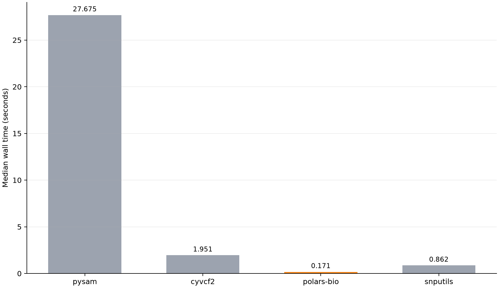
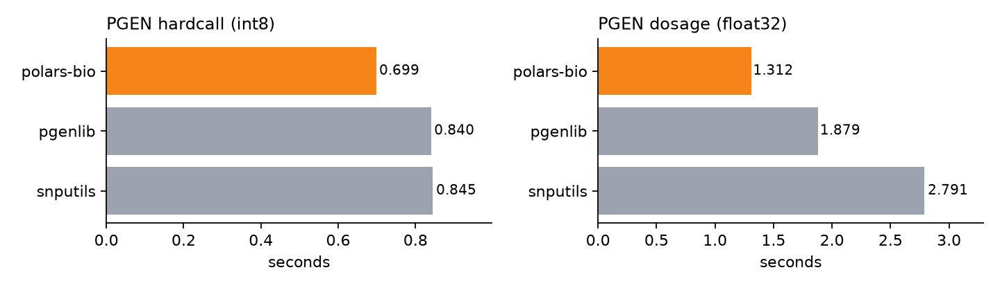
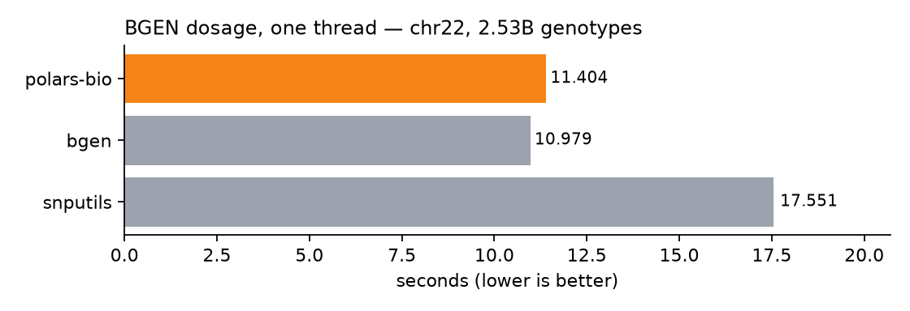
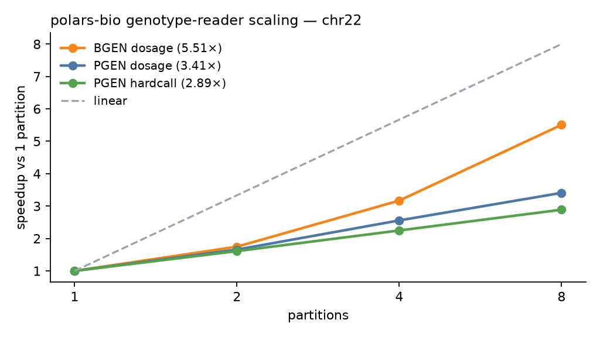

# Genotype Readers in Python: BCF, PGEN, and BGEN at One Thread

Reader benchmarks are easy to overstate: one tool counts records while another
materializes genotypes, or a parallel result is placed next to a serial one.
Here every headline result uses one thread and produces the same dense matrix,
with the same row order, sample order, dtype, and missing-value convention.

The result is mixed, and more useful for it. polars-bio is fastest on the BCF
and PGEN workloads. On BGEN dosage, the independent `bgen` package is 3.9%
faster at one thread; polars-bio is 1.54× faster than snputils. polars-bio has
**zero mismatches against the independent oracle in every workload tested**.

<!-- more -->

## Fairness contract

All inputs come from the phased, biallelic 1000 Genomes GRCh38 chromosome 22
callset and contain the same 2,548 samples.

| Workload | Variants | Values | Required output |
|---|---:|---:|---|
| BCF GT dosage | 25,000 | 63,700,000 | row-major `int8`, missing = −1 |
| PGEN hardcall | 993,881 | 2,532,408,788 | row-major `int8`, missing = −9 |
| PGEN dosage | 993,881 | 2,532,408,788 | row-major `float32`, missing = NaN |
| BGEN dosage | 993,881 | 2,532,408,788 | row-major `float32`, missing = NaN |
| BGEN probabilities | 25,000 | 254,800,000 | row-major `float32` GP tensor |

The BCF comparison uses the 25,000-variant slice so record-at-a-time Python
readers, including pysam, remain practical. PGEN and BGEN dosage use the full
chromosome; the larger BGEN probability tensor uses the same slice. Results are
compared only within a workload, never across rows of this table.

Each reader runs in a fresh process. Imports and thread-pool initialization are
excluded; opening the source, discovering the schema, decoding, converting,
and producing the final contiguous matrix are timed. Filesystem cache state is
warm, reader order rotates, and reported times are medians of three runs.
DataFusion, Polars, Rayon, OpenMP, BLAS, Accelerate, and NumExpr are capped at
one thread for the headline tables.

Each library uses its appropriate dense-output path. In particular, polars-bio
uses `read_pgen_matrix` and `read_bgen_matrix`, matching the NumPy arrays
returned by the reference readers rather than charging only polars-bio for a
DataFrame-to-matrix conversion.

## Correctness before speed

The checks are exact: no epsilon and no rounded summaries. Complete matrices
are compared element by element after verifying positions and sample order.

| Workload | Oracle | polars-bio mismatches | Other readers vs oracle |
|---|---|---:|---|
| BCF dosage, 63.7M cells | pysam | **0** | cyvcf2 0; snputils 0 |
| PGEN hardcall, 2.53B cells | pgenlib | **0** | snputils 0 |
| PGEN dosage, 2.53B cells | pgenlib | **0** | snputils 0 |
| BGEN dosage, 2.53B cells | `bgen` | **0** | snputils 126,259,603 |
| BGEN probabilities, 254.8M cells | `bgen` | **0** | snputils 0 |

The PGEN verifier also corrupts one cell and confirms that the comparison
detects it. snputils' PGEN result is not an independent oracle—it wraps
pgenlib—so polars-bio versus pgenlib is the meaningful check there.

On full-cohort BGEN dosage, snputils differs from `bgen` by at most
`1.18e-7`; the discrepancy is tiny but not zero. polars-bio matches all
2,532,408,788 values bit for bit. On the 25,000-variant probability tensor,
all three readers agree exactly.

## Results

### BCF dosage

| Reader | Median time |
|---|---:|
| **polars-bio** | **0.171 s** |
| snputils | 0.862 s |
| cyvcf2 | 1.951 s |
| pysam | 27.675 s |



pysam is included here because it supports BCF. It is not shown for PGEN or
BGEN because it cannot read those formats; an unsupported cell is not a slow
result and cannot be made apples-to-apples.

### PGEN hardcalls and dosage

| Reader | Hardcall `int8` | Dosage `float32` |
|---|---:|---:|
| **polars-bio** | **0.699 s** | **1.312 s** |
| pgenlib | 0.840 s | 1.879 s |
| snputils | 0.845 s | 2.791 s |



At equal core count, polars-bio is 1.20× faster than pgenlib on hardcalls and
1.43× faster on dosage. pgenlib remains slightly more memory-efficient because
it decodes directly into its caller-owned array.

### BGEN dosage

| Reader | Median time |
|---|---:|
| **bgen** | **10.979 s** |
| polars-bio | 11.404 s |
| snputils | 17.551 s |



This rerun corrects the earlier claim that polars-bio was fastest on BGEN at
one thread. The `bgen` package leads by 0.425 s, while polars-bio remains 1.54×
faster than snputils.

### polars-bio scalability

The cross-reader tables stay at one thread. Separately, the same full-chromosome
polars-bio workloads were run with 1, 2, 4, and 8 partitions:

| Workload | 1 partition | 2 partitions | 4 partitions | 8 partitions | Speedup at 8 |
|---|---:|---:|---:|---:|---:|
| PGEN hardcall | 0.699 s | 0.434 s | 0.311 s | 0.242 s | 2.89× |
| PGEN dosage | 1.312 s | 0.792 s | 0.513 s | 0.385 s | 3.41× |
| BGEN dosage | 11.404 s | 6.529 s | 3.598 s | 2.071 s | 5.51× |



These are within-reader scaling results, not comparisons against the serial
reference readers.

## Reproduce

These results cover the code shipping as polars-bio 0.34.0, with every formats
crate pinned to the released
[`datafusion-bio-formats` v1.10.0](https://github.com/biodatageeks/datafusion-bio-formats/releases/tag/v1.10.0)
commit `0d9730c`, and the current
[snputils benchmark](https://github.com/AI-sandbox/snputils/tree/main/benchmark)
at `482c6d1`.

| Component | Version |
|---|---|
| polars-bio | 0.34.0 |
| snputils | 1.1.1.dev19+g482c6d1df |
| pgenlib / `bgen` / pysam | 0.94.1 / 1.10.0 / 0.24.0 |
| Polars / PyArrow / NumPy | 1.42.1 / 24.0.0 / 2.5.2 |
| Python / host | 3.12.9 / Apple M3 Max, 64 GiB, macOS 15.6 |

polars-bio was built as an optimized native extension:

```bash
RUSTFLAGS="-C target-cpu=native" maturin develop --release --locked
```

The runners, fixture construction, raw-result schema, and exact verification
logic are in
[bioformats-benchmark](https://github.com/biodatageeks/bioformats-benchmark):
`run_genotype_matrix_benchmarks.py`, `run_pgen_benchmarks.py`, and
`run_bgen_benchmarks.py`.

The main conclusion is narrower than “one reader wins.” Under equal work and
equal core count, polars-bio leads BCF and PGEN, nearly ties the specialized
BGEN oracle, and reproduces every oracle value exactly. Keeping those
constraints visible is what makes the timings worth comparing.
