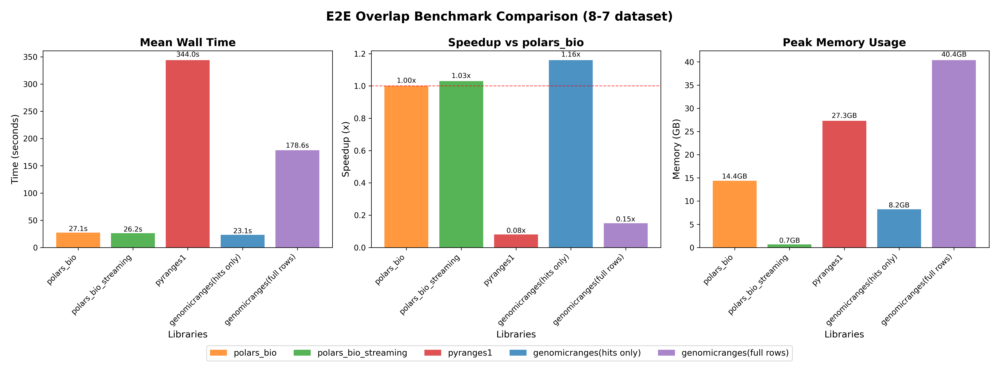

# Interval operations benchmark — update September 2025

## Introduction
Benchmarking isn’t a one-and-done exercise—it’s a moving target. As tools evolve, new versions can shift performance profiles in meaningful ways, so keeping results current is just as important as the first round of measurements.

Recently, three popular libraries [pyranges1](https://github.com/pyranges/pyranges_1.x), [GenomicRanges](https://github.com/BiocPy/GenomicRanges) and [polars-bio](https://github.com/biodatageeks/polars-bio)

shipped major updates:

* [pyranges1](https://github.com/pyranges/pyranges_1.x) adopted a new Rust backend ([ruranges](https://github.com/pyranges/ruranges)),
* [GenomicRanges](https://github.com/BiocPy/GenomicRanges) switched its interval core to a Nested Containment List ([NCLS](https://github.com/pyranges/ncls)) and added multithreaded execution,
* polars-bio migrated to the new Polars streaming engine and added support for new interval data structures. As of version `0.12.0` it supports:
    * [COITrees](https://github.com/dcjones/coitrees)
    * [IITree](https://github.com/rust-bio/rust-bio/blob/master/src/data_structures/interval_tree/array_backed_interval_tree.rs)
    * [AVL-tree](https://github.com/rust-bio/rust-bio/blob/master/src/data_structures/interval_tree/avl_interval_tree.rs)
    * [rust-lapper](https://github.com/sstadick/rust-lapper)
    * [superintervals](https://github.com/kcleal/superintervals/)

Each of these changes has the potential to meaningfully alter performance and memory characteristics for common genomic interval tasks.

In this post, we revisit our benchmarks with those releases in mind. We focus on three everyday operations:

* overlap detection,
* nearest feature queries
* overlap counting.

For comparability, we use the same AIList dataset from our previous write-up, so you can see exactly how the new backends and data structures change the picture. Let’s dive in and see what’s faster, what’s leaner, and where the trade-offs now live.

# Summary

- Default choice: use polars‑bio with the superintervals engine; it is consistently the fastest and most stable across cases. Avoid lapper unless you have profiled your data (severe worst case on 7‑3).
- Overlap joins: GenomicRanges is best on tiny inputs, but polars‑bio is faster on medium/large datasets where most production workloads live. PyRanges falls behind on large.
- Nearest queries: polars‑bio leads at all sizes, often by orders of magnitude on large inputs.
- Count overlaps: GenomicRanges edges out small cases; polars‑bio wins on medium/large.
- Parallel scaling: both libraries speed up with threads; polars‑bio maintains the advantage for real‑sized data.
- Memory: enable Polars streaming for large joins—peak RAM drops to ~0.7 GB with near‑baseline speed. “Hits‑only” outputs can be the fastest when you don’t need full rows.

Jump to figures:
- [polars‑bio internals](#polars-bio-interval-data-structures-performance-comparison)
- [All operations](#all-operations-comparison)
- [Parallel execution](#all-operations-parallel-execution)
- [End‑to‑end](#end-to-end-benchmark)

# Benchmark datasets

| Dataset pairs     | Size| Overlaps|
|-------------------|-----|---------|

# Software versions

| Library            | Version    |
|--------------------|------------|
| polars_bio         | 0.13.1     |
| pyranges          | 0.1.14     |
| genomicranges     | 0.7.2      |

# Results

## polars-bio interval data structures performance comparison

- Key takeaway: superintervals is the best default. Across all three test cases it is consistently the fastest or tied for fastest, delivering 1.25–1.44x speedups over the current default and avoiding worst‑case behavior.
- Lapper caveat: performs well on 1‑2 and 8‑7, but collapses on 7‑3 (≈25x slower than default), so it’s risky as a general‑purpose engine.
- intervaltree/arrayintervaltree: reliable but slower. They trail superintervals by 20–70% depending on the case.
- Guidance: keep superintervals as the baseline for interval joins; reserve lapper for hand‑picked scenarios with proven distributions.

## All operations comparison

- Overlap: GenomicRanges wins on tiny inputs (1‑2, 2‑1) by ~2.1–2.3x, but polars‑bio takes over from medium size onward and dominates on large (7‑8, 8‑7), where PyRanges falls far behind.
- Nearest: polars‑bio leads decisively at every size; speedups over the others grow with input size (orders of magnitude on large datasets).
- Count overlaps: GenomicRanges edges out polars‑bio on the tiniest inputs, while polars‑bio is faster on medium and substantially faster on large inputs.
- Practical read: for production‑scale interval joins, polars‑bio is the most robust choice; for very small overlap tasks GenomicRanges can be slightly quicker.

## All operations parallel execution

- Thread scaling: both libraries benefit from additional threads, but the absolute gap favors polars‑bio for medium/large datasets across overlap, nearest, and count.
- Small overlaps: GenomicRanges remains >2x faster at 1–8 threads; on medium/large pairs its relative speed drops below 1x.
- Nearest: polars‑bio stays on the 1x reference line; GenomicRanges is typically 10–100x slower (log scale) even with more threads.
- Count overlaps: small inputs slightly favor GenomicRanges; for larger inputs polars‑bio maintains 2–10x advantage with stable scaling.

## End to-end benchmark

- Wall time (8‑7): GenomicRanges (hits‑only) is the fastest end‑to‑end here (~1.16x vs polars_bio) by avoiding full materialization; PyRanges is far slower; GenomicRanges (full rows) is much slower.
- Memory: polars_bio_streaming minimizes peak RAM (~0.7 GB) while keeping speed comparable to polars_bio. GenomicRanges (full rows) peaks at ~40 GB; hits‑only sits in the middle (~8.2 GB).
- Takeaway: for heavy interval joins, enable polars streaming for excellent memory footprint with near‑baseline speed; choose hits‑only style outputs when feasible to reduce both time and memory regardless of engine.
