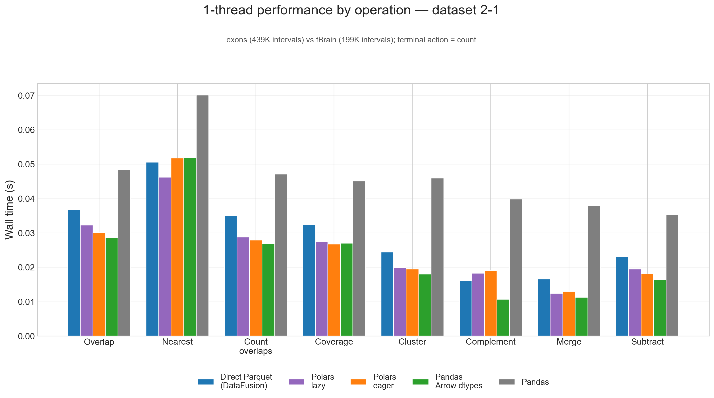
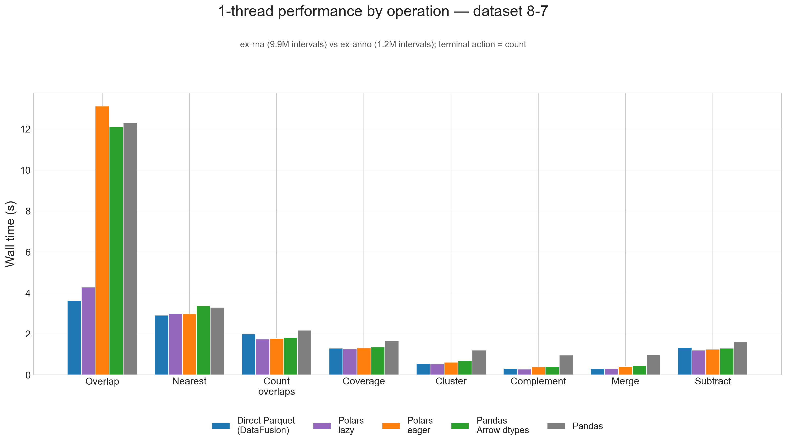
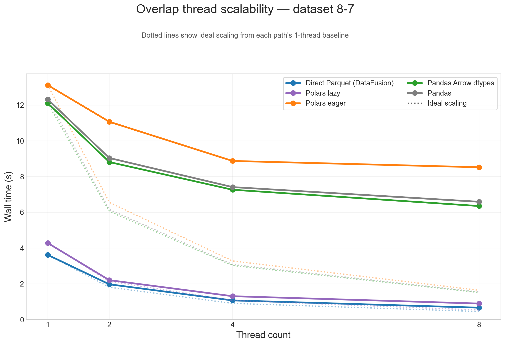
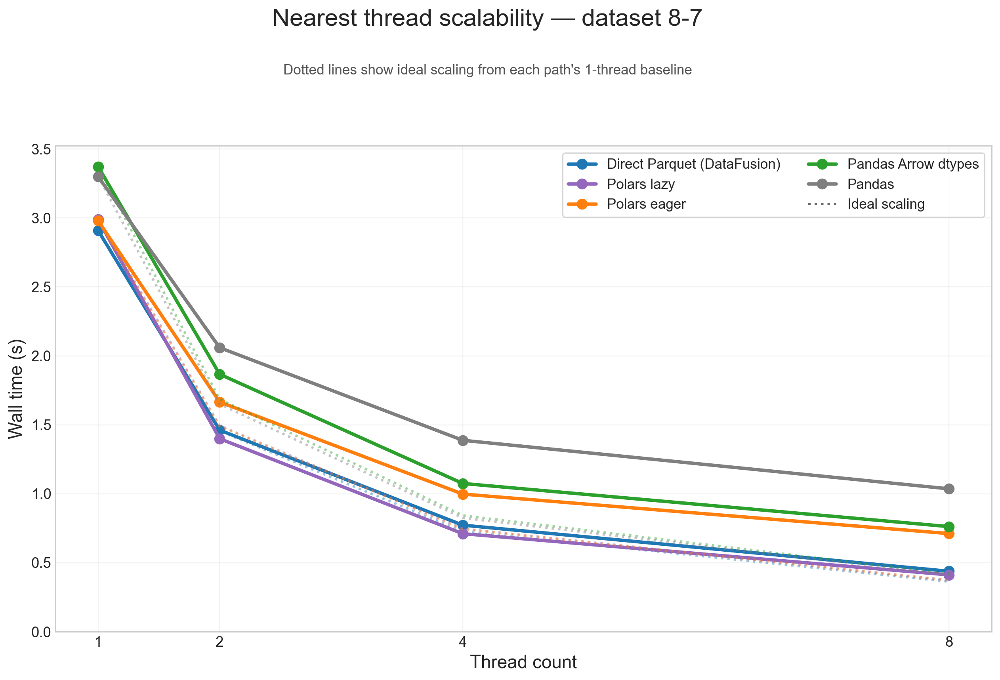
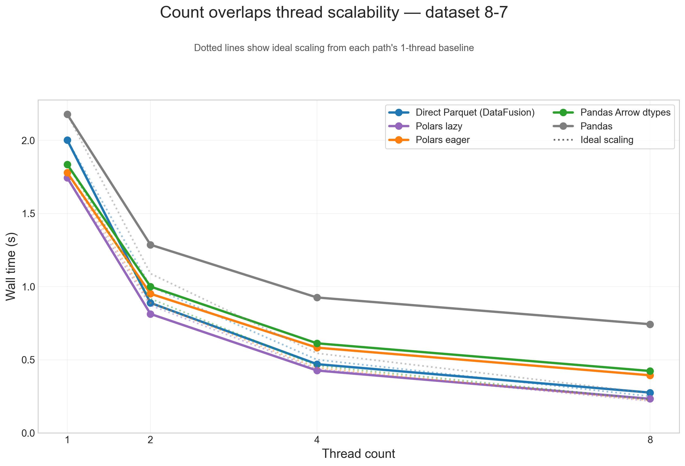
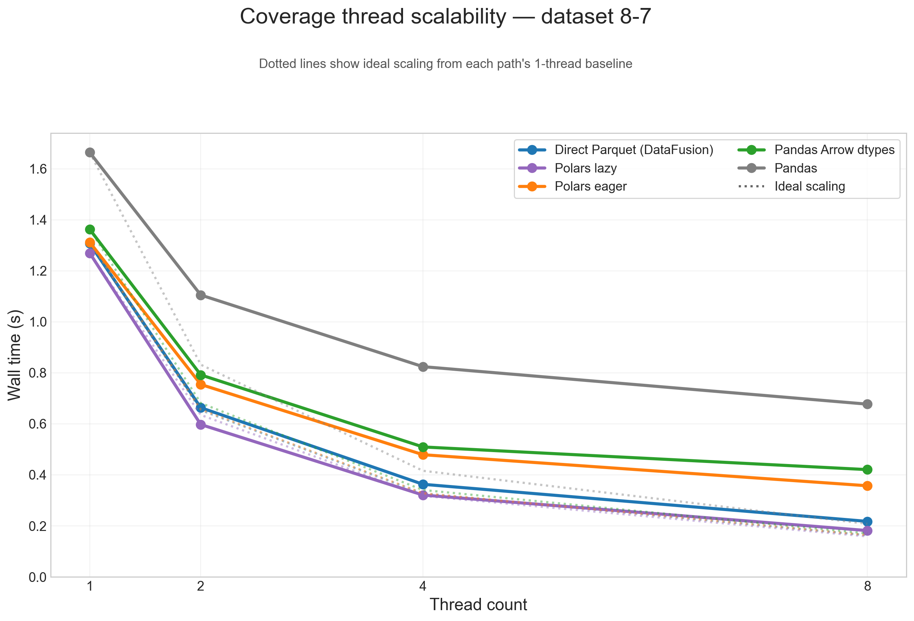
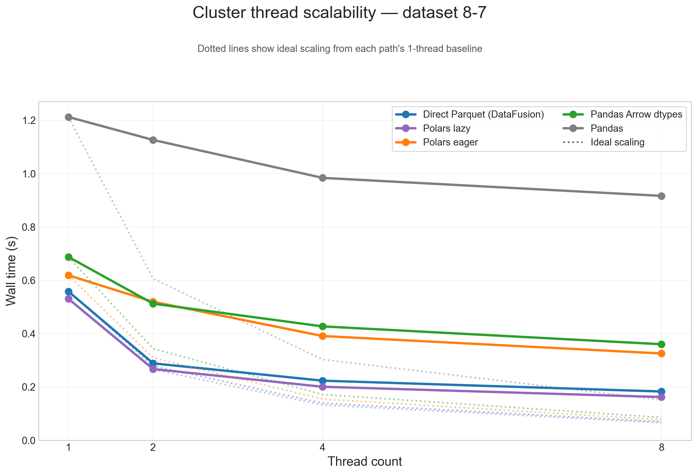
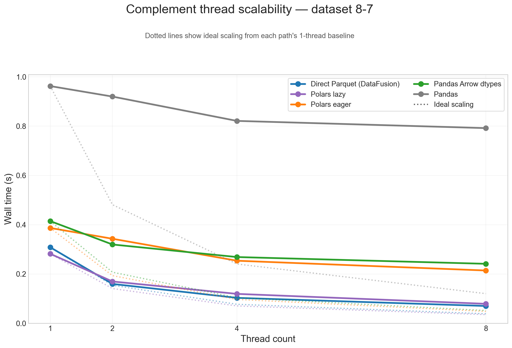
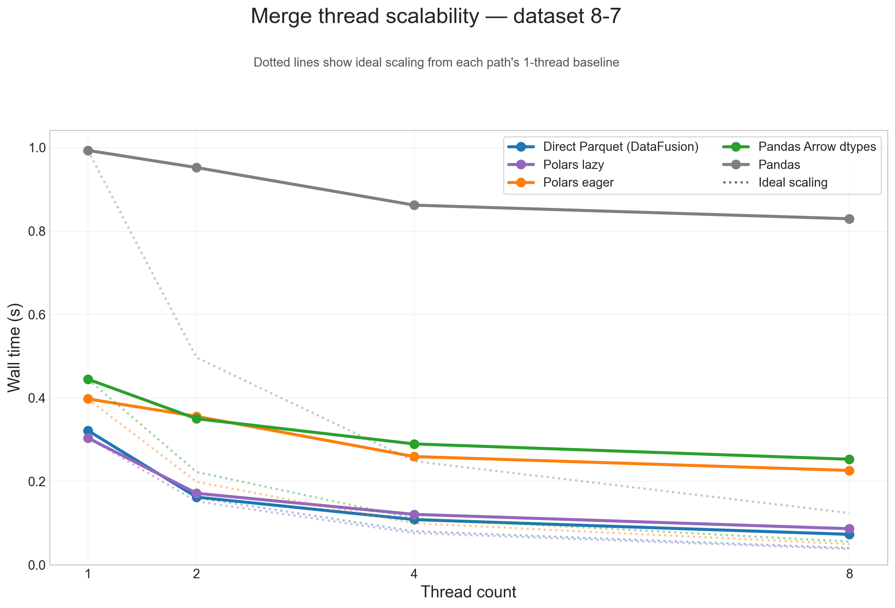
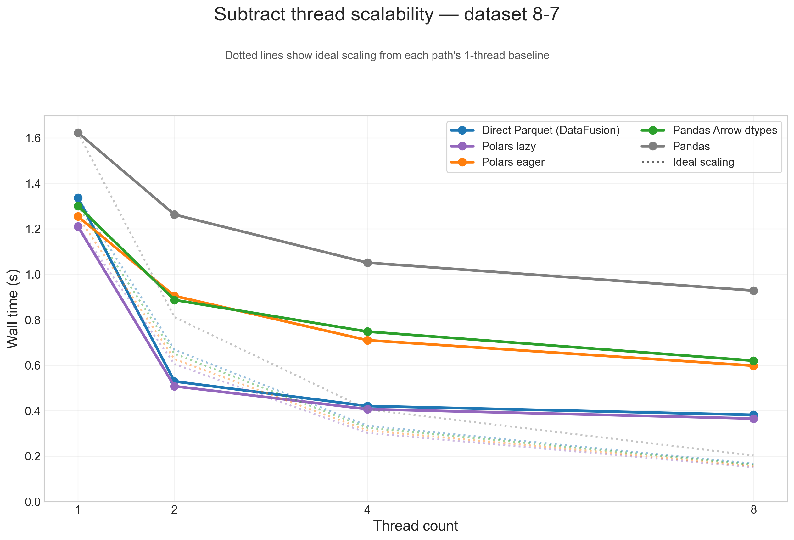

# Benchmarking DataFrame Paths in polars-bio 0.29.0

polars-bio 0.29.0 adds support for Pandas >= 3.0.0. Since [pandas 3.0](https://pandas.pydata.org/community/blog/pandas-3.0.html) made PyArrow-backed data even more central, with the new default string dtype using `pyarrow` under the hood when available, we wanted to measure what that means for interval workloads in practice.

So instead of comparing different interval libraries, this benchmark compares different **input and execution paths** through the same polars-bio range engine:

- direct Parquet scan through Apache DataFusion
- Pandas `DataFrame`
- Pandas with Arrow-backed dtypes
- Polars eager `DataFrame`
- Polars lazy `LazyFrame`

The question is simple: how much overhead do you pay once data is materialized into a Python DataFrame, and how much of that gap can Arrow-backed Pandas close?

<!-- more -->

## Benchmark setup

We reused the same `databio` Parquet benchmark data as in our earlier interval-operations posts. The figures below focus on two representative testcases:

- `2-1` small: `exons` (439K intervals) vs `fBrain` (199K intervals)
- `8-7` large: `ex-rna` (9.9M intervals) vs `ex-anno` (1.2M intervals)

The large `8-7` pair is the same testcase where `overlap` produces **307M result pairs**, so it is a good stress test for both compute and data movement.

We benchmarked eight interval operations:

- `overlap`
- `nearest`
- `count_overlaps`
- `coverage`
- `cluster`
- `complement`
- `merge`
- `subtract`

Each benchmark was run with 1, 2, 4, and 8 threads. We report the mean of 3 repeats. All runs used `count` as the terminal action, so the comparison stays focused on execution and representation overhead rather than CSV export or Python-side post-processing.

### Paths compared

- **Direct Parquet (DataFusion)**: Parquet is scanned directly by polars-bio/DataFusion, without first materializing a Python DataFrame.
- **Pandas**: Parquet is loaded into a regular `pandas.DataFrame`.
- **Pandas Arrow dtypes**: Parquet is loaded with `engine="pyarrow"` and `dtype_backend="pyarrow"`.
- **Polars eager**: Parquet is loaded into an eager `polars.DataFrame`.
- **Polars lazy**: Parquet is loaded as a `polars.LazyFrame`.

## Results

### 1-thread performance, small input (`2-1`)

On the small `2-1` testcase, fixed overhead matters more than raw scan throughput, and the ranking shifts noticeably.

Here, **Pandas Arrow dtypes wins 6 of 8 operations** at 1 thread, **Polars lazy** wins `nearest`, and **Polars eager** wins `coverage`. The native Parquet path is no longer the default winner on small inputs because there is simply less work available to amortize planning and scan overhead.

That is a useful result in its own right: for smaller interval workloads, the Arrow-backed Pandas path is not just "good enough" for interoperability, it is often the fastest path outright.

### 1-thread performance, large input (`8-7`)

The picture changes again once the workload gets large. On `8-7`, there are really **two tiers**:

- **Direct Parquet** and **Polars lazy** form the fast tier.
- **Polars eager**, **Pandas Arrow dtypes**, and especially classic **Pandas** form the slower tier.

On the large `8-7` testcase, direct Parquet wins **overlap** and **nearest**, while Polars lazy wins the other **6 of 8** operations. On geometric mean across all eight operations, Polars lazy is effectively tied with the native Parquet path and ends up **1.03x faster overall**.

The biggest gap shows up in `overlap`:

- Direct Parquet: **3.62s**
- Polars lazy: **4.28s**
- Pandas Arrow dtypes: **12.11s**
- Pandas: **12.32s**
- Polars eager: **13.12s**

So for the heaviest join-like workload, staying on the native Parquet path still matters a lot.

Arrow-backed Pandas is still a meaningful improvement. Across the eight single-thread operations on `8-7`, **Pandas Arrow dtypes is 1.42x faster than classic Pandas** on geometric mean. That is enough to close much of the gap to Polars eager, but not enough to catch either Polars lazy or direct Parquet.

### Thread scalability (`8-7`)

To show thread scaling for **all five dataframe paths**, the scalability plots below use the large `8-7` testcase and split the analysis into **one figure per operation**. Each solid line is one input path, and the dotted line of the same color shows ideal scaling from that path's 1-thread baseline.

Across these figures, the same broad pattern repeats: **direct Parquet** and **Polars lazy** are the paths that benefit most from threads on large inputs, while **Pandas**, **Pandas Arrow dtypes**, and **Polars eager** flatten earlier because more of their runtime is spent outside the native scan/execute path.

#### Overlap

#### Nearest

#### Count overlaps

#### Coverage

#### Cluster

#### Complement

#### Merge

#### Subtract

### Summary table (`8-7`)

| Path | 1-thread geometric mean, direct Parquet = 1.00x | 8-thread geometric mean speedup |
|---|---|---|
| Direct Parquet (DataFusion) | 1.00x | 4.89x |
| Polars lazy | 1.03x | 4.72x |
| Polars eager | 0.81x | 2.46x |
| Pandas Arrow dtypes | 0.77x | 2.48x |
| Pandas | 0.54x | 1.86x |

## Conclusions

- If your data already lives in Parquet, the best default is still the **native Parquet/DataFusion path**. It is the fastest choice for the heaviest workload in this benchmark, `overlap`, and it scales best overall.
- If you want DataFrame ergonomics without giving up much performance, **Polars lazy is the sweet spot**. It wins 6 of 8 single-thread operations and stays very close to the native path at 8 threads.
- **Pandas Arrow dtypes is a real improvement**, not a rounding error. It is materially faster than classic Pandas and scales better, which makes Pandas 3.x interoperability much more attractive than before.
- But Arrow-backed Pandas does **not** erase the cost of eager Python DataFrames. The lazy/native paths are still in a different performance class once workloads get large.
- **Polars eager** sits in the middle: usually better than classic Pandas, often close to Pandas Arrow dtypes, but still clearly behind Polars lazy and direct Parquet on this benchmark.

All benchmark configs and raw results are available in the [polars-bio-bench](https://github.com/biodatageeks/polars-bio-bench) repository.
