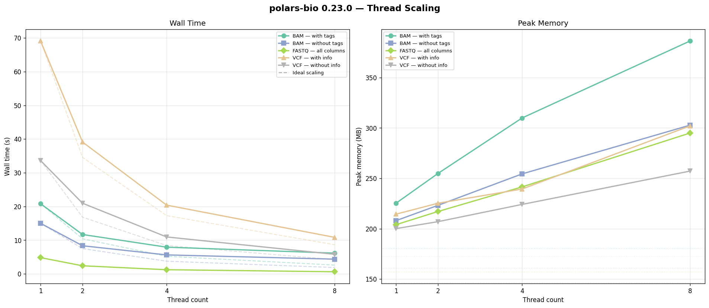

# Benchmarking Genomic Format Readers in Python with Polars

Genomic analyses in Python typically start with reading BAM, VCF, or FASTQ files into memory. The choice of library for this step can have a dramatic impact on both wall-clock time and memory consumption — especially as datasets grow to tens or hundreds of millions of records.

[pysam](https://github.com/pysam-developers/pysam) has long been the go-to Python library for working with these formats. It provides comprehensive bindings to [htslib](https://github.com/samtools/htslib) and is battle-tested across thousands of projects. However, several newer libraries have emerged that leverage [Apache Arrow](https://arrow.apache.org/) columnar format and Rust-based parsers to offer potentially better performance.

In this post, we benchmark four Python libraries head-to-head on real-world genomic data to find out which offers the best combination of speed and memory efficiency for reading BAM, VCF, and FASTQ files.

<!-- more -->

## Libraries Compared

| Library                                                  | Version | Parallel           | Out-of-Core / Streaming                                                                                       |
|----------------------------------------------------------|---------|--------------------|---------------------------------------------------------------------------------------------------------------|
| [pysam](https://github.com/pysam-developers/pysam)       | 0.23.3  | Decompression only | No                                                                                                            |
| [oxbow](https://github.com/abdenlab/oxbow)               | 0.5.1   | No                 | Yes ([streams](https://oxbow.readthedocs.io/en/latest/getting-started/quickstart.html#streams-and-fragments)) |
| [biobear](https://github.com/wheretrue/biobear)          | 0.23.7  | No                 | No                                                                                                            |
| [polars-bio](https://github.com/biodatageeks/polars-bio) | 0.23.0  | Yes                | Yes                                                                                                           |

All four libraries return data as Arrow-backed DataFrames (Polars or Pandas), making them easy to integrate into modern data analysis pipelines.

## About polars-bio

[polars-bio](https://github.com/biodatageeks/polars-bio) is built on the [Apache DataFusion](https://datafusion.apache.org/) query engine and [Polars](https://pola.rs/). Genomic format parsing is powered by [datafusion-bio-formats](https://github.com/biodatageeks/datafusion-bio-formats), which uses [noodles](https://github.com/zaeleus/noodles) for low-level format I/O.

Key architectural features that contribute to its performance:

- **Streaming execution** — records are processed in batches without materializing the full dataset in memory
- **Automatic parallel partitioning** — index files (BAI, TBI, GZI, CRAI) are used to split work across threads
- **Predicate and projection pushdown** — filtering and column selection happen during parsing, not after
- **Broad format support** — BAM, CRAM, VCF, FASTQ, FASTA, GFF, BED, and Pairs formats

## Benchmark Setup

### Test Data

| Format | File | Rows | Source |
|--------|------|------|--------|
| BAM | NA12878 WES chr1 (~2 GB) | 19.3M | Extracted from [NA12878](https://www.internationalgenome.org/data-portal/sample/NA12878) |
| VCF | Ensembl chr1 (bgzipped) | 86.8M | [Ensembl Variation](https://ftp.ensembl.org/pub/release-113/variation/vcf/homo_sapiens/) |
| FASTQ | ERR194158 (bgzipped) | 10.8M | [EBI SRA](https://www.ebi.ac.uk/ena/browser/view/ERR194158) |

### Methodology

- **Hardware**: Apple Silicon (M-series)
- **Runs**: 2 per configuration, median reported
- **Memory**: Peak RSS measured via `psutil` polling (process + children)
- **Thread counts**: 1, 2, 4, 8 for polars-bio; other libraries are single-threaded
- Each benchmark runs as a separate subprocess to ensure clean memory measurement

The full benchmark code is available in the [bioformats-benchmark](https://github.com/biodatageeks/bioformats-benchmark) repository.

## Results

### FASTQ


At single-thread, polars-bio matches biobear's speed (4.8s vs 4.4s) while using **17x less memory** (204 MB vs 3.7 GB).

With 8 threads, polars-bio reads 10.8M FASTQ records in **0.6 seconds** — that's **20x faster than pysam** and **7x faster than biobear**, while staying under 300 MB of memory.

### BAM — without tags


polars-bio is the fastest library at every thread count. At 1 thread: 15.4s (1.5x faster than biobear, 11x faster than pysam). At 8 threads: **4.5 seconds** to read 19.3M BAM records.

Memory tells an even more dramatic story: **209 MB** for polars-bio vs **28.8 GB** for pysam — a **138x difference**.

### BAM — with tags


Including auxiliary tags increases the data volume per record significantly. polars-bio at 1 thread (20.8s) is 1.6x faster than biobear (34.1s) and 16x faster than pysam (328s).

At 8 threads: **6.3 seconds** — **52x faster than pysam**. Memory remains under 410 MB compared to pysam's 32.9 GB and biobear's 39.9 GB.

### VCF — without INFO columns


For the 86.8M-row VCF, polars-bio at 1 thread (33.6s) is competitive with oxbow (35.2s) and faster than biobear (43.0s). pysam takes 111s.

At 8 threads, polars-bio finishes in **6.2 seconds** — **18x faster than pysam** — with only 255 MB of memory vs pysam's 19.8 GB.

### VCF — with INFO columns


This is the most challenging test: parsing the full INFO field across 86.8M VCF records.

- **pysam**: exceeded the 10-minute timeout
- **biobear**: skipped (fails on this dataset)
- **oxbow**: 104.8s (lazy) / 110.6s (stream), with the lazy mode consuming 29.6 GB

polars-bio completed the task at every thread count — 1 thread: **69s**, 8 threads: **11.2 seconds** — while staying under 300 MB of memory. This is a test where polars-bio is the only library that delivers both correctness and practical performance.

## Thread Scaling



polars-bio achieves near-linear scaling for most formats from 1 to 8 threads. FASTQ shows the best scaling efficiency (7.4x speedup at 8 threads), while BAM and VCF formats achieve 3-6x speedups.

Memory remains remarkably stable across thread counts — staying below **410 MB** even at 8 threads, regardless of format. This means you can leverage all available cores without worrying about memory pressure.

## Conclusions

- **polars-bio 0.23.0 is the fastest library** across all three formats, especially when multi-threading is enabled
- **10-100x less memory** than traditional eager libraries — polars-bio stays under 400 MB where pysam and biobear consume 20-40 GB
- **Handles edge cases** where other libraries fail (complex VCF INFO parsing) or time out
- **True streaming execution** enables processing datasets larger than available RAM, making it practical for whole-genome scale data

A follow-up post will dive into the performance improvements between polars-bio 0.22.0 and 0.23.0, detailing the optimizations in [datafusion-bio-formats](https://github.com/biodatageeks/datafusion-bio-formats) that made these results possible.

## Try It Yourself

```bash
pip install polars-bio
```

```python
import polars_bio as pb
import polars as pl

# Scan lazily with predicate pushdown
lf = pb.scan_bam("sample.bam")
result = lf.filter(pl.col("chrom") == "chr1").sink_parquet("/temp/chr1_alignments.parquet")
```

- [Documentation](https://biodatageeks.org/polars-bio/)
- [GitHub](https://github.com/biodatageeks/polars-bio)
- [PyPI](https://pypi.org/project/polars-bio/)
- [Benchmark repository](https://github.com/biodatageeks/bioformats-benchmark)
