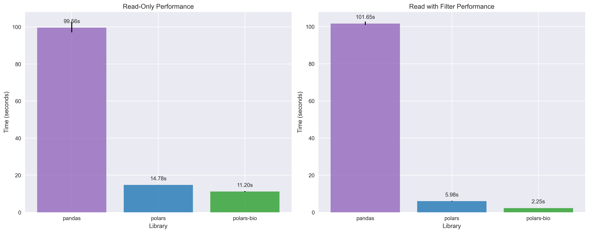
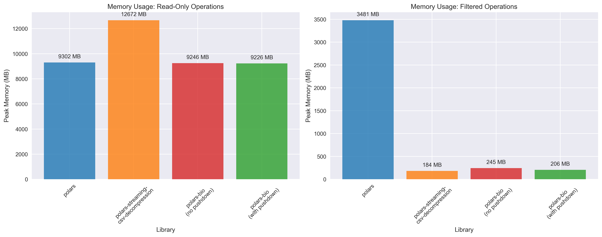
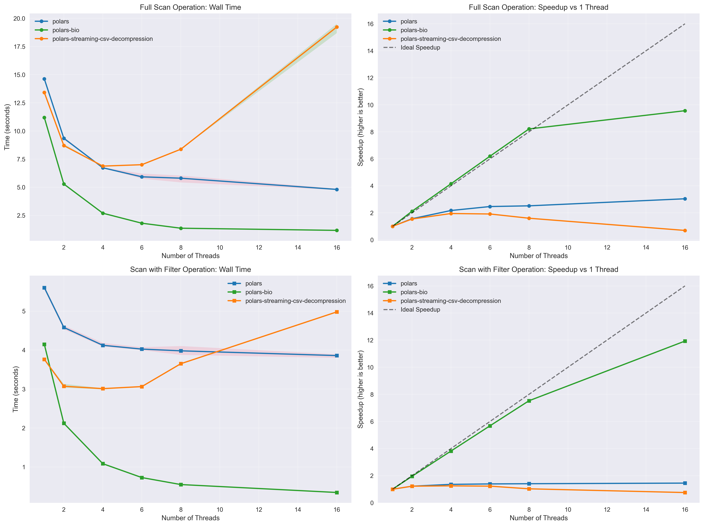

# GFF File Reading Performance Enhancements in polars-bio 0.15.0

We're excited to announce significant performance improvements to GFF file reading in polars-bio `0.15.0`. This release introduces two major optimizations that dramatically improve both speed and memory efficiency when working with GFF files:

## Key Enhancements

**Projection Pushdown**: Only the columns you need are read from disk, reducing I/O overhead and memory usage. This is particularly beneficial when working with wide GFF files that contain many optional attributes.

**Predicate Pushdown**: Row filtering is applied during the file reading process, eliminating the need to load irrelevant data into memory. This allows for lightning-fast queries on large GFF datasets.

**Fully Streamed Parallel Reads**: BGZF-compressed files can now be read in parallel with true streaming, enabling out-of-core processing of massive genomic datasets without memory constraints.

## Benchmark Methodology

To evaluate these improvements, we conducted comprehensive benchmarks comparing three popular data processing libraries:

- **Pandas**: The traditional Python data analysis library
- **Polars**: High-performance DataFrame library with lazy evaluation
- **polars-bio**: Our specialized genomic data processing library built on Polars and Apache DataFusion

All benchmarks were performed on a large GFF file (~7.7 million records, [file](https://drive.google.com/file/d/1PsHqKG-gyRJy5-sNzuH3xRntw4Er--Si/view?usp=sharing) and [index](https://drive.google.com/file/d/173RT5Afi2jAh64uCJwNRGHF4ozYU-xzX/view?usp=sharing) needed for parallel reading) with both full scan and filtered query scenarios to demonstrate real-world performance gains.

For pandas and polars reading, we used the following [methods](https://github.com/biodatageeks/polars-bio/blob/master/benchmarks/gff_parsers.py) (thanks to [@urineri](https://github.com/urineri) for the Polars code).
Since Polars decompresses compressed CSV/TSV files completely in memory as highlighted [here](https://github.com/ghuls/polars_streaming_csv_decompression/blob/main/README.md), we also used `polars_streaming_csv_decompression` a great plugin developed by [@ghuls](https://github.com/ghuls/polars_streaming_csv_decompression) to enable streaming decompression in Polars.

## Results

## Single-threaded performance

Key takeaways:

{.glightbox}

## Memory usage
{.glightbox}

## Thread scalability
{.glightbox}