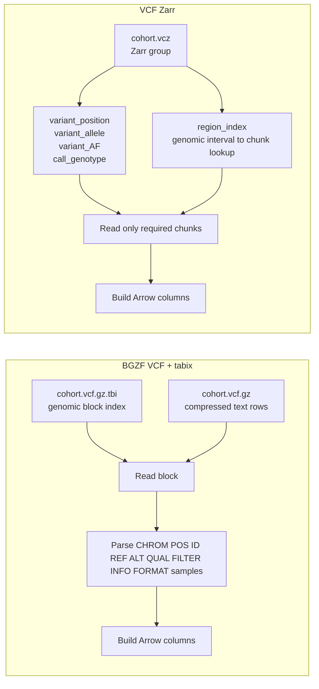
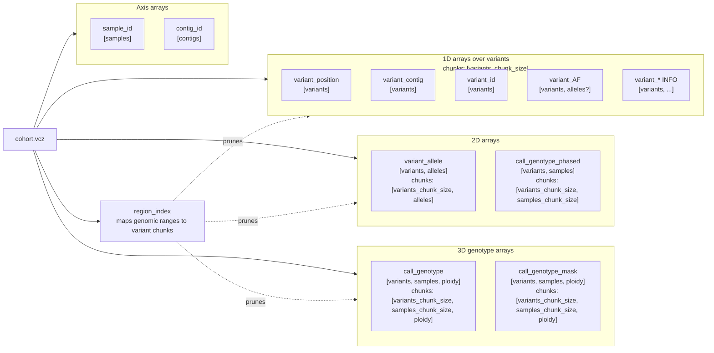

# polars-bio 0.31.0: VCF Zarr Support for Array-Native Variant Analytics

polars-bio 0.31.0 adds first-class support for [VCF Zarr](https://github.com/sgkit-dev/vcf-zarr-spec), giving Python users a fast, lazy, DataFusion-backed way to query VCF-derived Zarr stores with Polars.

<!-- more -->

VCF is still the standard interchange format for genetic variation. It is compact, human-readable, and widely supported. But even when bgzipped and indexed with tabix, VCF is fundamentally a row-oriented text format. A query engine still has to decompress blocks, parse text records, split INFO fields, split FORMAT/sample fields, and then rebuild typed arrays.

[Zarr](https://zarr-specs.readthedocs.io/en/latest/v3/core/index.html) takes a different approach. It stores typed N-dimensional arrays in independently compressed chunks with JSON metadata. VCF Zarr uses that model for the VCF data model: variants, samples, INFO fields, FORMAT fields, genotype calls, masks, phasing, and region lookup metadata are stored as arrays instead of text rows.



## VCF Zarr File Layout

A `.vcz` path is a Zarr group of typed arrays. The important performance knobs are array dimensions and chunk shapes.



## What Is New

The new APIs mirror the rest of polars-bio:

```python
import polars as pl
import polars_bio as pb

lf = pb.scan_vcf_zarr(
    "cohort.vcz",
    info_fields=["AF"],
    format_fields=[],
)

rare_chr22 = (
    lf.filter((pl.col("chrom") == "chr22") & (pl.col("AF").list.first() < 0.01))
    .select(["chrom", "start", "id", "ref", "alt", "AF"])
    .collect()
)
```

For sample-aware FORMAT queries:

```python
samples = ["HG00102", "HG00106", "HG00107"]

calls = (
    pb.scan_vcf_zarr(
        "cohort.vcz",
        info_fields=[],
        format_fields=["GT"],
        samples=samples,
    )
    .filter((pl.col("chrom") == "chr22") & (pl.col("start") == 10_519_265))
    .select(["chrom", "start", "id", "ref", "alt", "genotypes"])
    .collect()
)
```

By default, VCZ genotype calls are returned in the raw typed representation from the store, rather than being converted back to VCF-style strings. This avoids unnecessary conversion and preserves the array-native representation. If you need string GT values for compatibility, use `genotype_encoding_raw=False`.

The first release focuses on local VCF Zarr 0.4 stores produced by bio2zarr. It supports lazy scans, eager reads, projection pushdown, INFO and FORMAT field selection, sample selection, raw typed genotype values, genomic predicate pruning through the VCZ region index, and DataFusion parallel execution.

## Converting VCF to VCF Zarr

The recommended converter is [bio2zarr](https://sgkit-dev.github.io/bio2zarr/vcf2zarr/cli_ref.html), which provides the `vcf2zarr` command. For small files, direct conversion is enough:

```bash
vcf2zarr convert \
  --force \
  --variants-chunk-size 1000 \
  --samples-chunk-size 10 \
  input.vcf.gz \
  cohort.vcz
```

For larger files, use the two-step path through bio2zarr's intermediate columnar format:

```bash
vcf2zarr explode \
  --force \
  --worker-processes 8 \
  input.vcf.gz \
  cohort.icf

vcf2zarr encode \
  --force \
  --worker-processes 8 \
  --variants-chunk-size 1000 \
  --samples-chunk-size 10 \
  cohort.icf \
  cohort.vcz
```

Two chunking choices matter for query performance:

| Parameter | What It Controls | Practical Effect |
| --- | --- | --- |
| `--variants-chunk-size` | Number of variants per chunk | Controls genomic range pruning granularity and region-index granularity. Smaller chunks help point and range lookups; larger chunks reduce metadata and can improve large sequential scans. |
| `--samples-chunk-size` | Number of samples per FORMAT/genotype chunk | Smaller chunks help sample-subset queries; larger chunks are better when most queries read many or all samples. |

VCF Zarr stores can also contain a `region_index` array. polars-bio uses this to map genomic predicates such as `chrom == "chr22"` and `start` ranges to the relevant variant chunks. If your store does not contain a region index, create one with:

```bash
vcf2zarr create_index cohort.vcz
```

## Benchmarks

The benchmark notebook is [`notebooks/vcf_zarr_small_benchmark.ipynb`](https://github.com/biodatageeks/polars-bio/blob/main/notebooks/vcf_zarr_small_benchmark.ipynb). The dataset is the 1000 Genomes high-coverage chr22 VCF converted to VCF Zarr:

| Dataset | Value |
| --- | --- |
| Variants | 1,066,557 |
| Samples | 3,202 |
| VCF input | bgzipped VCF with tabix index |
| VCZ layout | Zarr v2, VCF Zarr 0.4 |
| Genotype chunks | `[1000, 10, 2]` for variants, samples, ploidy |
| `target_partitions` | 1 |

These results compare `pb.scan_vcf_zarr(...)` with `pb.scan_vcf(...)` against the same logical query. The VCF path uses the bgzipped VCF and its tabix index, including bounded `start >= ... AND start <= ...` pruning.

| Scenario | VCZ Wall Time | BGZF VCF Wall Time | VCZ Speedup |
| --- | ---: | ---: | ---: |
| Full chromosome count by chrom | 0.210 s | 6.35 s | 30.2x |
| 100 kb region core summary | 0.0279 s | 0.0430 s | 1.5x |
| 100 kb region AF projection | 0.0171 s | 0.0511 s | 3.0x |
| 100 kb region 3-sample GT slice | 0.0331 s | 0.0409 s | 1.2x |
| 100 kb region all-sample GT summary | 0.716 s | 0.965 s | 1.3x |
| Full scan AF >= 0.05 analytics | 0.269 s | 9.47 s | 35.2x |
| Full scan 3-sample GT grouping | 0.928 s | 6.79 s | 7.3x |
| Full table materialized in memory | 156.8 s | 387.0 s | 2.5x |

The most important result is not that VCZ always replaces tabix for narrow lookups. After bounded `start` pruning, bgzipped VCF is already very competitive for small indexed regions. In the 100 kb region tests above, VCZ ranges from roughly comparable to about 3x faster, depending on which columns are selected.

The larger wins show up when the query shape is columnar: full-chromosome scans, INFO-only analytics, selected-sample FORMAT grouping, and full table materialization. Those cases make VCF pay the cost of repeated text decompression and parsing, while VCZ reads typed arrays and can skip arrays that are not part of the query.

The full in-memory materialization case asks both readers to load every row and every default column, including genotype payloads, into a DataFrame. VCZ is still about 2.5x faster in this benchmark, but the strongest fit is not "always load everything"; it is "read the typed chunks needed for this analysis".

## Where It Helps

VCF Zarr removes several expensive steps from the hot path:

- Core, INFO, and FORMAT fields are already split into typed arrays.
- Projection pushdown can skip unrequested INFO and FORMAT arrays.
- Sample selection can skip unrelated sample chunks when the store is chunked appropriately.
- Genomic filters can be converted to region-index chunk pruning. For narrow tabix-indexed VCF regions, this makes VCZ competitive; it is not always a dramatic win.
- Raw GT output avoids converting typed genotype calls back into strings unless requested.
- DataFusion can run partitioned VCZ reads in parallel using `datafusion.execution.target_partitions`.

For example:

```python
pb.set_option("datafusion.execution.target_partitions", "8")

result = (
    pb.scan_vcf_zarr(
        "cohort.vcz",
        info_fields=["AF"],
        format_fields=[],
    )
    .with_columns(pl.col("AF").list.first().alias("af"))
    .filter(pl.col("af") >= 0.05)
    .group_by("chrom")
    .agg([
        pl.len().alias("variants_af_ge_0_05"),
        pl.col("af").min().alias("min_af"),
        pl.col("af").max().alias("max_af"),
    ])
    .collect()
)
```

With VCZ, this is an array read problem. With VCF, it is still a text parsing problem. For small bounded regions, tabix keeps that parsing work small; for repeated columnar scans and full-table analytics, the array layout starts to matter much more.

## When VCF Zarr Is the Best Match

VCF Zarr is a strong fit when:

- You run repeated analyses over the same large cohort.
- Your queries select a subset of INFO or FORMAT fields.
- You run full-chromosome or full-table scans over selected columns.
- You filter by genomic ranges and want chunk-level pruning, especially when combined with column projection.
- You query a subset of samples and can choose a suitable `--samples-chunk-size`.
- You do cohort analytics where typed arrays are the natural representation.
- You want a Polars/DataFusion lazy pipeline instead of ad hoc VCF parsing loops.

VCF Zarr is less compelling when:

- You only need a one-off read of a small VCF.
- You already have a bgzipped VCF and do one or two narrow tabix point lookups.
- Your workload is mostly small bounded regions over core VCF columns, where tabix is already efficient.
- Every query loads every field and every genotype for every sample.
- You cannot choose a chunk layout that matches your common access pattern.

Chunking matters. A store created with `--samples-chunk-size 3202` is good for all-sample genotype scans but will still read large genotype chunks for one-sample queries. A store created with `--samples-chunk-size 10` is much better for selected-sample analytics, but it creates many more chunks and a larger on-disk store. There is no universal best layout; choose the sample and variant chunk sizes for the workload you actually run.

## Try It

Install the release:

```bash
pip install polars-bio==0.31.0
```

Read a VCZ store lazily:

```python
import polars as pl
import polars_bio as pb

pb.set_option("datafusion.execution.target_partitions", "8")

df = (
    pb.scan_vcf_zarr(
        "cohort.vcz",
        info_fields=["AF"],
        format_fields=["GT"],
        samples=["HG00102", "HG00106", "HG00107"],
    )
    .filter((pl.col("chrom") == "chr22") & (pl.col("start") >= 20_000_000))
    .select(["chrom", "start", "id", "ref", "alt", "AF", "genotypes"])
    .collect()
)
```

Resources:

- [polars-bio documentation](https://biodatageeks.org/polars-bio/)
- [VCF Zarr specification](https://github.com/sgkit-dev/vcf-zarr-spec)
- [bio2zarr vcf2zarr CLI reference](https://sgkit-dev.github.io/bio2zarr/vcf2zarr/cli_ref.html)
- [Zarr core specification](https://zarr-specs.readthedocs.io/en/latest/v3/core/index.html)
