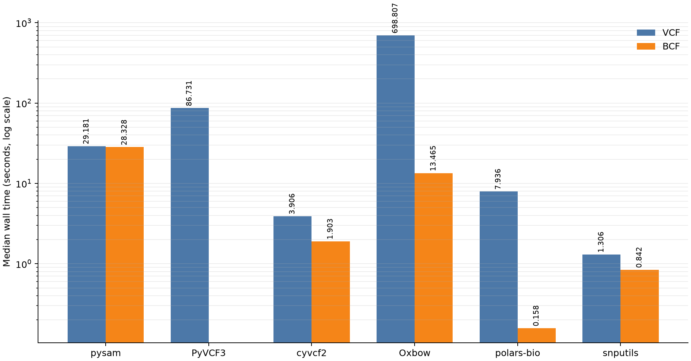
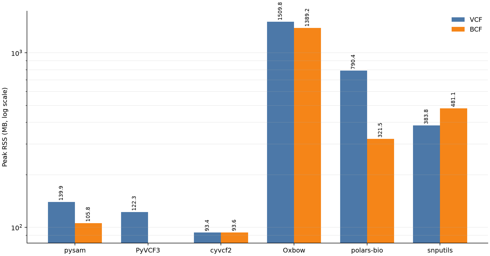
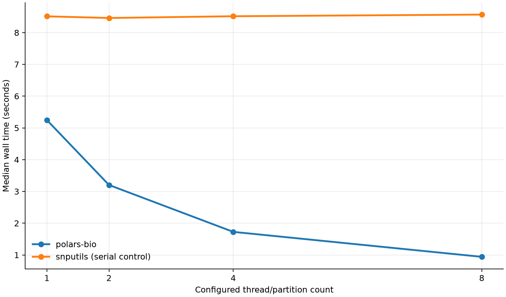

# VCF and BCF Genotype Readers in Python: An Apples-to-Apples Benchmark

Python genomics reader benchmarks often compare unlike work: one library counts
records, another retains metadata, and a third materializes every genotype. For
this comparison we set a stricter contract. Every successful reader must return
the same ordered variants, the same ordered samples, and the same complete
biallelic ALT-dosage matrix. We then compare pysam, PyVCF3, cyvcf2, Oxbow,
polars-bio, and snputils on both VCF and BCF.

The headline is format-dependent. The specialized text-VCF path in snputils is
fastest for VCF. For BCF, polars-bio's new direct typed dosage path is fastest
at one thread, and its CSI-backed execution scales to eight partitions on the
full chromosome callset.

<!-- more -->

## What exactly is being compared?

The source is the phased, biallelic 1000 Genomes GRCh38 chromosome 22 callset.
For the broad reader matrix we derive equivalent VCF and BCF files for the
inclusive region `chr22:10516173-16717478`. Each file contains:

- 25,000 variants in identical order;
- 2,548 samples in identical order;
- 63,700,000 genotype dosage cells.

A genotype becomes the number of allele-index-1 calls: `0|0 → 0`, `0|1` and
`1|0 → 1`, and `1|1 → 2`. Missing calls use `-1` in the normalized output. Each
reader retains a C-contiguous row-major NumPy `int8` matrix plus 1-based
positions and sample IDs. Physical input/output schemas may differ; logical
rows and cells may not.

The runner rejects a result unless position, sample-order, and complete dosage
SHA-256 hashes match across every library and both formats. In other words, the
timing cannot pass by reading fewer rows, dropping samples, or skipping final
materialization.

## Readers and execution modes

| Reader | Version | VCF | BCF | Mode used |
|---|---:|:---:|:---:|---|
| pysam | 0.24.0 | ✓ | ✓ | native iterator, preallocated matrix |
| PyVCF3 | 1.0.4 | ✓ | — | Python iterator, preallocated matrix |
| cyvcf2 | 0.31.4 | ✓ | ✓ | native iterator, vectorized per-record dosage |
| Oxbow | 0.8.1 | ✓ | ✓ | bounded Arrow record batches |
| polars-bio | 0.33.1 feature branch | ✓ | ✓ | lazy scan, streaming collection |
| snputils | pinned development commit | ✓ | ✓ | specialized eager reader |

PyVCF3 does not accept binary BCF input, so that matrix cell is explicitly
unsupported rather than treated as a failure or silently substituted.

## Methodology

Each measurement runs in a fresh Python process. Module imports and thread-pool
configuration happen before the timer. The timed section includes source
opening, header/schema discovery, file reading, GT decoding, dosage conversion,
and final row-major `int8` materialization. Peak RSS is measured after retaining
the comparable output.

All known thread pools are capped at one thread for the cross-reader matrix:
Polars, Rayon, OpenMP, OpenBLAS, MKL, Accelerate, and NumExpr. Two rounds run in
a deterministic rotating order on a warm filesystem cache. The machine is a
16-core Apple M3 Max MacBook Pro with 64 GiB RAM and macOS 15.6.

The polars-bio extension was built from the reviewed feature branch with:

```bash
RUSTFLAGS="-C target-cpu=native" maturin develop --release --locked
```

## One-thread results

### Wall time

| Reader | VCF median | BCF median | BCF relative to polars-bio |
|---|---:|---:|---:|
| pysam | 29.181 s | 28.328 s | 179.291× |
| PyVCF3 | 86.731 s | unsupported | — |
| cyvcf2 | 3.906 s | 1.903 s | 12.044× |
| Oxbow | 698.807 s | 13.465 s | 85.222× |
| **polars-bio** | 7.936 s | **0.158 s** | **1.000×** |
| snputils | **1.306 s** | 0.842 s | 5.329× |

For BCF, polars-bio is 5.329× faster than snputils at one thread and reduces
wall time by 81.2%. For VCF, snputils is fastest; its specialized text parser
is 6.077× faster than polars-bio's current string-compatible path.



### Peak memory

| Reader | VCF peak RSS | BCF peak RSS |
|---|---:|---:|
| pysam | 139.9 MB | 105.8 MB |
| PyVCF3 | 122.3 MB | unsupported |
| cyvcf2 | **93.4 MB** | **93.6 MB** |
| Oxbow | 1,509.8 MB | 1,389.2 MB |
| **polars-bio** | 790.4 MB | 321.5 MB |
| snputils | 383.8 MB | 481.1 MB |

cyvcf2 has the smallest peak RSS in both subset runs. For BCF, polars-bio uses
33.2% less peak RSS than snputils while completing the workload 5.329× faster.



## Why BCF changes the result

BCF stores FORMAT series as typed binary values. polars-bio projects only
`FORMAT/GT` and sends the encoded allele bytes directly into a nullable Arrow
`Int8` dosage builder. It avoids intermediate GT strings, dynamic FORMAT value
objects, and per-cell heap allocations. Batches remain bounded by the shared
8 MB genotype-byte budget, even for very large sample counts.

That optimization is specifically a GT dosage representation, but the broader
pattern generalizes: project early, decode typed fields directly into their
final Arrow representation, and keep batches bounded. Other FORMAT fields need
their own semantics and output types; they should not be mislabeled as dosage.

Text VCF follows a different path today. polars-bio preserves the compatible GT
string schema and then converts those strings to dosage with a streaming Polars
expression. snputils' specialized GT-only block parser and cyvcf2's native
iterator are faster for this workload. A direct text-VCF dosage sink is the
clear next optimization opportunity; the BCF result should not be used to hide
that gap.

Oxbow also deserves a methodological note. Its normal row-count benchmarks are
fast and memory-bounded, but this workload asks it to materialize a 2,548-wide
nested genotype structure and then normalize all 63.7 million alleles. We use
its bounded Arrow batch API, not an eager whole-file frame, but the wide FORMAT
shape remains expensive. That is exactly why output-equivalent benchmarks are
more informative than parser-only counts.

## Full-cohort BCF scaling

The second experiment restores all 993,881 chromosome 22 variants and all
2,548 samples: 2,532,408,788 dosage cells. polars-bio runs at 1, 2, 4, and 8
target partitions; snputils is repeated as a serial control because its BCF API
does not expose a worker-count option.

| Threads | polars-bio median | Scale-up | Peak RSS | snputils control | vs snputils |
|---:|---:|---:|---:|---:|---:|
| 1 | 5.248 s | 1.000× | 2,658.7 MB | 8.513 s / 10,067.4 MB | 1.622× faster |
| 2 | 3.203 s | 1.638× | 2,663.2 MB | 8.461 s / 10,065.9 MB | 2.642× faster |
| 4 | 1.727 s | 3.039× | 2,667.9 MB | 8.516 s / 10,067.7 MB | 4.931× faster |
| 8 | 0.941 s | 5.577× | 2,677.7 MB | 8.568 s / 10,066.6 MB | 9.105× faster |



At the apples-to-apples one-thread point, polars-bio is 1.622× faster and uses
73.6% less peak RSS. At eight threads it reaches a 5.577× scale-up while memory
stays near 2.68 GB. Complete row, sample, and dosage equality passes before
every sweep point.

## CSI pushdown and partition processing

The BCF reader auto-discovers a neighboring `.bcf.csi`. Coordinate predicates
are translated into CSI regions and exact record intersection checks; full
indexed scans divide those regions across the configured target partitions.
The test suite covers range-query equality against indexed VCF and sequential
BCF, physical partition counts at 1/2/4/8, stable results across partition
counts, unknown contigs, missing-index fallback, and both local and remote
range reads.

This is not GT-only. CSI pruning and partition planning happen below projection,
so core columns, INFO, FORMAT strings, and typed GT dosage all benefit.

## Limitations

- The broad matrix uses a 25,000-row slice so pure-Python readers and Oxbow's
  wide genotype layout complete on a 64 GiB machine. The separate scaling test
  uses the complete 993,881-row callset.
- The callset is phased, diploid, and biallelic. Multiallelic dosage is rejected
  rather than collapsed into a misleading non-reference count.
- Results are warm-cache measurements on one Apple Silicon machine. Treat the
  ratios as workload evidence, not universal constants.
- Different libraries have different natural containers. The benchmark times
  the normalization required to produce one genuinely comparable matrix.

## Try it

```python
import polars_bio as pb

dosage = (
    pb.scan_vcf(
        "cohort.bcf",
        info_fields=[],
        format_fields=["GT"],
        genotype_output="dosage",
    )
    .select("chrom", "start", "genotypes")
    .collect(engine="streaming")
)
```

For indexed range work, keep the scan lazy so predicates reach the CSI-backed
source:

```python
import polars as pl

region = (
    pb.scan_vcf("cohort.bcf", info_fields=["AF"], format_fields=[])
    .filter(
        (pl.col("chrom") == "chr22")
        & (pl.col("start") >= 20_000_000)
        & (pl.col("start") <= 21_000_000)
    )
    .collect(engine="streaming")
)
```

- [Exact benchmark report and raw runs](https://github.com/biodatageeks/bioformats-benchmark/blob/5bef307f55ddfad0e9b14e565c0bdaded6765e9d/GENOTYPE_READER_BENCHMARK.md)
- [Reproducible benchmark pull request](https://github.com/biodatageeks/bioformats-benchmark/pull/3)
- [datafusion-bio-formats BCF pull request](https://github.com/biodatageeks/datafusion-bio-formats/pull/218)
- [polars-bio BCF pull request](https://github.com/biodatageeks/polars-bio/pull/435)
- [Earlier genomic-reader benchmark](https://biodatageeks.org/polars-bio/blog/2026/02/14/benchmarking-genomic-format-readers-in-python-with-polars/)
