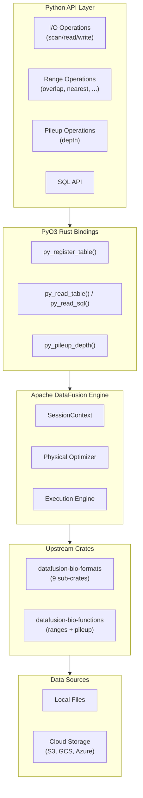
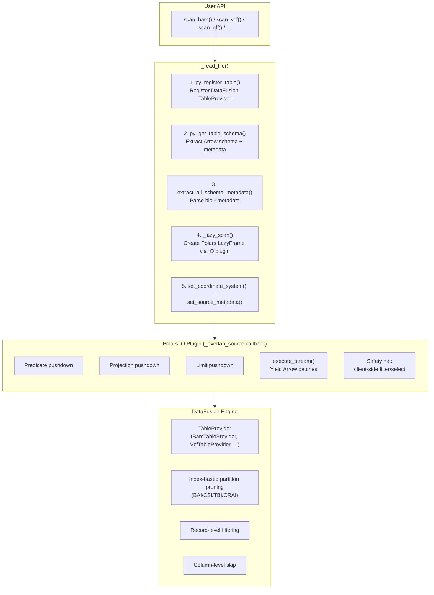
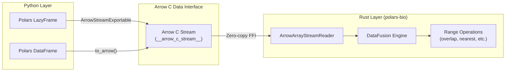
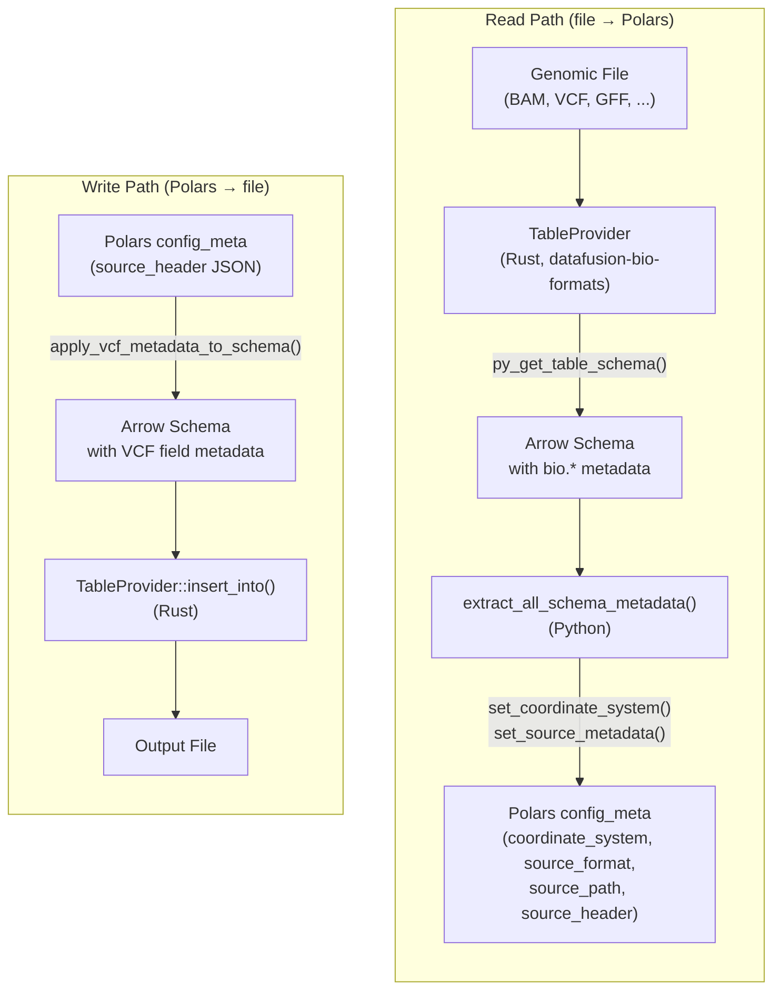
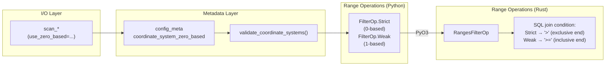

## Architecture Overview

polars-bio is a Python library for high-performance genomic data processing. It combines a Python API layer with a Rust-based execution engine powered by Apache DataFusion, extended with bioinformatics-specific capabilities through upstream `datafusion-bio-*` crates.



The key design principles are:

- **Zero-copy data exchange** between Python (Polars/Pandas) and Rust via the Arrow C Data Interface
- **Predicate and projection pushdown** through DataFusion's optimizer to minimize I/O
- **Streaming execution** for out-of-core processing of datasets larger than memory
- **Parallel execution** via DataFusion's partitioned execution model


## Upstream Repositories

polars-bio relies on two upstream repository families that provide the DataFusion extensions for bioinformatics workloads. These are pinned as git dependencies in `Cargo.toml`.

### datafusion-bio-formats

**Repository**: [github.com/biodatageeks/datafusion-bio-formats](https://github.com/biodatageeks/datafusion-bio-formats)

Provides DataFusion `TableProvider` implementations for bioinformatics file formats, using [noodles](https://github.com/zaeleus/noodles) for low-level format I/O.

| Crate | Format | Features |
|-------|--------|----------|
| `datafusion-bio-format-bam` | BAM | Indexed reads (BAI/CSI), predicate & projection pushdown, parallel partitioning |
| `datafusion-bio-format-cram` | CRAM | Indexed reads (CRAI), predicate & projection pushdown, reference-based compression |
| `datafusion-bio-format-vcf` | VCF | Indexed reads (TBI/CSI), predicate & projection pushdown, INFO/FORMAT field extraction |
| `datafusion-bio-format-gff` | GFF3 | Indexed reads (TBI/CSI), predicate & projection pushdown, attribute field extraction |
| `datafusion-bio-format-bed` | BED | Single-threaded reads, limit pushdown |
| `datafusion-bio-format-fastq` | FASTQ | GZI-indexed parallel BGZF decoding, limit pushdown |
| `datafusion-bio-format-fasta` | FASTA | Single-threaded reads, limit pushdown |
| `datafusion-bio-format-pairs` | Pairs | Indexed reads (TBI/CSI), predicate & projection pushdown |
| `datafusion-bio-format-core` | Core | Shared utilities, coordinate system metadata, OpenDAL cloud storage integration |

### datafusion-bio-functions

**Repository**: [github.com/biodatageeks/datafusion-bio-functions](https://github.com/biodatageeks/datafusion-bio-functions)

Provides DataFusion extensions for genomic range operations and pileup computation.

| Crate | Purpose | Mechanism |
|-------|---------|-----------|
| `datafusion-bio-function-ranges` | Overlap, nearest, coverage, count-overlaps | `PhysicalOptimizerRule` for interval join rewriting + UDTF for coverage/count-overlaps |
| `datafusion-bio-function-pileup` | Per-base read depth (pileup) | UDTF registered as `depth()` in SQL |

### Dependency pinning

Both repositories are pinned to specific git revisions in `Cargo.toml`:

```toml
# Format crates (all pinned to the same revision)
datafusion-bio-format-vcf = { git = "https://github.com/biodatageeks/datafusion-bio-formats.git", rev = "..." }
datafusion-bio-format-bam = { git = "https://github.com/biodatageeks/datafusion-bio-formats.git", rev = "..." }
# ... (9 sub-crates total)

# Function crates
datafusion-bio-function-ranges = { git = "https://github.com/biodatageeks/datafusion-bio-functions.git", rev = "..." }
datafusion-bio-function-pileup = { git = "https://github.com/biodatageeks/datafusion-bio-functions.git", rev = "...", default-features = false }
```

!!! note
    `datafusion-bio-function-pileup` uses `default-features = false` to avoid a duplicate BAM dependency conflict with `datafusion-bio-format-bam`.


## I/O Pipeline & Polars IO Plugin

polars-bio uses the [Polars IO plugin](https://docs.pola.rs/api/python/stable/reference/io_plugins.html) mechanism (`register_io_source`) to bridge between DataFusion's streaming execution and Polars' lazy evaluation. This section documents the end-to-end I/O pipeline and the pushdown optimizations applied at each stage.

### Overview

Every `scan_*()` / `read_*()` call flows through the same pipeline:



### Step-by-step

**1. Registration** — `py_register_table()` (Rust/PyO3) creates a DataFusion `TableProvider` for the given format (e.g., `BamTableProvider`, `VcfTableProvider`). The provider handles file opening, index discovery, schema inference, and partition planning.

**2. Schema extraction** — `py_get_table_schema()` returns the Arrow schema with all `bio.*` metadata without reading any data. This is used to derive the Polars schema for the IO plugin.

**3. Metadata parsing** — `extract_all_schema_metadata()` decodes Arrow metadata into format-specific structures (VCF headers, sample names, etc.). See [Metadata Flow](#metadata-flow-polars-arrow) for details.

**4. IO plugin registration** — `_lazy_scan()` calls Polars' `register_io_source()`, providing:

- A **schema** (dict of column name → Polars dtype, derived from the Arrow schema)
- A **callback function** (`_overlap_source`) that receives pushdown hints from Polars' query optimizer

**5. Metadata attachment** — Coordinate system and source metadata are set on the returned LazyFrame via `config_meta`.

### The IO plugin callback (`_overlap_source`)

When Polars collects the LazyFrame (`.collect()` or streaming), it calls the registered `_overlap_source` callback with four parameters provided by the Polars engine:

```python
def _overlap_source(
    with_columns: pl.Expr | None,   # Requested columns (projection)
    predicate: pl.Expr | None,       # Filter expression
    n_rows: int | None,              # Row limit
    _batch_size: int | None,         # Batch size hint
) -> Iterator[pl.DataFrame]:
```

The callback implements three pushdown optimizations, falling back to client-side evaluation when pushdown fails:

### Predicate pushdown

Predicate pushdown translates Polars filter expressions into DataFusion predicates so that filtering happens inside the DataFusion execution engine — before data reaches Python.

The translation has two levels:

**Level 1: Index-based region pruning** — When a genomic region filter is present (e.g., `pl.col("chrom") == "chr1"`) and an index file exists, the upstream `TableProvider` uses the index to skip irrelevant file regions entirely. This is handled automatically by DataFusion's plan optimization — the predicate in the DataFusion `DataFrame.filter()` is propagated to the `TableProvider::scan()` method which performs partition pruning.

**Level 2: Record-level filtering** — For non-genomic predicates (e.g., `pl.col("mapping_quality") >= 30`), the filter is evaluated per-record during parsing, before Arrow RecordBatch construction.

The translation pipeline is:

```
Polars Expr                          (pl.col("chrom") == "chr1")
    ↓ translate_predicate()
DataFusion Expr                      (col("chrom") == lit("chr1"))
    ↓ datafusion_expr_to_sql()
SQL string                           ("chrom = 'chr1'")
    ↓ query_df.parse_sql_expr()
Binding-compatible DataFusion Expr   (same PyO3 compilation unit)
    ↓ query_df.filter()
DataFusion DataFrame with predicate
```

!!! note "Why the SQL roundtrip?"
    The `polars_bio` Rust crate and the `pip install datafusion` Python package are separate PyO3 compilation units. Their `Expr` types are **not interchangeable** at the Python level. The bridge goes through `parse_sql_expr()`, which creates an `Expr` from the *same* compilation unit as the `DataFrame`, avoiding type mismatches.

**Format-aware validation** — The predicate translator knows the column types for each format and validates operator compatibility:

| Column type | Supported operators |
|------------|-------------------|
| String (`chrom`, `name`, ...) | `==`, `!=`, `IN`, `NOT IN` |
| Numeric (`start`, `end`, `mapping_quality`, ...) | `==`, `!=`, `<`, `<=`, `>`, `>=`, `BETWEEN`, `IN`, `NOT IN` |
| Unknown (BAM tags, VCF INFO fields, GFF attributes) | All — DataFusion type-checks at execution |
| Compound | `AND` combinations of the above |

**Safety net** — If translation fails (unsupported expression, type error), the callback logs a warning and applies the filter client-side on each batch after streaming:

```python
if predicate is not None and not datafusion_predicate_applied:
    out = out.filter(predicate)  # client-side fallback
```

### Projection pushdown

When Polars' optimizer determines only a subset of columns is needed (e.g., `.select(["name", "chrom"])`), the `with_columns` parameter carries the requested column names. The callback pushes this down to DataFusion:

```python
select_exprs = [query_df.parse_sql_expr(f'"{c}"') for c in requested_cols]
query_df = query_df.select(*select_exprs)
```

This propagates through the DataFusion plan to the `TableProvider`, where **parsing-level projection** skips fields during record decoding:

- **BAM**: Unprojected fields (sequence, quality scores, CIGAR, tags) are not decoded
- **VCF**: Unprojected INFO/FORMAT fields are not parsed
- **GFF**: Attribute fields are only parsed if requested (GFF re-registers the table with `attr_fields` when specific attribute columns are projected)

**Safety net** — If DataFusion projection fails, client-side select is applied:

```python
if with_columns is not None and not datafusion_projection_applied:
    out = out.select(with_columns)  # client-side fallback
```

### Limit pushdown

When a `.head(n)` or `.limit(n)` is applied, Polars passes `n_rows` to the callback. This is pushed to DataFusion:

```python
if n_rows and n_rows > 0:
    query_df = query_df.limit(int(n_rows))
```

DataFusion propagates the limit to the `TableProvider`, which stops reading after enough records are produced. An additional client-side limit guard tracks remaining rows across batches.

### Streaming execution

After all pushdowns are applied, the callback executes the query as a stream of Arrow RecordBatches:

```python
df_stream = query_df.execute_stream()
for r in df_stream:
    out = pl.DataFrame(r.to_pyarrow())
    # Apply client-side fallbacks if needed
    yield out
```

Each yielded `pl.DataFrame` batch becomes part of the Polars LazyFrame execution graph. Polars can then apply further operations (joins, aggregations, sinks) on the stream.

### GFF special handling

GFF is the only format where projection affects table registration. GFF files have a semi-structured `attributes` column containing `key=value` pairs. When specific attribute columns are projected (e.g., `gene_id`, `transcript_id`), the callback **re-registers the table** with those `attr_fields` so the TableProvider parses them into individual columns:

```python
if input_format == InputFormat.Gff and attr_fields:
    gff_opts = GffReadOptions(attr_fields=attr_fields, ...)
    table_obj = py_register_table(_ctx, file_path, None, InputFormat.Gff, ropts)
    table_to_query = table_obj.name
```


## Polars Integration

polars-bio leverages deep integration with Polars through the [Arrow C Data Interface](https://arrow.apache.org/docs/format/CDataInterface.html), enabling high-performance zero-copy data exchange between Polars LazyFrames and the Rust-based genomic range operations engine.

### Architecture



### How It Works

When you pass a Polars LazyFrame to range operations like `overlap()` or `nearest()`:

1. **Stream Export**: The LazyFrame exports itself as an Arrow C Stream via `collect_batches(lazy=True)._inner.__arrow_c_stream__()` (Polars >= 1.37.0)
2. **Zero-Copy Transfer**: The stream pointer is passed directly to Rust - no data copying or Python object conversion
3. **GIL-Free Execution**: Once the stream is exported, all data processing happens in Rust without holding Python's GIL
4. **Streaming Execution**: Data flows through DataFusion's streaming engine, processing batches on-demand

### Performance Benefits

| Aspect | Previous Approach | Arrow C Stream |
|--------|------------------|----------------|
| GIL acquisition | Per batch | Once at export |
| Data conversion | Polars -> PyArrow -> Arrow | Direct FFI |
| Memory overhead | Python iterator objects | None |
| Batch processing | Python `__next__()` calls | Native Rust iteration |

### Requirements

- **Polars >= 1.37.0** (required for `ArrowStreamExportable`)

### Batch Size Configuration

polars-bio automatically synchronizes the batch size between Polars streaming and DataFusion execution. When you set `datafusion.execution.batch_size`, Polars' `collect_batches()` will use the same chunk size:

```python
import polars_bio as pb

# Set batch size for both Polars and DataFusion
pb.set_option("datafusion.execution.batch_size", "8192")

# Now LazyFrame streaming uses 8192-row batches
# This ensures consistent memory usage and processing patterns
```

| Setting | Effect |
|---------|--------|
| `datafusion.execution.batch_size` | Controls batch size for both Polars streaming export and DataFusion processing |
| Default | 8192 rows (synchronized between Polars and DataFusion) |
| `"65536"` | Larger batches for high-throughput scenarios |

!!! tip
    Matching batch sizes between Polars and DataFusion improves cache locality and reduces memory fragmentation when processing large datasets.

### Example

```python
import polars as pl
import polars_bio as pb

# Create a LazyFrame from a large file
lf1 = pl.scan_parquet("variants.parquet")
lf2 = pl.scan_parquet("regions.parquet")

# Set coordinate system metadata
lf1 = lf1.config_meta.set(coordinate_system_zero_based=True)
lf2 = lf2.config_meta.set(coordinate_system_zero_based=True)

# Range operation uses Arrow C Stream for efficient data transfer
result = pb.overlap(
    lf1, lf2,
    cols1=["chrom", "start", "end"],
    cols2=["chrom", "start", "end"],
    output_type="polars.LazyFrame"
)

# Execute with Polars streaming engine
result.collect(engine="streaming")
```


## Metadata Flow: Polars ↔ Arrow

polars-bio maintains rich metadata (coordinate system, source format, file headers) across the boundary between Polars DataFrames and the Arrow/DataFusion layer. This section describes how metadata is stored, transferred, and preserved.

### Overview



### Arrow-side metadata (DataFusion/Rust)

When a `TableProvider` registers a file, the upstream `datafusion-bio-formats` crates embed format-specific metadata into the Arrow schema using `bio.*`-prefixed keys:

| Key prefix | Format | Examples |
|------------|--------|----------|
| `bio.coordinate_system_zero_based` | All | `"true"` or `"false"` |
| `bio.vcf.file_format` | VCF | `"VCFv4.2"` |
| `bio.vcf.contigs` | VCF | JSON array of contig definitions |
| `bio.vcf.filters` | VCF | JSON array of filter definitions |
| `bio.vcf.field.*` | VCF | Per-field metadata (`field_type`, `number`, `type`, `description`) |
| `bio.bam.*` | BAM/SAM/CRAM | Format-specific metadata |
| `bio.gff.*` | GFF | Format-specific metadata |
| `bio.fastq.*` | FASTQ | Format-specific metadata |

The Arrow schema is extracted **without materializing any data** via `py_get_table_schema()`, which calls `table.schema().as_arrow()` in Rust.

### Polars-side metadata (Python)

On the Python side, metadata is stored using the [polars-config-meta](https://github.com/ion-elgreco/polars-config-meta) library, which attaches key-value pairs to Polars DataFrames and LazyFrames via `config_meta`:

| Key | Type | Description |
|-----|------|-------------|
| `coordinate_system_zero_based` | `bool` | `True` = 0-based half-open, `False` = 1-based closed |
| `source_format` | `str` | Format identifier (`"vcf"`, `"bam"`, `"gff"`, ...) |
| `source_path` | `str` | Original file path |
| `source_header` | `str` | JSON-encoded format-specific header data |

For Pandas DataFrames, the same keys are stored in `df.attrs`.

### Read path: Arrow → Polars

When `scan_*()` or `read_*()` is called, the I/O pipeline transfers metadata in three steps:

1. **Register table** — `py_register_table()` creates a DataFusion `TableProvider` that embeds `bio.*` metadata in the Arrow schema
2. **Extract schema** — `py_get_table_schema()` returns the PyArrow schema; `extract_all_schema_metadata()` parses all `bio.*` keys into a structured dict with format-specific parsers (VCF fields, sample names, contigs, etc.)
3. **Set Polars metadata** — `set_coordinate_system()` and `set_source_metadata()` attach the parsed metadata to the LazyFrame via `config_meta`

```python
# Internally, _read_file() does:
table = py_register_table(ctx, path, None, input_format, read_options)
schema = py_get_table_schema(ctx, table.name)          # Arrow schema with bio.* metadata
full_metadata = extract_all_schema_metadata(schema)     # Parse into structured dict
lf = _lazy_scan(schema, ...)                            # Create LazyFrame
set_coordinate_system(lf, zero_based)                   # Attach to config_meta
set_source_metadata(lf, format="vcf", path=path, header=header_metadata)
```

### Write path: Polars → Arrow

When writing files (e.g., `write_vcf()`, `sink_bam()`), metadata flows back from the Polars DataFrame to the Arrow schema:

1. **Extract Polars metadata** — `get_metadata()` reads `source_header` JSON from `config_meta`
2. **Apply to Arrow schema** — `apply_vcf_metadata_to_schema()` (Rust) converts the JSON metadata back into Arrow field-level metadata (`bio.vcf.field.*` keys)
3. **Write with headers** — The `TableProvider::insert_into()` implementation uses the schema metadata to write proper file headers (VCF INFO/FORMAT definitions, BAM `@SQ`/`@RG`/`@PG` records, etc.)

### Metadata preservation

Polars metadata set via `config_meta` is preserved through most Polars operations:

```python
lf = pb.scan_vcf("variants.vcf")
filtered = lf.filter(pl.col("qual") > 30)    # metadata preserved
selected = lf.select(["chrom", "start"])       # metadata preserved
limited = lf.head(100)                         # metadata preserved

# All share the same metadata
assert pb.get_metadata(lf)["format"] == pb.get_metadata(filtered)["format"]  # "vcf"
```

### Registered table metadata

For registered DataFusion tables, coordinate system metadata can also be read directly from the Arrow schema:

```python
from polars_bio.context import ctx

pb.register_vcf("variants.vcf", name="my_variants")
df = ctx.table("my_variants")
schema = df.schema()
print(schema.metadata)  # {b'bio.coordinate_system_zero_based': b'false', ...}
```


## Coordinate System Internals

polars-bio supports both **0-based half-open** `[start, end)` and **1-based closed** `[start, end]` coordinate systems. The user-facing API is documented in [Features — Coordinate systems support](features.md#coordinate-systems-support). This section describes how the coordinate system propagates through the internal pipeline and affects query semantics.

### End-to-end flow



### How it works

1. **I/O sets metadata** — When `scan_*()` or `read_*()` is called, `set_coordinate_system(lf, zero_based)` stores the coordinate system in `config_meta`. The `use_zero_based` parameter defaults to the global session setting `datafusion.bio.coordinate_system_zero_based`.

2. **Validation at operation time** — Before every range operation (`overlap`, `nearest`, `count_overlaps`, `coverage`, `merge`), `validate_coordinate_systems()` reads `config_meta` from both input DataFrames and checks they match. In strict mode (`coordinate_system_check=true`), missing metadata raises `MissingCoordinateSystemError`. In lenient mode (default), it falls back to the global setting with a warning.

3. **Coordinate system → FilterOp** — The validated boolean is mapped to a `FilterOp` enum:

    | `zero_based` | `FilterOp` | Interval semantics |
    |:------------:|:----------:|:------------------:|
    | `True`  | `Strict` | `[start, end)` — end is exclusive |
    | `False` | `Weak`   | `[start, end]` — end is inclusive |

4. **FilterOp → SQL join condition** — In Rust, `FilterOp` controls the comparison operator in the interval overlap predicate:

    - **Strict** (0-based): `a.start < b.end AND a.end > b.start` — strict inequalities because end positions are exclusive
    - **Weak** (1-based): `a.start <= b.end AND a.end >= b.start` — weak inequalities because end positions are inclusive

### Storage locations

The coordinate system is stored in different places depending on the context:

| Context | Storage | Key |
|---------|---------|-----|
| Polars DataFrame/LazyFrame | `config_meta` (polars-config-meta) | `coordinate_system_zero_based` |
| Pandas DataFrame | `df.attrs` | `coordinate_system_zero_based` |
| DataFusion registered table | Arrow schema metadata | `bio.coordinate_system_zero_based` |
| Session default | DataFusion config | `datafusion.bio.coordinate_system_zero_based` |

### Session parameters

| Parameter | Default | Description |
|-----------|---------|-------------|
| `datafusion.bio.coordinate_system_zero_based` | `"false"` (1-based) | Global default applied when `use_zero_based` is not specified |
| `datafusion.bio.coordinate_system_check` | `"false"` (lenient) | `"true"` = raise error on missing metadata; `"false"` = fall back to global default with warning |

### Format defaults

Different file formats have conventional coordinate systems. polars-bio uses the global default (1-based) for all formats, but users can override at I/O time with `use_zero_based=True`:

| Format | Convention | polars-bio default |
|--------|-----------|-------------------|
| VCF | 1-based | 1-based |
| GFF | 1-based | 1-based |
| SAM/BAM/CRAM | 1-based | 1-based |
| BED | 0-based | 1-based (override with `use_zero_based=True`) |
| Pairs | 0-based or 1-based | 1-based |

!!! warning
    BED format conventionally uses 0-based coordinates. If your pipeline mixes BED files with VCF/BAM data, be sure to read BED files with `use_zero_based=True` or set the global default accordingly — otherwise, range operations will produce incorrect results.


## DataFusion Extension Points

polars-bio uses the following [Apache DataFusion](https://datafusion.apache.org/) extension points:

### PhysicalOptimizerRule for interval join rewriting

[DefaultPhysicalPlanner](https://docs.rs/datafusion/50.3.0/datafusion/physical_planner/struct.DefaultPhysicalPlanner.html) and [PhysicalOptimizerRule](https://docs.rs/datafusion/50.3.0/datafusion/physical_optimizer/trait.PhysicalOptimizerRule.html) are used for detecting and rewriting **generic** interval join operations (i.e. *overlap* and *nearest*) with optimized execution strategies. This is implemented in [datafusion-bio-function-ranges](https://github.com/biodatageeks/datafusion-bio-functions) which exposes optimized interval join operations for Apache DataFusion with both SQL and DataFrame APIs.

### TableProvider + UDTF for specialized operations

[TableProvider](https://docs.rs/datafusion/50.3.0/datafusion/catalog/trait.TableProvider.html) and [User-Defined Table Function](https://datafusion.apache.org/library-user-guide/functions/adding-udfs.html#adding-a-user-defined-table-function) mechanisms are used for implementing **specialized** operations:

- **coverage** and **count-overlaps**: Implemented as UDTFs in `datafusion-bio-function-ranges`
- **depth (pileup)**: Implemented as a UDTF in `datafusion-bio-function-pileup`, registered as `depth()` in SQL

```python
import polars_bio as pb

# Coverage via UDTF
result = pb.coverage(df1, df2)

# Depth via SQL UDTF
result = pb.sql("SELECT * FROM depth('alignments.bam')").collect()
```


## Predicate & Projection Pushdown Examples

This section provides concrete usage examples and execution plan inspection for the pushdown optimizations described in the [I/O Pipeline](#predicate-pushdown) section above.

### Record-level filter pushdown

Beyond index-based region queries, all formats support **record-level predicate evaluation**. Filters on columns like `mapping_quality`, `flag`, `score`, or `strand` are evaluated as each record is read, filtering early before Arrow RecordBatch construction.

This works **with or without** an index file:

```python
import polars as pl
import polars_bio as pb

# No index needed — filters applied per-record during scan
df = (
    pb.scan_bam("alignments.bam")
    .filter((pl.col("mapping_quality") >= 30) & (pl.col("flag") & 4 == 0))
    .collect()
)

# Combine genomic region (uses index) with record filter (applied per-record)
df = (
    pb.scan_bam("alignments.bam")
    .filter(
        (pl.col("chrom") == "chr1")
        & (pl.col("start") >= 1000000)
        & (pl.col("mapping_quality") >= 30)
    )
    .collect()
)
```

### Projection pushdown

BAM, CRAM, VCF, and Pairs formats support **parsing-level projection pushdown**. When you select a subset of columns, unprojected fields are skipped entirely during record parsing — no string formatting, sequence decoding, map lookups, or memory allocation for those fields. This can significantly reduce I/O and CPU time, especially for wide schemas like BAM (11+ columns) where you only need a few fields.

Projection pushdown is **enabled by default** (`projection_pushdown=True`) on all `scan_*`/`read_*` calls and range operations. To disable it, pass `projection_pushdown=False`.

```python
import polars_bio as pb

# Only name and chrom are parsed from each BAM record (projection pushdown is on by default)
df = (
    pb.scan_bam("alignments.bam")
    .select(["name", "chrom"])
    .collect()
)

# Works the same for CRAM and VCF
df = pb.scan_cram("alignments.cram").select(["name", "chrom"]).collect()

# Works with SQL too — only referenced columns are parsed
pb.register_vcf("variants.vcf.gz", "variants")
result = pb.sql("SELECT chrom, start FROM variants").collect()
```

### Inspecting the execution plan

You can verify pushdown is active by inspecting the physical execution plan:

```python
from polars_bio.context import ctx
from polars_bio.polars_bio import (
    InputFormat, ReadOptions, BamReadOptions,
    py_register_table, py_read_table,
)

read_options = ReadOptions(bam_read_options=BamReadOptions())
table = py_register_table(ctx, "alignments.bam", None, InputFormat.Bam, read_options)
df = py_read_table(ctx, table.name).select_columns("name", "chrom")
print(df.execution_plan())
# CooperativeExec
#   BamExec: projection=[name, chrom]    <-- only 2 of 11 columns parsed
```

!!! tip
    `COUNT(*)` queries also benefit — when no columns are needed, the empty projection path avoids parsing any fields while still counting records correctly.


## Building & Development

### Building from source

polars-bio can be built from source using [maturin](https://github.com/PyO3/maturin) and [poetry](https://python-poetry.org/):

```bash
git clone https://github.com/biodatageeks/polars-bio.git
cd polars-bio
poetry env use 3.12
poetry update
RUSTFLAGS="-Ctarget-cpu=native" maturin build --release -m Cargo.toml
pip install target/wheels/polars_bio-*.whl
```

For development (installs directly into the current virtual environment):

```bash
RUSTFLAGS="-Ctarget-cpu=native" maturin develop --release -m Cargo.toml
```

!!! tip "Required dependencies"
    - Python >= 3.10, < 3.15 (3.12 or 3.13 recommended, 3.14 is **experimental**)
    - [poetry](https://python-poetry.org/)
    - cmake
    - Rust compiler + Cargo ([rustup](https://rustup.rs/) recommended)

### Running tests

Unit and integration tests use [pytest](https://docs.pytest.org/):

```bash
# Run all tests
python -m pytest tests/ -v

# Run specific test modules
python -m pytest tests/test_io_bam.py -v
python -m pytest tests/test_io_vcf.py -v
```

For cloud storage integration tests (requires `azure-cli` and `docker`):

```bash
cd it
source bin/start.sh
JUPYTER_PLATFORM_DIRS=1 pytest it_object_storage_io.py -o log_cli=true --log-cli-level=INFO
source bin/stop.sh
```

Check the `README` in the `it` directory for more information.

### Building documentation

The documentation is built with [MkDocs](https://www.mkdocs.org/) and the [Material](https://squidfunk.github.io/mkdocs-material/) theme:

```bash
# Full build with all dynamic content
MKDOCS_EXPORTER_PDF=false JUPYTER_PLATFORM_DIRS=1 mkdocs serve -w polars_bio
```

To speed up development builds by disabling dynamic content rendering:

```bash
MKDOCS_EXPORTER_PDF=false ENABLE_MD_EXEC=false ENABLE_MKDOCSTRINGS=false ENABLE_JUPYTER=false JUPYTER_PLATFORM_DIRS=1 mkdocs serve
```

### Rust compilation check

For a quick compilation check without building the full wheel:

```bash
cargo check
```
