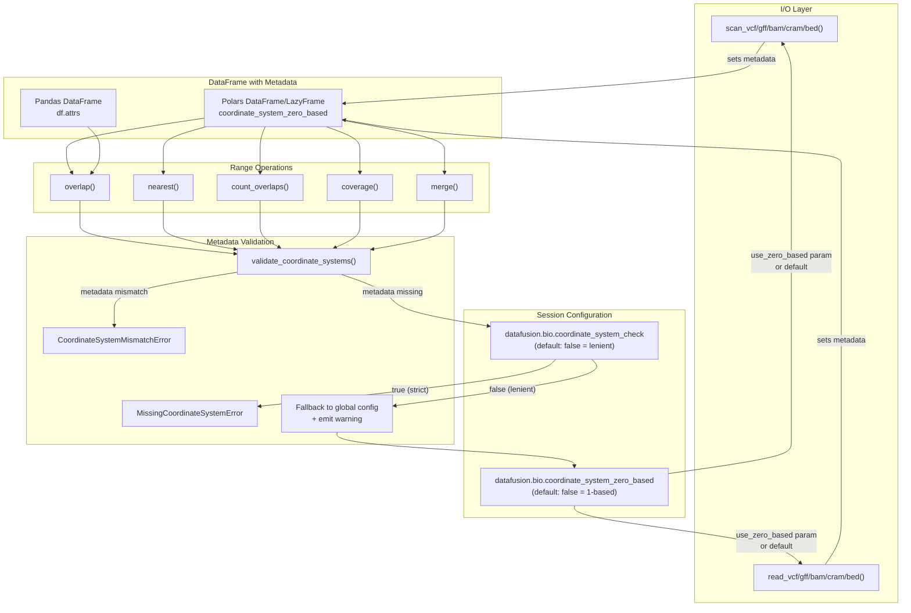
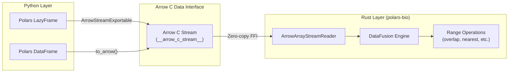

## Genomic ranges operations

| Features                                           | Bioframe           | polars-bio         | PyRanges           | Pybedtools         | PyGenomics         | GenomicRanges      |
|----------------------------------------------------|--------------------|--------------------|--------------------|--------------------|--------------------|--------------------|
| [overlap](api.md#polars_bio.overlap)               | :white_check_mark: | :white_check_mark: | :white_check_mark: | :white_check_mark: | :white_check_mark: | :white_check_mark: |
| [nearest](api.md#polars_bio.nearest)               | :white_check_mark: | :white_check_mark: | :white_check_mark: | :white_check_mark: |                    | :white_check_mark: |
| [count_overlaps](api.md#polars_bio.count_overlaps) | :white_check_mark: | :white_check_mark: | :white_check_mark: | :white_check_mark: | :white_check_mark: | :white_check_mark: |
| cluster                                            | :white_check_mark: |                    | :white_check_mark: | :white_check_mark: |                    |                    |
| [merge](api.md#polars_bio.merge)                   | :white_check_mark: | :white_check_mark: | :white_check_mark: | :white_check_mark: |                    | :white_check_mark: |
| complement                                         | :white_check_mark: | :construction:     |                    | :white_check_mark: | :white_check_mark: |                    |
| [coverage](api.md#polars_bio.coverage)             | :white_check_mark: | :white_check_mark: | :white_check_mark: | :white_check_mark: |                    | :white_check_mark: |
| [expand](api.md#polars_bio.LazyFrame.expand)       | :white_check_mark: | :white_check_mark: | :white_check_mark: | :white_check_mark: |                    | :white_check_mark: |
| [sort](api.md#polars_bio.LazyFrame.sort_bedframe)  | :white_check_mark: | :white_check_mark: | :white_check_mark: | :white_check_mark: |                    | :white_check_mark: |
| [read_table](api.md#polars_bio.read_table)         | :white_check_mark: | :white_check_mark: | :white_check_mark: | :white_check_mark: |                    | :white_check_mark: |


!!! Limitations
    For now *polars-bio* uses `int32` positions encoding for interval operations ([issue](https://github.com/dcjones/coitrees/issues/18)) meaning that it does not support operation on chromosomes longer than **2Gb**. `int64` support is planned for future releases ([issue](https://github.com/biodatageeks/polars-bio/issues/169)).

!!! tip "Memory Optimization"
    For `overlap()` operations that produce very large result sets, use the `low_memory=True` parameter to reduce peak memory consumption:

    ```python
    result = pb.overlap(df1, df2, low_memory=True)
    ```

    This enables streaming output generation that caps the output batch size, trading some performance for significantly lower memory usage.

## Coordinate systems support

polars-bio supports both **0-based half-open** and **1-based closed** coordinate systems for genomic ranges operations. By **default**, it uses **1-based closed** coordinates, which is the native format for VCF, GFF, and SAM/BAM files.

### How it works

The coordinate system is managed through **DataFrame metadata** that is set at I/O time and read by range operations. This ensures consistency throughout your analysis pipeline.



### Session parameters

polars-bio provides two session parameters to control coordinate system behavior:

| Parameter | Default | Description |
|-----------|---------|-------------|
| `datafusion.bio.coordinate_system_zero_based` | `"false"` (1-based) | Default coordinate system for I/O operations when `use_zero_based` is not specified |
| `datafusion.bio.coordinate_system_check` | `"false"` (lenient) | Whether to raise an error when DataFrame metadata is missing |

```python
import polars_bio as pb

# Check current settings
print(pb.get_option(pb.POLARS_BIO_COORDINATE_SYSTEM_ZERO_BASED))  # "false"
print(pb.get_option(pb.POLARS_BIO_COORDINATE_SYSTEM_CHECK))       # "false"

# Change to 0-based coordinates globally
pb.set_option(pb.POLARS_BIO_COORDINATE_SYSTEM_ZERO_BASED, True)
```

### Reading files with coordinate system metadata

When you read genomic files using polars-bio I/O functions, the coordinate system metadata is automatically set on the returned DataFrame:

```python
import polars_bio as pb

# Default: 1-based coordinates (use_zero_based=False)
df = pb.scan_vcf("variants.vcf")
# Metadata is automatically set: coordinate_system_zero_based=False

# Explicit 0-based coordinates
df_zero = pb.scan_bed("regions.bed", use_zero_based=True)
# Metadata is automatically set: coordinate_system_zero_based=True

# Range operations read coordinate system from metadata
result = pb.overlap(df, df_zero, ...)  # Raises CoordinateSystemMismatchError!
```

### Setting metadata on DataFrames

For DataFrames not created via polars-bio I/O functions, you must set the coordinate system metadata manually:

=== "Polars DataFrame/LazyFrame"

    ```python
    import polars as pl

    # Create a DataFrame
    df = pl.DataFrame({
        "chrom": ["chr1", "chr1"],
        "start": [100, 200],
        "end": [150, 250]
    }).lazy()

    # Set coordinate system metadata (requires polars-config-meta)
    df = df.config_meta.set(coordinate_system_zero_based=False)  # 1-based

    # Now it can be used with range operations
    result = pb.overlap(df, other_df, ...)
    ```

=== "Pandas DataFrame"

    ```python
    import pandas as pd

    # Create a DataFrame
    pdf = pd.DataFrame({
        "chrom": ["chr1", "chr1"],
        "start": [100, 200],
        "end": [150, 250]
    })

    # Set coordinate system metadata via df.attrs
    pdf.attrs["coordinate_system_zero_based"] = False  # 1-based

    # Now it can be used with range operations
    result = pb.overlap(pdf, other_df, output_type="pandas.DataFrame", ...)
    ```

### Error handling

polars-bio raises specific errors to prevent coordinate system mismatches:

#### MissingCoordinateSystemError

Raised when a DataFrame lacks coordinate system metadata:

```python
import polars as pl
import polars_bio as pb

# DataFrame without metadata
df = pl.DataFrame({"chrom": ["chr1"], "start": [100], "end": [200]}).lazy()

# This raises MissingCoordinateSystemError
pb.overlap(df, other_df, ...)
```

**How to fix:** Set metadata on your DataFrame before passing it to range operations (see examples above).

#### CoordinateSystemMismatchError

Raised when two DataFrames have different coordinate systems:

```python
import polars_bio as pb

# One DataFrame is 1-based, another is 0-based
df1 = pb.scan_vcf("file.vcf")                    # 1-based (default)
df2 = pb.scan_bed("file.bed", use_zero_based=True)  # 0-based

# This raises CoordinateSystemMismatchError
pb.overlap(df1, df2, ...)
```

**How to fix:** Ensure both DataFrames use the same coordinate system.

### Default behavior (lenient validation)

By default, polars-bio uses lenient validation (`coordinate_system_check=false`). When a DataFrame lacks coordinate system metadata, it falls back to the global configuration and emits a warning:

```python
import polars as pl
import polars_bio as pb

# DataFrames without metadata will use the global config with a warning
df = pl.DataFrame({"chrom": ["chr1"], "start": [100], "end": [200]}).lazy()
result = pb.overlap(df, other_df, ...)  # Uses global coordinate system setting
# Warning: Coordinate system metadata is missing. Using global config...
```

### Strict mode

For production pipelines where coordinate system consistency is critical, you can enable strict validation:

```python
import polars_bio as pb

# Enable strict coordinate system check
pb.set_option(pb.POLARS_BIO_COORDINATE_SYSTEM_CHECK, True)

# Now DataFrames without metadata will raise MissingCoordinateSystemError
```

!!! tip
    Enable strict mode in production pipelines to catch coordinate system mismatches early and prevent incorrect results.

### Migration from previous versions

If you're upgrading from a previous version of polars-bio:

1. **Range operations no longer accept `use_zero_based` parameter** - coordinate system is read from DataFrame metadata
2. **I/O functions use `use_zero_based` parameter** (renamed from `one_based` with inverted logic)
3. **Pandas DataFrames require explicit metadata** - set `df.attrs["coordinate_system_zero_based"]` before range operations

```python
# Before (old API)
result = pb.overlap(df1, df2, use_zero_based=True, ...)

# After (new API) - set metadata at I/O time or on DataFrames
df1 = pb.scan_vcf("file.vcf", use_zero_based=True)
df2 = pb.scan_bed("file.bed", use_zero_based=True)
result = pb.overlap(df1, df2, ...)  # Reads from metadata
```

## File Metadata

polars-bio automatically attaches comprehensive metadata to DataFrames when reading genomic files. This metadata includes format information, coordinate systems, and format-specific details like VCF header fields.

### Metadata Structure

The metadata is stored in a clean, user-friendly structure:

```python
import polars_bio as pb

lf = pb.scan_vcf("variants.vcf")
meta = pb.get_metadata(lf)

# Returns:
{
  "format": "vcf",                           # File format
  "path": "variants.vcf",                    # Source file path
  "coordinate_system_zero_based": False,     # Coordinate system (VCF is 1-based)
  "header": {
    "version": "VCFv4.2",                    # VCF version
    "sample_names": ["Sample1", "Sample2"],  # Sample names
    "info_fields": {                         # INFO field definitions
      "AF": {
        "number": "A",
        "type": "Float",
        "description": "Allele Frequency",
        "id": "AF"
      }
    },
    "format_fields": {                       # FORMAT field definitions
      "GT": {
        "number": "1",
        "type": "String",
        "description": "Genotype"
      }
    },
    "contigs": [...],                        # Contig definitions
    "filters": [...],                        # Filter definitions
    "_datafusion_table_name": "variants"     # Internal table name (for debugging)
  }
}
```

### Accessing Metadata

polars-bio provides three main functions for working with metadata:

#### 1. Get all metadata as a dictionary

```python
import polars_bio as pb

lf = pb.scan_vcf("file.vcf")
meta = pb.get_metadata(lf)

# Access different parts
print(meta["format"])                       # "vcf"
print(meta["path"])                         # "file.vcf"
print(meta["coordinate_system_zero_based"]) # False (1-based)

# Access VCF-specific fields
print(meta["header"]["version"])            # "VCFv4.2"
print(meta["header"]["sample_names"])       # ["Sample1", "Sample2"]

# Access INFO field definitions
af_field = meta["header"]["info_fields"]["AF"]
print(af_field["type"])                     # "Float"
print(af_field["description"])              # "Allele Frequency"

# Access FORMAT field definitions
gt_field = meta["header"]["format_fields"]["GT"]
print(gt_field["type"])                     # "String"
```

#### 2. Print metadata as formatted JSON

```python
import polars_bio as pb

lf = pb.scan_vcf("file.vcf")

# Print as pretty JSON
pb.print_metadata_json(lf)

# Customize indentation
pb.print_metadata_json(lf, indent=4)
```

#### 3. Print human-readable summary

```python
import polars_bio as pb

lf = pb.scan_vcf("file.vcf")
pb.print_metadata_summary(lf)
```

Output:
```
======================================================================
Metadata Summary
======================================================================

Format: vcf
Path: file.vcf
Coordinate System: 1-based

Format-specific metadata:
----------------------------------------------------------------------
  VCF Version: VCFv4.2
  Samples (3): Sample1, Sample2, Sample3
  INFO fields: 5
    - AF: Float (Allele Frequency)
    - DP: Integer (Total Depth)
    - AC: Integer (Allele Count)
  FORMAT fields: 3
    - GT: String (Genotype)
    - DP: Integer (Read Depth)
    - GQ: Integer (Genotype Quality)

======================================================================
```

### Format-Specific Metadata

Different file formats include different metadata:

=== "VCF"

    ```python
    lf = pb.scan_vcf("variants.vcf")
    meta = pb.get_metadata(lf)

    # VCF header metadata
    meta["header"]["version"]          # VCF version
    meta["header"]["sample_names"]     # Sample names
    meta["header"]["info_fields"]      # INFO field definitions
    meta["header"]["format_fields"]    # FORMAT field definitions
    meta["header"]["contigs"]          # Contig definitions
    meta["header"]["filters"]          # Filter definitions
    ```

=== "FASTQ"

    ```python
    lf = pb.scan_fastq("reads.fastq.gz")
    meta = pb.get_metadata(lf)

    # FASTQ-specific metadata
    meta["format"]                     # "fastq"
    meta["path"]                       # "reads.fastq.gz"
    meta["coordinate_system_zero_based"] # None (N/A for FASTQ)
    ```

=== "BED/BAM/GFF"

    ```python
    lf = pb.scan_bed("regions.bed")
    meta = pb.get_metadata(lf)

    # Basic metadata
    meta["format"]                     # "bed"
    meta["coordinate_system_zero_based"] # True (0-based)
    ```

### Setting Custom Metadata

You can set metadata on DataFrames created from other sources:

```python
import polars as pl
import polars_bio as pb

# Create a DataFrame
df = pl.DataFrame({
    "chrom": ["chr1", "chr1"],
    "start": [100, 200],
    "end": [150, 250]
}).lazy()

# Set metadata
pb.set_source_metadata(
    df,
    format="bed",
    path="custom.bed",
    header={"description": "Custom intervals"}
)

# Now metadata is available
meta = pb.get_metadata(df)
print(meta["format"])  # "bed"
print(meta["header"]["description"])  # "Custom intervals"
```

### Metadata Preservation

Metadata is preserved through Polars operations:

```python
lf = pb.scan_vcf("variants.vcf")

# Metadata persists after operations
filtered = lf.filter(pl.col("qual") > 30)
selected = lf.select(["chrom", "start", "end"])
limited = lf.head(100)

# All have the same metadata
meta1 = pb.get_metadata(lf)
meta2 = pb.get_metadata(filtered)
meta3 = pb.get_metadata(selected)

assert meta1["format"] == meta2["format"] == meta3["format"]  # All "vcf"
```

### Using Metadata for Debugging

The `_datafusion_table_name` field is useful for debugging DataFusion SQL queries:

```python
lf = pb.scan_vcf("variants.vcf")
meta = pb.get_metadata(lf)

# Get internal table name
table_name = meta["header"]["_datafusion_table_name"]
print(f"Table name: {table_name}")  # "variants"

# Use it in SQL queries for debugging
result = pb.sql(f"SELECT COUNT(*) FROM {table_name}")
```

### API Reference

| Function | Description |
|----------|-------------|
| [`get_metadata(df)`](api.md#polars_bio.get_metadata) | Get all metadata as a dictionary |
| [`print_metadata_json(df, indent=2)`](api.md#polars_bio.print_metadata_json) | Print metadata as formatted JSON |
| [`print_metadata_summary(df)`](api.md#polars_bio.print_metadata_summary) | Print human-readable metadata summary |
| [`set_source_metadata(df, format, path, header)`](api.md#polars_bio.set_source_metadata) | Set metadata on a DataFrame |


## API comparison between libraries
There is no standard API for genomic ranges operations in Python.
This table compares the API of the libraries. The table is not exhaustive and only shows the most common operations used in benchmarking.

| operation  | Bioframe                                                                                                | polars-bio                                 | PyRanges0                                                                                                           | PyRanges1                                                                                                     | Pybedtools                                                                                                                                    | GenomicRanges                                                                                                                                      |
|------------|---------------------------------------------------------------------------------------------------------|--------------------------------------------|---------------------------------------------------------------------------------------------------------------------|---------------------------------------------------------------------------------------------------------------|-----------------------------------------------------------------------------------------------------------------------------------------------|----------------------------------------------------------------------------------------------------------------------------------------------------|
| overlap    | [overlap](https://bioframe.readthedocs.io/en/latest/api-intervalops.html#bioframe.ops.overlap)          | [overlap](api.md#polars_bio.overlap)       | [join](https://pyranges.readthedocs.io/en/latest/autoapi/pyranges/index.html#pyranges.PyRanges.join)<sup>1</sup>    | [join_ranges](https://pyranges1.readthedocs.io/en/latest/pyranges_objects.html#pyranges.PyRanges.join_ranges) | [intersect](https://bedtools.readthedocs.io/en/latest/content/tools/intersect.html?highlight=intersect#usage-and-option-summary)<sup>2</sup>  | [find_overlaps](https://biocpy.github.io/GenomicRanges/api/genomicranges.html#genomicranges.GenomicRanges.GenomicRanges.find_overlaps)<sup>3</sup> |
| nearest    | [closest](https://bioframe.readthedocs.io/en/latest/api-intervalops.html#bioframe.ops.closest)          | [nearest](api.md#polars_bio.nearest)       | [nearest](https://pyranges.readthedocs.io/en/latest/autoapi/pyranges/index.html#pyranges.PyRanges.nearest)          | [nearest](https://pyranges1.readthedocs.io/en/latest/pyranges_objects.html#pyranges.PyRanges.nearest)         | [closest](https://daler.github.io/pybedtools/autodocs/pybedtools.bedtool.BedTool.closest.html#pybedtools.bedtool.BedTool.closest)<sup>4</sup> | [nearest](https://biocpy.github.io/GenomicRanges/api/genomicranges.html#genomicranges.GenomicRanges.GenomicRanges.nearest)<sup>5</sup>             |
| read_table | [read_table](https://bioframe.readthedocs.io/en/latest/api-fileops.html#bioframe.io.fileops.read_table) | [read_table](api.md#polars_bio.read_table) | [read_bed](https://pyranges.readthedocs.io/en/latest/autoapi/pyranges/readers/index.html#pyranges.readers.read_bed) | [read_bed](https://pyranges1.readthedocs.io/en/latest/pyranges_module.html#pyranges.read_bed)                 | [BedTool](https://daler.github.io/pybedtools/topical-create-a-bedtool.html#creating-a-bedtool)                                                | [read_bed](https://biocpy.github.io/GenomicRanges/tutorial.html#from-bioinformatic-file-formats)                                                   |

!!! note
    1. There is an [overlap](https://pyranges.readthedocs.io/en/latest/autoapi/pyranges/index.html#pyranges.PyRanges.overlap) method in PyRanges, but its output is only limited to indices of intervals from the other Dataframe that overlap.
    In Bioframe's [benchmark](https://bioframe.readthedocs.io/en/latest/guide-performance.html#vs-pyranges-and-optionally-pybedtools) also **join** method instead of overlap was used.
    2. **wa** and **wb** options used to obtain a comparable output.
    3. Output contains only a list with the same length as query, containing hits to overlapping indices. Data transformation is required to obtain the same output as in other libraries.
      Since the performance was far worse than in more efficient libraries anyway, additional data transformation was not included in the benchmark.
    4. **s=first** was used to obtain a comparable output.
    5. **select="arbitrary"** was used to obtain a comparable output.


## File formats support
For bioinformatic format there are always three methods available: `read_*` (eager), `scan_*` (lazy) and `register_*` that can be used to either read file into Polars DataFrame/LazyFrame or register it as a DataFusion table for further processing using SQL or builtin interval methods. In either case, local and or cloud storage files can be used as an input. Please refer to [cloud storage](#cloud-storage) section for more details.

| Format                                           | Single-threaded    | Parallel (indexed) | Limit pushdown     | Predicate pushdown | Projection pushdown |
|--------------------------------------------------|--------------------|--------------------|--------------------|--------------------|---------------------|
| [BED](api.md#polars_bio.data_input.read_bed)     | :white_check_mark: | ❌                  | :white_check_mark: | ❌                  | ❌                   |
| [VCF](api.md#polars_bio.data_input.read_vcf)     | :white_check_mark: | :white_check_mark: (TBI/CSI) | :white_check_mark: | :white_check_mark: | :white_check_mark: |
| [BAM](api.md#polars_bio.data_input.read_bam)     | :white_check_mark: | :white_check_mark: (BAI/CSI) | :white_check_mark: | :white_check_mark: | :white_check_mark: |
| [CRAM](api.md#polars_bio.data_input.read_cram)   | :white_check_mark: | :white_check_mark: (CRAI) | :white_check_mark: | :white_check_mark: | :white_check_mark: |
| [FASTQ](api.md#polars_bio.data_input.read_fastq) | :white_check_mark: | :white_check_mark: (GZI) | :white_check_mark: |  ❌  |  ❌   |
| [FASTA](api.md#polars_bio.data_input.read_fasta) | :white_check_mark: |  ❌  | :white_check_mark: |  ❌  |  ❌   |
| [GFF3](api.md#polars_bio.data_input.read_gff)    | :white_check_mark: | :white_check_mark: (TBI/CSI) | :white_check_mark: | :white_check_mark: | :white_check_mark:  |
| [Pairs](api.md#polars_bio.data_input.read_pairs) | :white_check_mark: | :white_check_mark: (TBI/CSI) | :white_check_mark: | :white_check_mark: | :white_check_mark:  |


### Indexed reads & predicate pushdown

When an index file is present alongside the data file (BAI/CSI for BAM, CRAI for CRAM, TBI/CSI for VCF, GFF, and Pairs), polars-bio can push genomic region filters down to the DataFusion execution layer. This enables **index-based random access** — only the relevant genomic regions are read from disk, dramatically improving performance for selective queries on large files.

Index files are **auto-discovered** by convention. Predicate pushdown is **enabled by default** for BAM, CRAM, VCF, GFF, and Pairs formats — no extra configuration is needed.

#### Supported index formats

| Data Format | Index Formats | Naming Convention |
|-------------|---------------|-------------------|
| BAM | BAI, CSI | `sample.bam.bai` or `sample.bai`, `sample.bam.csi` |
| CRAM | CRAI | `sample.cram.crai` |
| VCF (bgzf) | TBI, CSI | `sample.vcf.gz.tbi`, `sample.vcf.gz.csi` |
| GFF (bgzf) | TBI, CSI | `sample.gff.gz.tbi`, `sample.gff.gz.csi` |
| Pairs (bgzf) | TBI, CSI | `contacts.pairs.gz.tbi`, `contacts.pairs.gz.csi` |
| FASTQ (bgzf) | GZI | `sample.fastq.bgz.gzi` |

#### Usage with the scan/read API

Simply use `.filter()` — predicate pushdown is enabled by default for BAM, CRAM, VCF, GFF, and Pairs:

```python
import polars as pl
import polars_bio as pb

# Single chromosome filter — only chr1 data is read from disk
df = (
    pb.scan_bam("alignments.bam")
    .filter(pl.col("chrom") == "chr1")
    .collect()
)

# Multi-chromosome filter
df = (
    pb.scan_vcf("variants.vcf.gz")
    .filter(pl.col("chrom").is_in(["chr21", "chr22"]))
    .collect()
)

# Region query — combines chromosome and coordinate filters
df = (
    pb.scan_bam("alignments.bam")
    .filter(
        (pl.col("chrom") == "chr1")
        & (pl.col("start") >= 10000)
        & (pl.col("end") <= 50000)
    )
    .collect()
)

# CRAM with predicate pushdown
df = (
    pb.scan_cram("alignments.cram")
    .filter(pl.col("chrom") == "chr1")
    .collect()
)
```

!!! tip
    Predicate pushdown supports: equality (`==`), comparisons (`>=`, `<=`, `>`, `<`), `is_in()`, `is_null()`, `is_not_null()`, and combinations with `&` (AND). Complex predicates like `.str.contains()` or OR logic are automatically filtered client-side. To disable pushdown, pass `predicate_pushdown=False`.

#### Usage with the SQL API

The SQL path works automatically — DataFusion parses the WHERE clause and uses the index without any extra flags:

```python
import polars_bio as pb

pb.register_bam("alignments.bam", "reads")

# Single chromosome
result = pb.sql("SELECT * FROM reads WHERE chrom = 'chr1'").collect()

# Region query
result = pb.sql(
    "SELECT * FROM reads WHERE chrom = 'chr1' AND start >= 10000 AND \"end\" <= 50000"
).collect()

# Combined genomic and record filters
result = pb.sql(
    "SELECT * FROM reads WHERE chrom = 'chr1' AND mapping_quality >= 30"
).collect()
```

#### Automatic parallel partitioning

When an index file is present, DataFusion distributes genomic regions across balanced partitions using index-derived size estimates, enabling parallel
execution. Formats with known contig lengths (BAM, CRAM) can split large regions into sub-regions for full parallelism even on single-chromosome queries. For FASTQ files, a **GZI index** alongside a BGZF-compressed file enables parallel decoding of compressed blocks. This is controlled by the global `target_partitions` setting:

```python
import polars_bio as pb

pb.set_option("datafusion.execution.target_partitions", "8")
df = pb.read_bam("large_file.bam")  # 8 partitions will be used for parallel execution
df = pb.read_fastq("reads.fastq.bgz")  # parallel BGZF decoding when .gzi index is present
```

**Partitioning behavior (BAM, CRAM, VCF, GFF):**

| Index Available? | SQL Filters | Partitions |
|-----------------|-------------|------------|
| Yes | `chrom = 'chr1' AND start >= 1000` | up to target_partitions (region split into sub-regions) |
| Yes | `chrom IN ('chr1', 'chr2')` | up to target_partitions (both regions split to fill bins) |
| Yes | `mapping_quality >= 30` (no genomic filter) | up to target_partitions (all chroms balanced + split) |
| Yes | None (full scan) | up to target_partitions (all chroms balanced + split) |
| No | Any | 1 (sequential full scan) |

**Partitioning behavior (FASTQ):**

| File type | GZI Index? | Partitions |
|-----------|-----------|------------|
| BGZF (`.fastq.bgz`) | Yes (`.fastq.bgz.gzi`) | up to target_partitions (parallel block decoding) |
| BGZF (`.fastq.bgz`) | No | 1 (sequential read) |
| GZIP (`.fastq.gz`) | N/A | 1 (sequential — GZIP cannot be parallelized) |
| Uncompressed (`.fastq`) | N/A | up to target_partitions (byte-range parallel) |


#### Record-level filter pushdown

Beyond index-based region queries, all formats support **record-level predicate evaluation**. Filters on columns like `mapping_quality`, `flag`, `score`, or `strand` are evaluated as each record is read, filtering early before Arrow RecordBatch construction.

This works **with or without** an index file:

```python
import polars as pl
import polars_bio as pb

# No index needed — filters applied per-record during scan
df = (
    pb.scan_bam("alignments.bam")
    .filter((pl.col("mapping_quality") >= 30) & (pl.col("flag") & 4 == 0))
    .collect()
)

# Combine genomic region (uses index) with record filter (applied per-record)
df = (
    pb.scan_bam("alignments.bam")
    .filter(
        (pl.col("chrom") == "chr1")
        & (pl.col("start") >= 1000000)
        & (pl.col("mapping_quality") >= 30)
    )
    .collect()
)
```

#### Projection pushdown

BAM, CRAM, VCF, and Pairs formats support **parsing-level projection pushdown**. When you select a subset of columns, unprojected fields are skipped entirely during record parsing — no string formatting, sequence decoding, map lookups, or memory allocation for those fields. This can significantly reduce I/O and CPU time, especially for wide schemas like BAM (11+ columns) where you only need a few fields.

Projection pushdown is **enabled by default** (`projection_pushdown=True`) on all `scan_*`/`read_*` calls and range operations. To disable it, pass `projection_pushdown=False`.

```python
import polars_bio as pb

# Only name and chrom are parsed from each BAM record (projection pushdown is on by default)
df = (
    pb.scan_bam("alignments.bam")
    .select(["name", "chrom"])
    .collect()
)

# Works the same for CRAM and VCF
df = pb.scan_cram("alignments.cram").select(["name", "chrom"]).collect()

# Works with SQL too — only referenced columns are parsed
pb.register_vcf("variants.vcf.gz", "variants")
result = pb.sql("SELECT chrom, start FROM variants").collect()
```

You can verify pushdown is active by inspecting the physical execution plan:

```python
from polars_bio.context import ctx
from polars_bio.polars_bio import (
    InputFormat, ReadOptions, BamReadOptions,
    py_register_table, py_read_table,
)

read_options = ReadOptions(bam_read_options=BamReadOptions())
table = py_register_table(ctx, "alignments.bam", None, InputFormat.Bam, read_options)
df = py_read_table(ctx, table.name).select_columns("name", "chrom")
print(df.execution_plan())
# CooperativeExec
#   BamExec: projection=[name, chrom]    <-- only 2 of 11 columns parsed
```

!!! tip
    `COUNT(*)` queries also benefit — when no columns are needed, the empty projection path avoids parsing any fields while still counting records correctly.

#### Index file generation

!!! tip "Creating index files"
    Create index files using standard bioinformatics tools:

    ```bash
    # BAM: sort and index
    samtools sort input.bam -o sorted.bam
    samtools index sorted.bam                # creates sorted.bam.bai

    # CRAM: sort and index
    samtools sort input.cram -o sorted.cram --reference ref.fa
    samtools index sorted.cram               # creates sorted.cram.crai

    # VCF: sort, compress, and index
    bcftools sort input.vcf -Oz -o sorted.vcf.gz
    bcftools index -t sorted.vcf.gz          # creates sorted.vcf.gz.tbi

    # GFF: sort, compress, and index
    (grep "^#" input.gff; grep -v "^#" input.gff | sort -k1,1 -k4,4n) | bgzip > sorted.gff.gz
    tabix -p gff sorted.gff.gz               # creates sorted.gff.gz.tbi

    # Pairs: sort, compress, and index (col 2=chr1, col 3=pos1)
    sort -k2,2 -k3,3n contacts.pairs | bgzip > contacts.pairs.gz
    tabix -s 2 -b 3 -e 3 contacts.pairs.gz   # creates contacts.pairs.gz.tbi

    # FASTQ: BGZF compress and create GZI index for parallel reads
    bgzip reads.fastq                         # creates reads.fastq.bgz
    bgzip -r reads.fastq.bgz                 # creates reads.fastq.bgz.gzi
    ```


## File Output

polars-bio supports writing DataFrames back to bioinformatic file formats. Two methods are available for each supported format:

- `write_*` - Eager write that collects the DataFrame and writes it to disk, returns row count
- `sink_*` - Streaming write for LazyFrames that processes data in batches without full materialization

### Output Format Support

| Format | write_* | sink_* | Compression | Notes |
|--------|---------|--------|-------------|-------|
| [VCF](api.md#polars_bio.data_output.write_vcf) | :white_check_mark: | :white_check_mark: | `.vcf.gz`, `.vcf.bgz` | Auto-detected from extension |
| [BAM](api.md#polars_bio.data_output.write_bam) | :white_check_mark: | :white_check_mark: | BGZF (built-in) | Binary alignment format |
| [SAM](api.md#polars_bio.data_output.write_sam) | :white_check_mark: | :white_check_mark: | None | Plain text alignment format |
| [CRAM](api.md#polars_bio.data_output.write_cram) | :white_check_mark: | :white_check_mark: | Built-in | Requires reference FASTA |
| [FASTQ](api.md#polars_bio.data_output.write_fastq) | :white_check_mark: | :white_check_mark: | `.fastq.gz`, `.fastq.bgz` | Auto-detected from extension |

### Basic Usage

```python
import polars_bio as pb

# Read, transform, and write back
df = pb.read_bam("input.bam", tag_fields=["NM", "AS"])
filtered = df.filter(pl.col("mapping_quality") > 20)
pb.write_bam(filtered, "output.bam")

# Streaming write with LazyFrame
lf = pb.scan_vcf("variants.vcf")
pb.sink_vcf(lf.filter(pl.col("qual") > 30), "filtered.vcf.bgz")
```

### Sorted Output with `sort_on_write`

BAM, SAM, and CRAM write functions support the `sort_on_write` parameter to produce coordinate-sorted output:

```python
import polars_bio as pb

# Write coordinate-sorted BAM
df = pb.read_bam("unsorted.bam")
pb.write_bam(df, "sorted.bam", sort_on_write=True)

# Streaming sorted write
lf = pb.scan_sam("input.sam")
pb.sink_bam(lf, "sorted.bam", sort_on_write=True)
```

When `sort_on_write=True`:

- Records are sorted by `(chrom ASC, start ASC)` during write
- Output header contains `@HD ... SO:coordinate`

When `sort_on_write=False` (default):

- Records are written in input order
- Output header contains `@HD ... SO:unsorted`

### CRAM Output

CRAM format requires a reference FASTA file for writing:

```python
import polars_bio as pb

# CRAM write requires reference_path
df = pb.read_cram("input.cram", reference_path="reference.fa")
pb.write_cram(df, "output.cram", reference_path="reference.fa")

# Streaming CRAM write
lf = pb.scan_cram("input.cram", reference_path="reference.fa")
pb.sink_cram(lf, "output.cram", reference_path="reference.fa", sort_on_write=True)
```

!!! warning
    The `reference_path` parameter is **required** for `write_cram()` and `sink_cram()`. Attempting to write CRAM without a reference will raise an error.

### Output Compression

Output compression is auto-detected from the file extension for VCF and FASTQ formats:

| Extension | Compression |
|-----------|-------------|
| `.vcf` / `.fastq` | None (plain text) |
| `.vcf.gz` / `.fastq.gz` | GZIP |
| `.vcf.bgz` / `.fastq.bgz` | BGZF (block gzip) |

```python
import polars_bio as pb

# VCF
df = pb.read_vcf("variants.vcf")
pb.write_vcf(df, "output.vcf")        # plain text
pb.write_vcf(df, "output.vcf.gz")     # GZIP
pb.write_vcf(df, "output.vcf.bgz")    # BGZF (recommended for indexing)

# FASTQ
df = pb.read_fastq("reads.fastq")
pb.write_fastq(df, "output.fastq")       # plain text
pb.write_fastq(df, "output.fastq.gz")    # GZIP
pb.write_fastq(df, "output.fastq.bgz")   # BGZF (recommended for parallel reads with GZI index)

# Streaming write
lf = pb.scan_fastq("large_reads.fastq.gz")
pb.sink_fastq(lf.limit(1000), "sample.fastq")
```

### Header Preservation

When reading and writing alignment files (BAM/SAM/CRAM), polars-bio preserves header metadata including:

- `@SQ` (sequence dictionary)
- `@RG` (read groups)
- `@PG` (program records)

This enables lossless roundtrip workflows:

```python
import polars_bio as pb

# Read with full header preservation
df = pb.read_bam("input.bam")

# Filter records
filtered = df.filter(pl.col("mapping_quality") > 20)

# Write back - header metadata is preserved
pb.write_bam(filtered, "filtered.bam")
```

### Polars Extension Methods

Write functions are also available as Polars namespace extensions:

```python
import polars_bio as pb

# DataFrame extensions
df = pb.read_bam("input.bam")
df.pb.write_bam("output.bam", sort_on_write=True)
df.pb.write_sam("output.sam")
df.pb.write_cram("output.cram", reference_path="ref.fa")
df.pb.write_vcf("output.vcf.bgz")
df.pb.write_fastq("output.fastq.gz")

# LazyFrame extensions
lf = pb.scan_bam("input.bam")
lf.pb.sink_bam("output.bam", sort_on_write=True)
lf.pb.sink_sam("output.sam")
lf.pb.sink_cram("output.cram", reference_path="ref.fa")
lf.pb.sink_vcf("output.vcf.bgz")
lf.pb.sink_fastq("output.fastq.bgz")
```


## SQL-powered data processing
polars-bio provides a SQL-like API for bioinformatic data querying or manipulation.
Check [SQL reference](https://datafusion.apache.org/user-guide/sql/index.html) for more details.

```python
import polars_bio as pb
pb.register_vcf("gs://gcp-public-data--gnomad/release/4.1/genome_sv/gnomad.v4.1.sv.sites.vcf.gz", "gnomad_sv", info_fields=["SVTYPE", "SVLEN"])
pb.sql("SELECT * FROM gnomad_sv WHERE SVTYPE = 'DEL' AND SVLEN > 1000").limit(3).collect()
```

### Accessing registered tables

You can access registered tables programmatically using the `ctx.table()` method, which returns a DataFusion DataFrame:

```python
import polars_bio as pb
from polars_bio.context import ctx

# Register a file as a table
pb.register_vcf("variants.vcf", name="my_variants")

# Get the table as a DataFusion DataFrame
df = ctx.table("my_variants")

# Access the Arrow schema (includes coordinate system metadata)
schema = df.schema()
print(schema.metadata)  # {b'bio.coordinate_system_zero_based': b'false'}

# Execute queries on the DataFrame
result = df.filter(df["chrom"] == "chr1").collect()
```

!!! tip
    The `ctx.table()` method is useful for:

    1. Accessing Arrow schema metadata (including coordinate system information)
    2. Using the DataFusion DataFrame API directly
    3. Integrating with other DataFusion-based tools

### Schema Inspection

Quickly inspect BAM/CRAM file schemas without reading the entire file:

```python
import polars_bio as pb

# Get schema information for BAM file
schema = pb.describe_bam("file.bam")
print(schema)
# shape: (11, 2)
# ┌─────────────────┬──────────┐
# │ column          ┆ datatype │
# │ ---             ┆ ---      │
# │ str             ┆ str      │
# ╞═════════════════╪══════════╡
# │ name            ┆ String   │
# │ chrom           ┆ String   │
# │ start           ┆ UInt32   │
# ...

# Include tag columns in schema
schema = pb.describe_bam("file.bam", tag_fields=["NM", "AS", "MD"])
print(schema)  # Shows 14 columns including tags

# CRAM schema
schema = pb.describe_cram("file.cram")
```

### BAM Optional Tags

polars-bio supports reading BAM optional alignment tags as individual columns. Tags are only parsed when explicitly requested, ensuring zero overhead for standard reads.

> **Note**: CRAM tag support is planned for a future release. The `tag_fields` parameter is accepted for CRAM functions but currently ignored with a warning.

#### Usage

```python
import polars_bio as pb

# Read BAM with specific tags
df = pb.read_bam(
    "alignments.bam",
    tag_fields=["NM", "AS", "MD"]  # Edit distance, alignment score, mismatch string
)

# Tags appear as regular columns
print(df.select(["name", "chrom", "NM", "AS"]))

# Lazy scan with tag filtering
lf = pb.scan_bam("alignments.bam", tag_fields=["NM", "AS"])
high_quality = lf.filter((pl.col("NM") <= 2) & (pl.col("AS") >= 100)).collect()

# SQL queries (tags must be quoted)
pb.register_bam("alignments.bam", "reads", tag_fields=["NM", "RG"])
result = pb.sql('SELECT name, "NM" FROM reads WHERE "NM" <= 2').collect()
```

#### Common Tags

- **NM** (Int32): Edit distance to reference
- **MD** (Utf8): Mismatch positions string
- **AS** (Int32): Alignment score
- **XS** (Int32): Secondary alignment score
- **RG** (Utf8): Read group identifier
- **CB** (Utf8): Cell barcode (single-cell)
- **UB** (Utf8): UMI barcode (single-cell)

Full registry includes ~40 common SAM tags.

#### Performance

- Zero overhead when `tag_fields=None` (default)
- Projection pushdown: only selected tags are parsed
- Tags parsed once per batch, not per record

```shell
shape: (3, 10)
┌───────┬───────┬───────┬────────────────────────────────┬───┬───────┬────────────┬────────┬───────┐
│ chrom ┆ start ┆ end   ┆ id                             ┆ … ┆ qual  ┆ filter     ┆ svtype ┆ svlen │
│ ---   ┆ ---   ┆ ---   ┆ ---                            ┆   ┆ ---   ┆ ---        ┆ ---    ┆ ---   │
│ str   ┆ u32   ┆ u32   ┆ str                            ┆   ┆ f64   ┆ str        ┆ str    ┆ i32   │
╞═══════╪═══════╪═══════╪════════════════════════════════╪═══╪═══════╪════════════╪════════╪═══════╡
│ chr1  ┆ 22000 ┆ 30000 ┆ gnomAD-SV_v3_DEL_chr1_fa103016 ┆ … ┆ 999.0 ┆ HIGH_NCR   ┆ DEL    ┆ 8000  │
│ chr1  ┆ 40000 ┆ 47000 ┆ gnomAD-SV_v3_DEL_chr1_b26f63f7 ┆ … ┆ 145.0 ┆ PASS       ┆ DEL    ┆ 7000  │
│ chr1  ┆ 79086 ┆ 88118 ┆ gnomAD-SV_v3_DEL_chr1_733c4ef0 ┆ … ┆ 344.0 ┆ UNRESOLVED ┆ DEL    ┆ 9032  │
└───────┴───────┴───────┴────────────────────────────────┴───┴───────┴────────────┴────────┴───────┘

```

You can use [view](api.md/#polars_bio.register_view) mechanism to create a virtual table from a DataFrame that contain preprocessing steps and reuse it in multiple steps.
To avoid materializing the intermediate results in memory, you can run your processing in  [streaming](features.md#streaming) mode.


## Parallel engine 🏎️
It is straightforward to parallelize operations in polars-bio. The library is built on top of [Apache DataFusion](https://datafusion.apache.org/)  you can set
the degree of parallelism using the `datafusion.execution.target_partitions` option, e.g.:
```python
import polars_bio as pb
pb.set_option("datafusion.execution.target_partitions", "8")
```
!!! tip
    1. The default value is **1** (parallel execution disabled).
    2. The `datafusion.execution.target_partitions` option is a global setting and affects all operations in the current session.
    3. Check [available strategies](performance.md#parallel-execution-and-scalability) for optimal performance.
    4. See  the other configuration settings in the Apache DataFusion [documentation](https://datafusion.apache.org/user-guide/configs.html).


## Cloud storage ☁️
polars-bio supports direct streamed reading from cloud storages (e.g. S3, GCS) enabling processing large-scale genomics data without materializing in memory.
It is built upon the [OpenDAL](https://opendal.apache.org/) project, a unified data access layer for cloud storage, which allows to read  bioinformatic file formats from various cloud storage providers. For Apache DataFusion **native** file formats, such as Parquet or CSV please
refer to [DataFusion user guide](https://datafusion.apache.org/user-guide/cli/datasources.html#locations).


### Example
```python
import polars_bio as pb
## Register VCF files from Google Cloud Storage that will be streamed - no need to download them to the local disk, size ~0.8TB
pb.register_vcf("gs://gcp-public-data--gnomad/release/2.1.1/liftover_grch38/vcf/genomes/gnomad.genomes.r2.1.1.sites.liftover_grch38.vcf.bgz", "gnomad_big", allow_anonymous=True)
pb.register_vcf("gs://gcp-public-data--gnomad/release/4.1/genome_sv/gnomad.v4.1.sv.sites.vcf.gz", "gnomad_sv", allow_anonymous=True)
pb.overlap("gnomad_sv", "gnomad_big", streaming=True).sink_parquet("/tmp/overlap.parquet")
```
It is  especially useful when combined with [SQL](features.md#sql-powered-data-processing) support for preprocessing and [streaming](features.md#streaming) processing capabilities.

!!! tip
    If you access cloud storage with authentication provided, please make sure the `allow_anonymous` parameter is set to `False` in the read/describe/register_table functions.

### Supported features

| Feature                         | AWS S3             | Google Cloud Storage | Azure Blob Storage |
|---------------------------------|--------------------|----------------------|--------------------|
| Anonymous access                | :white_check_mark: | :white_check_mark:   |                    |
| Authenticated access            | :white_check_mark: | :white_check_mark:   | :white_check_mark: |
| Requester Pays                  | :white_check_mark: |                      |                    |
| Concurrent requests<sup>1</sup> |                    | :white_check_mark:   |                    |
| Streaming reads                 | :white_check_mark: | :white_check_mark:   | :white_check_mark: |

!!! note
    <sup>1</sup>For more information on concurrent requests and block size tuning please refer to [issue](https://github.com/biodatageeks/polars-bio/issues/132#issuecomment-2967687947).

### AWS S3 configuration
Supported environment variables:

| Variable                          | Description                                                 |
|-----------------------------------|-------------------------------------------------------------|
| AWS_ACCESS_KEY_ID                 | AWS access key ID for authenticated access to S3.           |
| AWS_SECRET_ACCESS_KEY             | AWS secret access key for authenticated access to S3.       |
| AWS_ENDPOINT_URL                  | Custom S3 endpoint URL for accessing S3-compatible storage. |
| AWS_REGION  or AWS_DEFAULT_REGION | AWS region for accessing S3.                                |

### Google Cloud Storage configuration

Supported environment variables:

| Variable                       | Description                                                                        |
|--------------------------------|------------------------------------------------------------------------------------|
| GOOGLE_APPLICATION_CREDENTIALS | Path to the Google Cloud service account key file for authenticated access to GCS. |

### Azure Blob Storage configuration
Supported environment variables:

| Variable              | Description                                                                |
|-----------------------|----------------------------------------------------------------------------|
| AZURE_STORAGE_ACCOUNT | Azure Storage account name for authenticated access to Azure Blob Storage. |
| AZURE_STORAGE_KEY     | Azure Storage account key for authenticated access to Azure Blob Storage.  |
| AZURE_ENDPOINT_URL    | Azure Blob Storage endpoint URL for accessing Azure Blob Storage.          |

## Streaming 🚂
polars-bio supports out-of-core processing with Apache DataFusion async [streams](https://docs.rs/datafusion/46.0.0/datafusion/physical_plan/trait.ExecutionPlan.html#tymethod.execute) and Polars LazyFrame [streaming](https://docs.pola.rs/user-guide/concepts/_streaming/) option.
It can bring  significant speedup as well reduction in memory usage allowing to process large datasets that do not fit in memory.
See our benchmark [results](performance.md#calculate-overlaps-and-export-to-a-csv-file-7-8).
There are 2 ways of using streaming mode:

1. By setting the `output_type` to `datafusion.DataFrame` and using the Python DataFrame [API](https://datafusion.apache.org/python/autoapi/datafusion/dataframe/index.html), including methods such as [count](https://datafusion.apache.org/python/autoapi/datafusion/dataframe/index.html#datafusion.dataframe.DataFrame.count), [write_parquet](https://datafusion.apache.org/python/autoapi/datafusion/dataframe/index.html#datafusion.dataframe.DataFrame.write_parquet) or [write_csv](https://datafusion.apache.org/python/autoapi/datafusion/dataframe/index.html#datafusion.dataframe.DataFrame.write_csv) or [write_json](https://datafusion.apache.org/python/autoapi/datafusion/dataframe/index.html#datafusion.dataframe.DataFrame.write_json). In this option you completely bypass the polars streaming engine.

    ```python
    import polars_bio as pb
    import polars as pl
    pb.overlap("/tmp/gnomad.v4.1.sv.sites.parquet", "/tmp/gnomad.exomes.v4.1.sites.chr1.parquet", output_type="datafusion.DataFrame").write_parquet("/tmp/overlap.parquet")
    pl.scan_parquet("/tmp/overlap.parquet").collect().count()
   ```
   ```shell
    shape: (1, 6)
    ┌────────────┬────────────┬────────────┬────────────┬────────────┬────────────┐
    │ chrom_1    ┆ start_1    ┆ end_1      ┆ chrom_2    ┆ start_2    ┆ end_2      │
    │ ---        ┆ ---        ┆ ---        ┆ ---        ┆ ---        ┆ ---        │
    │ u32        ┆ u32        ┆ u32        ┆ u32        ┆ u32        ┆ u32        │
    ╞════════════╪════════════╪════════════╪════════════╪════════════╪════════════╡
    │ 2629727337 ┆ 2629727337 ┆ 2629727337 ┆ 2629727337 ┆ 2629727337 ┆ 2629727337 │
    └────────────┴────────────┴────────────┴────────────┴────────────┴────────────┘
   ```

    !!! tip
        If you only need to write the results as fast as possible into one of the above file formats or quickly get the row count, then it is in the most cases the **best** option.


2. Using polars new streaming engine:

    ```python
    import os
    import polars_bio as pb
    os.environ['BENCH_DATA_ROOT'] = "/Users/mwiewior/research/data/databio"
    os.environ['POLARS_VERBOSE'] = "1"

    cols=["contig", "pos_start", "pos_end"]
    BENCH_DATA_ROOT = os.getenv('BENCH_DATA_ROOT', '/data/bench_data/databio')
    df_1 = f"{BENCH_DATA_ROOT}/exons/*.parquet"
    df_2 =  f"{BENCH_DATA_ROOT}/exons/*.parquet"
    pb.overlap(df_1, df_2, cols1=cols, cols2=cols).collect(engine="streaming").limit()
    ```

    ```bash
    1652814rows [00:00, 20208793.67rows/s]
    [MultiScanState]: Readers disconnected
    polars-stream: done running graph phase
    polars-stream: updating graph state
    shape: (5, 6)
    ┌──────────┬─────────────┬───────────┬──────────┬─────────────┬───────────┐
    │ contig_1 ┆ pos_start_1 ┆ pos_end_1 ┆ contig_2 ┆ pos_start_2 ┆ pos_end_2 │
    │ ---      ┆ ---         ┆ ---       ┆ ---      ┆ ---         ┆ ---       │
    │ str      ┆ i32         ┆ i32       ┆ str      ┆ i32         ┆ i32       │
    ╞══════════╪═════════════╪═══════════╪══════════╪═════════════╪═══════════╡
    │ chr1     ┆ 11873       ┆ 12227     ┆ chr1     ┆ 11873       ┆ 12227     │
    │ chr1     ┆ 12612       ┆ 12721     ┆ chr1     ┆ 12612       ┆ 12721     │
    │ chr1     ┆ 13220       ┆ 14409     ┆ chr1     ┆ 13220       ┆ 14409     │
    │ chr1     ┆ 13220       ┆ 14409     ┆ chr1     ┆ 14361       ┆ 14829     │
    │ chr1     ┆ 14361       ┆ 14829     ┆ chr1     ┆ 13220       ┆ 14409     │
    └──────────┴─────────────┴───────────┴──────────┴─────────────┴───────────┘
    ```

Parallellism can be controlled using the `datafusion.execution.target_partitions`option as described in the [parallel engine](features.md#parallel-engine-🏎️) section (compare the row/s metric in the following examples).

   ```python
    pb.set_option("datafusion.execution.target_partitions", "1")
    pb.overlap(df_1, df_2, cols1=cols, cols2=cols).collect(engine="streaming").count()

   ```
   ```shell
    1652814rows [00:00, 19664163.99rows/s]
    shape: (1, 6)
    ┌──────────┬─────────────┬───────────┬──────────┬─────────────┬───────────┐
    │ contig_1 ┆ pos_start_1 ┆ pos_end_1 ┆ contig_2 ┆ pos_start_2 ┆ pos_end_2 │
    │ ---      ┆ ---         ┆ ---       ┆ ---      ┆ ---         ┆ ---       │
    │ u32      ┆ u32         ┆ u32       ┆ u32      ┆ u32         ┆ u32       │
    ╞══════════╪═════════════╪═══════════╪══════════╪═════════════╪═══════════╡
    │ 1652814  ┆ 1652814     ┆ 1652814   ┆ 1652814  ┆ 1652814     ┆ 1652814   │
    └──────────┴─────────────┴───────────┴──────────┴─────────────┴───────────┘
   ```
   ```python
    pb.set_option("datafusion.execution.target_partitions", "2")
    pb.overlap(df_1, df_2, cols1=cols, cols2=cols).collect(engine="streaming").count()
   ```

   ```shell
    1652814rows [00:00, 27841987.75rows/s]
    shape: (1, 6)
    ┌──────────┬─────────────┬───────────┬──────────┬─────────────┬───────────┐
    │ contig_1 ┆ pos_start_1 ┆ pos_end_1 ┆ contig_2 ┆ pos_start_2 ┆ pos_end_2 │
    │ ---      ┆ ---         ┆ ---       ┆ ---      ┆ ---         ┆ ---       │
    │ u32      ┆ u32         ┆ u32       ┆ u32      ┆ u32         ┆ u32       │
    ╞══════════╪═════════════╪═══════════╪══════════╪═════════════╪═══════════╡
    │ 1652814  ┆ 1652814     ┆ 1652814   ┆ 1652814  ┆ 1652814     ┆ 1652814   │
    └──────────┴─────────────┴───────────┴──────────┴─────────────┴───────────┘
   ```

## Compression
*polars-bio* supports **GZIP** (default file extension `*.gz`) and **Block GZIP** (BGZIP, default file extension `*.bgz`) when reading files from local and cloud storages.
For BGZIP-compressed FASTQ files, parallel decoding of compressed blocks is **automatic** — see [Automatic parallel partitioning](#automatic-parallel-partitioning) and [Index file generation](#index-file-generation) for details. Please take a look at the following [GitHub discussion](https://github.com/biodatageeks/polars-bio/issues/132).


## DataFrames support
| I/O              | Bioframe           | polars-bio             | PyRanges           | Pybedtools | PyGenomics | GenomicRanges          |
|------------------|--------------------|------------------------|--------------------|------------|------------|------------------------|
| Pandas DataFrame | :white_check_mark: | :white_check_mark:     | :white_check_mark: |            |            | :white_check_mark:     |
| Polars DataFrame |                    | :white_check_mark:     |                    |            |            | :white_check_mark:     |
| Polars LazyFrame |                    | :white_check_mark:     |                    |            |            |                        |
| Native readers   |                    | :white_check_mark:     |                    |            |            |                        |

## Polars Integration

polars-bio leverages deep integration with Polars through the [Arrow C Data Interface](https://arrow.apache.org/docs/format/CDataInterface.html), enabling high-performance zero-copy data exchange between Polars LazyFrames and the Rust-based genomic range operations engine.

### Architecture



### How It Works

When you pass a Polars LazyFrame to range operations like `overlap()` or `nearest()`:

1. **Stream Export**: The LazyFrame exports itself as an Arrow C Stream via `collect_batches(lazy=True)._inner.__arrow_c_stream__()` (Polars >= 1.37.0)
2. **Zero-Copy Transfer**: The stream pointer is passed directly to Rust - no data copying or Python object conversion
3. **GIL-Free Execution**: Once the stream is exported, all data processing happens in Rust without holding Python's GIL
4. **Streaming Execution**: Data flows through DataFusion's streaming engine, processing batches on-demand

### Performance Benefits

| Aspect | Previous Approach | Arrow C Stream |
|--------|------------------|----------------|
| GIL acquisition | Per batch | Once at export |
| Data conversion | Polars → PyArrow → Arrow | Direct FFI |
| Memory overhead | Python iterator objects | None |
| Batch processing | Python `__next__()` calls | Native Rust iteration |

### Requirements

- **Polars >= 1.37.0** (required for `ArrowStreamExportable`)

### Batch Size Configuration

polars-bio automatically synchronizes the batch size between Polars streaming and DataFusion execution. When you set `datafusion.execution.batch_size`, Polars' `collect_batches()` will use the same chunk size:

```python
import polars_bio as pb

# Set batch size for both Polars and DataFusion
pb.set_option("datafusion.execution.batch_size", "8192")

# Now LazyFrame streaming uses 8192-row batches
# This ensures consistent memory usage and processing patterns
```

| Setting | Effect |
|---------|--------|
| `datafusion.execution.batch_size` | Controls batch size for both Polars streaming export and DataFusion processing |
| Default | 8192 rows (synchronized between Polars and DataFusion) |
| `"65536"` | Larger batches for high-throughput scenarios |

!!! tip
    Matching batch sizes between Polars and DataFusion improves cache locality and reduces memory fragmentation when processing large datasets.

### Example

```python
import polars as pl
import polars_bio as pb

# Create a LazyFrame from a large file
lf1 = pl.scan_parquet("variants.parquet")
lf2 = pl.scan_parquet("regions.parquet")

# Set coordinate system metadata
lf1 = lf1.config_meta.set(coordinate_system_zero_based=True)
lf2 = lf2.config_meta.set(coordinate_system_zero_based=True)

# Range operation uses Arrow C Stream for efficient data transfer
result = pb.overlap(
    lf1, lf2,
    cols1=["chrom", "start", "end"],
    cols2=["chrom", "start", "end"],
    output_type="polars.LazyFrame"
)

# Execute with Polars streaming engine
result.collect(engine="streaming")
```
