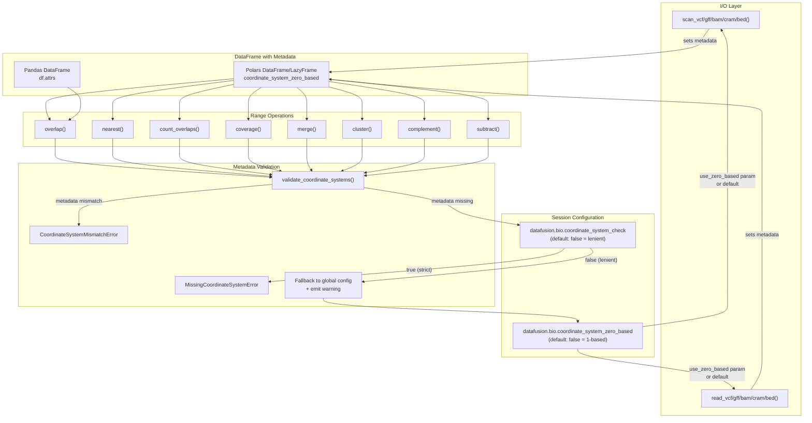

# Reading files

This page covers how polars-bio loads bioinformatics files — the supported formats, the performance machinery shared across them (indexed reads, predicate/projection pushdown, parallel reads), per-format specifics, coordinate-system handling, and the metadata attached to every DataFrame. Files can be read from local disk or streamed directly from [cloud storage](cloud.md#cloud-storage).

**On this page:** [File formats](#file-formats-support) · [Performance features](#performance-features) · [Format-specific notes](#format-specific-notes) · [Schema inspection](#schema-inspection) · [Coordinate systems](#coordinate-systems-support) · [File metadata](#file-metadata)

## File formats support

For every bioinformatic format there are always three methods available: `read_*` (eager), `scan_*` (lazy) and `register_*` that can be used to either read the file into a Polars DataFrame/LazyFrame or register it as a DataFusion table for further processing using SQL or built-in interval methods. In either case, local and/or cloud storage files can be used as an input. Please refer to the [cloud storage](cloud.md#cloud-storage) section for more details.

!!! tip "Prefer lazy scans"
    Reach for `scan_*` over `read_*` whenever you can. A lazy scan lets polars-bio push filters and
    column projections down into the reader (and use indexes where available), so only the data you
    actually need is decoded and materialized. See
    [Benchmarking DataFrame paths in polars-bio](../blog/posts/dataframe-paths-benchmark-2026-04.md)
    for a quantitative comparison of the input and execution paths.

The matrix below summarizes which [performance features](#performance-features) each format supports. Format-specific options and behaviors are documented under [format-specific notes](#format-specific-notes).

| Format                                           | Single-threaded    | Parallel (indexed) | Limit pushdown     | Predicate pushdown | Projection pushdown |
|--------------------------------------------------|--------------------|--------------------|--------------------|--------------------|---------------------|
| [BED](../api/reading.md#polars_bio.data_input.read_bed)     | :white_check_mark: | ❌                  | :white_check_mark: | ❌                  | ❌                   |
| [VCF](../api/reading.md#polars_bio.data_input.read_vcf)     | :white_check_mark: | :white_check_mark: (TBI/CSI) | :white_check_mark: | :white_check_mark: | :white_check_mark: |
| [VCF Zarr](../api/reading.md#polars_bio.data_input.read_vcf_zarr) | :white_check_mark: | :white_check_mark: (region index) | ❌ | :white_check_mark: | :white_check_mark: |
| [BAM](../api/reading.md#polars_bio.data_input.read_bam)     | :white_check_mark: | :white_check_mark: (BAI/CSI) | :white_check_mark: | :white_check_mark: | :white_check_mark: |
| [CRAM](../api/reading.md#polars_bio.data_input.read_cram)   | :white_check_mark: | :white_check_mark: (CRAI) | :white_check_mark: | :white_check_mark: | :white_check_mark: |
| [FASTQ](../api/reading.md#polars_bio.data_input.read_fastq) | :white_check_mark: | :white_check_mark: (GZI) | :white_check_mark: |  ❌  |  ❌   |
| [FASTA](../api/reading.md#polars_bio.data_input.read_fasta) | :white_check_mark: |  ❌  | :white_check_mark: |  ❌  |  ❌   |
| [GFF3](../api/reading.md#polars_bio.data_input.read_gff)    | :white_check_mark: | :white_check_mark: (TBI/CSI) | :white_check_mark: | :white_check_mark: | :white_check_mark:  |
| [GTF](../api/reading.md#polars_bio.data_input.read_gtf)     | :white_check_mark: | ❌                  | :white_check_mark: | :white_check_mark: | :white_check_mark:  |
| [Pairs](../api/reading.md#polars_bio.data_input.read_pairs) | :white_check_mark: | :white_check_mark: (TBI/CSI) | :white_check_mark: | :white_check_mark: | :white_check_mark:  |
| [BigWig](../api/reading.md#polars_bio.data_input.read_bigwig) | :white_check_mark: | ❌ | ❌ | :white_check_mark: | :white_check_mark: |
| [BigBed](../api/reading.md#polars_bio.data_input.read_bigbed) | :white_check_mark: | ❌ | ❌ | :white_check_mark: | :white_check_mark: |

## Performance features

polars-bio applies the same performance machinery — indexing, pushdown, and parallel reads — across most formats. The [capability matrix](#file-formats-support) above shows which format supports what; this section explains each feature and how to use it.

### Indexed reads & random access

When an index file is present alongside the data file (BAI/CSI for BAM, CRAI for CRAM, TBI/CSI for VCF, GFF, and Pairs), polars-bio can push genomic region filters down to the DataFusion execution layer. This enables **index-based random access** — only the relevant genomic regions are read from disk, dramatically improving performance for selective queries on large files.

Index files are **auto-discovered** by convention. Predicate pushdown is **enabled by default** for BAM, CRAM, VCF, GFF, and Pairs formats — no extra configuration is needed.

#### Supported index formats

| Data Format | Index Formats | Naming Convention |
|-------------|---------------|-------------------|
| BAM | BAI, CSI | `sample.bam.bai` or `sample.bai`, `sample.bam.csi` |
| CRAM | CRAI | `sample.cram.crai` |
| VCF (bgzf) | TBI, CSI | `sample.vcf.gz.tbi`, `sample.vcf.gz.csi` |
| GFF (bgzf) | TBI, CSI | `sample.gff.gz.tbi`, `sample.gff.gz.csi` |
| Pairs (bgzf) | TBI, CSI | `contacts.pairs.gz.tbi`, `contacts.pairs.gz.csi` |
| FASTQ (bgzf) | GZI | `sample.fastq.bgz.gzi` |

#### Region queries with the DataFrame API

Simply use `.filter()` — predicate pushdown is enabled by default for BAM, CRAM, VCF, GFF, and Pairs:

```python
import polars as pl
import polars_bio as pb

# Single chromosome filter — only chr1 data is read from disk
df = (
    pb.scan_bam("alignments.bam")
    .filter(pl.col("chrom") == "chr1")
    .collect()
)

# Multi-chromosome filter
df = (
    pb.scan_vcf("variants.vcf.gz")
    .filter(pl.col("chrom").is_in(["chr21", "chr22"]))
    .collect()
)

# Region query — combines chromosome and coordinate filters
df = (
    pb.scan_bam("alignments.bam")
    .filter(
        (pl.col("chrom") == "chr1")
        & (pl.col("start") >= 10000)
        & (pl.col("end") <= 50000)
    )
    .collect()
)

# CRAM with predicate pushdown
df = (
    pb.scan_cram("alignments.cram")
    .filter(pl.col("chrom") == "chr1")
    .collect()
)
```

#### Region queries with SQL

The SQL path works automatically — DataFusion parses the WHERE clause and uses the index without any extra flags:

```python
import polars_bio as pb

pb.register_bam("alignments.bam", "reads")

# Single chromosome
result = pb.sql("SELECT * FROM reads WHERE chrom = 'chr1'").collect()

# Region query
result = pb.sql(
    "SELECT * FROM reads WHERE chrom = 'chr1' AND start >= 10000 AND \"end\" <= 50000"
).collect()

# Combined genomic and record filters
result = pb.sql(
    "SELECT * FROM reads WHERE chrom = 'chr1' AND mapping_quality >= 30"
).collect()
```

### Predicate pushdown

All formats support record-level predicate evaluation — filters on columns like `mapping_quality`, `flag`, or `strand` are evaluated per-record during the scan, with or without an index file. When an index is present, genomic-coordinate filters additionally drive [index-based random access](#indexed-reads-random-access).

!!! tip "Supported predicates"
    Predicate pushdown supports: equality (`==`), comparisons (`>=`, `<=`, `>`, `<`), `is_in()`, `is_null()`, `is_not_null()`, and combinations with `&` (AND). Complex predicates like `.str.contains()` or OR logic are automatically filtered client-side. To disable pushdown, pass `predicate_pushdown=False`.

See the [Developers Guide](../developers.md#predicate-pushdown) for the translation pipeline internals and [examples](../developers.md#predicate-projection-pushdown-examples).

### Projection pushdown

BAM, CRAM, VCF, and Pairs formats support parsing-level projection pushdown — unprojected fields are skipped entirely during record parsing. Enabled by default (`projection_pushdown=True`). See the [Developers Guide](../developers.md#projection-pushdown) for internals and [execution plan inspection](../developers.md#inspecting-the-execution-plan).

### Parallel reads & partitioning

This section covers how *reading* a file is partitioned. The degree of parallelism is the same global
`datafusion.execution.target_partitions` knob that governs every operation — see
[Parallel engine](parallel.md#parallel-engine) for the setting itself and its default.

When an index file is present, DataFusion distributes genomic regions across balanced partitions using index-derived size estimates, enabling parallel
execution. Formats with known contig lengths (BAM, CRAM) can split large regions into sub-regions for full parallelism even on single-chromosome queries. For FASTQ files, a **GZI index** alongside a BGZF-compressed file enables parallel decoding of compressed blocks. This is controlled by the global `target_partitions` setting:

```python
import polars_bio as pb

pb.set_option("datafusion.execution.target_partitions", "8")
df = pb.read_bam("large_file.bam")  # 8 partitions will be used for parallel execution
df = pb.read_fastq("reads.fastq.bgz")  # parallel BGZF decoding when .gzi index is present
```

**Partitioning behavior (BAM, CRAM, VCF, GFF):**

| Index Available? | SQL Filters | Partitions |
|-----------------|-------------|------------|
| Yes | `chrom = 'chr1' AND start >= 1000` | up to target_partitions (region split into sub-regions) |
| Yes | `chrom IN ('chr1', 'chr2')` | up to target_partitions (both regions split to fill bins) |
| Yes | `mapping_quality >= 30` (no genomic filter) | up to target_partitions (all chroms balanced + split) |
| Yes | None (full scan) | up to target_partitions (all chroms balanced + split) |
| No | Any | 1 (sequential full scan) |

**Partitioning behavior (FASTQ):**

| File type | GZI Index? | Partitions |
|-----------|-----------|------------|
| BGZF (`.fastq.bgz`) | Yes (`.fastq.bgz.gzi`) | up to target_partitions (parallel block decoding) |
| BGZF (`.fastq.bgz`) | No | 1 (sequential read) |
| GZIP (`.fastq.gz`) | N/A | 1 (sequential — GZIP cannot be parallelized) |
| Uncompressed (`.fastq`) | N/A | up to target_partitions (byte-range parallel) |

### Generating index files

!!! tip "Creating index files"
    Create index files using standard bioinformatics tools:

    ```bash
    # BAM: sort and index
    samtools sort input.bam -o sorted.bam
    samtools index sorted.bam                # creates sorted.bam.bai

    # CRAM: sort and index
    samtools sort input.cram -o sorted.cram --reference ref.fa
    samtools index sorted.cram               # creates sorted.cram.crai

    # VCF: sort, compress, and index
    bcftools sort input.vcf -Oz -o sorted.vcf.gz
    bcftools index -t sorted.vcf.gz          # creates sorted.vcf.gz.tbi

    # GFF: sort, compress, and index
    (grep "^#" input.gff; grep -v "^#" input.gff | sort -k1,1 -k4,4n) | bgzip > sorted.gff.gz
    tabix -p gff sorted.gff.gz               # creates sorted.gff.gz.tbi

    # Pairs: sort, compress, and index (col 2=chr1, col 3=pos1)
    sort -k2,2 -k3,3n contacts.pairs | bgzip > contacts.pairs.gz
    tabix -s 2 -b 3 -e 3 contacts.pairs.gz   # creates contacts.pairs.gz.tbi

    # FASTQ: BGZF compress and create GZI index for parallel reads
    bgzip reads.fastq                         # creates reads.fastq.bgz
    bgzip -r reads.fastq.bgz                 # creates reads.fastq.bgz.gzi
    ```

## Format-specific notes

Most formats work through the generic `read_*`/`scan_*`/`register_*` API with no extra options. The formats below expose additional capabilities or behaviors worth knowing about.

### VCF and VCF Zarr

polars-bio reads VCF (plain and bgzf-compressed) and local VCF Zarr stores through `read_vcf`/`scan_vcf`/`register_vcf` and the corresponding `*_vcf_zarr` functions. Key behaviors:

- **INFO fields** — by default (`info_fields=None`) all header INFO fields are available in the schema. Pass an explicit list to select a subset, or `info_fields=[]` to exclude INFO columns entirely.
- **Single-sample FORMAT** — FORMAT fields are exposed as top-level columns (`GT`, `DP`, `GQ`, ...).
- **Multisample FORMAT** — exposed as a nested `genotypes` column (`struct<GT: list, DP: list, ...>`), where each FORMAT field is a list of values ordered by sample. Sample names are available via `meta["header"]["sample_names"]`.
- **Sample subset selection** — pass `samples=[...]` to `read_vcf` / `scan_vcf` to keep only selected samples in the nested `genotypes` output. Missing sample names are skipped with a warning.
- **FORMAT metadata fidelity** — `meta["header"]["format_fields"]` preserves each FORMAT field's `number` / `type` / `description`.

```python
import polars_bio as pb

# INFO selection: all fields (default) vs none
df_all_info = pb.read_vcf("variants.vcf")                  # all INFO fields
df_no_info  = pb.read_vcf("variants.vcf", info_fields=[])  # no INFO columns

# Multisample FORMAT is exposed as a nested `genotypes` column
df = pb.read_vcf("multisample.vcf", format_fields=["GT", "DP"])
df.select(["chrom", "start", "genotypes"])

# Restrict the nested genotypes output to selected samples
df_subset = pb.read_vcf(
    "multisample.vcf",
    format_fields=["GT"],
    samples=["NA12880", "NA12878"],
)
```

!!! note "Upgrading from polars-bio < 0.26.0"
    The multisample FORMAT layout changed in 0.26.0: FORMAT data moved from flattened per-sample
    columns (e.g. `NA12878_GT`) to the nested `genotypes` struct described above. Single-sample VCFs
    are unaffected.

### BAM, SAM and CRAM

polars-bio supports reading BAM, SAM, and CRAM optional alignment tags as individual columns.
Tags are only parsed when explicitly requested, ensuring zero overhead for standard reads.

#### Reading optional tags

```python
import polars_bio as pb

# Read BAM with specific tags
df = pb.read_bam(
    "alignments.bam",
    tag_fields=["NM", "AS", "MD"]  # Edit distance, alignment score, mismatch string
)

# Tags appear as regular columns
print(df.select(["name", "chrom", "NM", "AS"]))

# Lazy scan with tag filtering
lf = pb.scan_bam("alignments.bam", tag_fields=["NM", "AS"])
high_quality = lf.filter((pl.col("NM") <= 2) & (pl.col("AS") >= 100)).collect()

# SQL queries (tags must be quoted)
pb.register_bam("alignments.bam", "reads", tag_fields=["NM", "RG"])
result = pb.sql('SELECT name, "NM" FROM reads WHERE "NM" <= 2').collect()

# Exact type hints for custom or array tags
typed = pb.read_bam(
    "alignments.bam",
    tag_fields=["tp", "ML", "FZ"],
    infer_tag_types=False,
    tag_type_hints=["tp:A", "ML:B:C", "FZ:B:S"],
)
```

`tag_type_hints` accepts scalar forms such as `NM:i`, `de:f`, `tp:A`, `XH:H`,
plus array forms `TAG:B` and `TAG:B:SUBTYPE` such as `ML:B:C` or `FZ:B:S`.
Bare `TAG:B` is treated as the default integer-array hint and normalized to
`TAG:B:i` internally, so it reads back as `list[i32]`.

#### Common tags

- **NM** (Int32): Edit distance to reference
- **MD** (Utf8): Mismatch positions string
- **AS** (Int32): Alignment score
- **XS** (Int32): Secondary alignment score
- **RG** (Utf8): Read group identifier
- **CB** (Utf8): Cell barcode (single-cell)
- **UB** (Utf8): UMI barcode (single-cell)

Full registry includes ~40 common SAM tags.

#### Tag reading performance

- Zero overhead when `tag_fields=None` (default)
- Projection pushdown: only selected tags are parsed
- Tags parsed once per batch, not per record

### BigWig and BigBed

[BigWig](https://genome.ucsc.edu/goldenPath/help/bigWig.html) (continuous signal) and
[BigBed](https://genome.ucsc.edu/goldenPath/help/bigBed.html) (feature intervals) are
supported through the same eager/lazy/register access patterns. Predicate pushdown on the
genomic coordinate columns and projection pushdown are enabled by default.

```python
import polars as pl
import polars_bio as pb

# Lazy scan with a genomic range filter (predicate pushdown)
signal = (
    pb.scan_bigwig("signal.bw")
    .filter(pl.col("chrom") == "chr1")
    .collect()
)

# Eager read
features = pb.read_bigbed("features.bb")

# Register as a DataFusion table for SQL
pb.register_bigwig("signal.bw", "signal")
pb.sql("SELECT chrom, start, `end`, value FROM signal WHERE chrom = 'chr1'").collect()
```

## Schema inspection

Quickly inspect BAM/CRAM file schemas without reading the entire file:

```python
import polars_bio as pb
import polars as pl

# Get schema information for BAM file
schema = pb.describe_bam("file.bam")
print(schema)
# shape: (11, 2)
# ┌─────────────────┬──────────┐
# │ column          ┆ datatype │
# │ ---             ┆ ---      │
# │ str             ┆ str      │
# ╞═════════════════╪══════════╡
# │ name            ┆ String   │
# │ chrom           ┆ String   │
# │ start           ┆ UInt32   │
# ...

# Include tag columns in schema
schema = pb.describe_bam("file.bam", tag_fields=["NM", "AS", "MD"])
print(schema)  # Shows 14 columns including tags

# CRAM schema
schema = pb.describe_cram("file.cram")

# VCF and local VCF Zarr describe output includes INFO and FORMAT rows.
# Nested FORMAT data is reported by its selectable column name, `genotypes`.
vcf_schema = pb.describe_vcf("variants.vcf")
vcz_schema = pb.describe_vcf_zarr("cohort.vcz")
format_fields = vcf_schema.filter(pl.col("field_type") == "FORMAT")

# VCF describe columns: name, field_type, data_type, description.
```

## Coordinate systems support

polars-bio supports both **0-based half-open** and **1-based closed** coordinate systems for genomic ranges operations. By **default**, it uses **1-based closed** coordinates, which is the native format for VCF, GFF, and SAM/BAM files.

### How it works

The coordinate system is managed through **DataFrame metadata** that is set at I/O time and read by range operations. This ensures consistency throughout your analysis pipeline.



### Session parameters

polars-bio provides two session parameters to control coordinate system behavior:

| Parameter | Default | Description |
|-----------|---------|-------------|
| `datafusion.bio.coordinate_system_zero_based` | `"false"` (1-based) | Default coordinate system for I/O operations when `use_zero_based` is not specified |
| `datafusion.bio.coordinate_system_check` | `"false"` (lenient) | Whether to raise an error when DataFrame metadata is missing |

```python
import polars_bio as pb

# Check current settings
print(pb.get_option(pb.POLARS_BIO_COORDINATE_SYSTEM_ZERO_BASED))  # "false"
print(pb.get_option(pb.POLARS_BIO_COORDINATE_SYSTEM_CHECK))       # "false"

# Change to 0-based coordinates globally
pb.set_option(pb.POLARS_BIO_COORDINATE_SYSTEM_ZERO_BASED, True)
```

### Reading files with coordinate system metadata

When you read genomic files using polars-bio I/O functions, the coordinate system metadata is automatically set on the returned DataFrame:

```python
import polars_bio as pb

# Default: 1-based coordinates (use_zero_based=False)
df = pb.scan_vcf("variants.vcf")
# Metadata is automatically set: coordinate_system_zero_based=False

# Explicit 0-based coordinates
df_zero = pb.scan_bed("regions.bed", use_zero_based=True)
# Metadata is automatically set: coordinate_system_zero_based=True

# Range operations read coordinate system from metadata
result = pb.overlap(df, df_zero, ...)  # Raises CoordinateSystemMismatchError!
```

### Setting metadata on DataFrames

For DataFrames not created via polars-bio I/O functions, you must set the coordinate system metadata manually:

=== "Polars DataFrame/LazyFrame"

    ```python
    import polars as pl

    # Create a DataFrame
    df = pl.DataFrame({
        "chrom": ["chr1", "chr1"],
        "start": [100, 200],
        "end": [150, 250]
    }).lazy()

    # Set coordinate system metadata (requires polars-config-meta)
    df = df.config_meta.set(coordinate_system_zero_based=False)  # 1-based

    # Now it can be used with range operations
    result = pb.overlap(df, other_df, ...)
    ```

=== "Pandas DataFrame"

    ```python
    import pandas as pd

    # Create a DataFrame
    pdf = pd.DataFrame({
        "chrom": ["chr1", "chr1"],
        "start": [100, 200],
        "end": [150, 250]
    })

    # Set coordinate system metadata via df.attrs
    pdf.attrs["coordinate_system_zero_based"] = False  # 1-based

    # Now it can be used with range operations
    result = pb.overlap(pdf, other_df, output_type="pandas.DataFrame", ...)
    ```

### Error handling

polars-bio raises specific errors to prevent coordinate system mismatches:

#### MissingCoordinateSystemError

Raised when a DataFrame lacks coordinate system metadata:

```python
import polars as pl
import polars_bio as pb

# DataFrame without metadata
df = pl.DataFrame({"chrom": ["chr1"], "start": [100], "end": [200]}).lazy()

# This raises MissingCoordinateSystemError
pb.overlap(df, other_df, ...)
```

**How to fix:** Set metadata on your DataFrame before passing it to range operations (see examples above).

#### CoordinateSystemMismatchError

Raised when two DataFrames have different coordinate systems:

```python
import polars_bio as pb

# One DataFrame is 1-based, another is 0-based
df1 = pb.scan_vcf("file.vcf")                    # 1-based (default)
df2 = pb.scan_bed("file.bed", use_zero_based=True)  # 0-based

# This raises CoordinateSystemMismatchError
pb.overlap(df1, df2, ...)
```

**How to fix:** Ensure both DataFrames use the same coordinate system.

### Default behavior (lenient validation)

By default, polars-bio uses lenient validation (`coordinate_system_check=false`). When a DataFrame lacks coordinate system metadata, it falls back to the global configuration and emits a warning:

```python
import polars as pl
import polars_bio as pb

# DataFrames without metadata will use the global config with a warning
df = pl.DataFrame({"chrom": ["chr1"], "start": [100], "end": [200]}).lazy()
result = pb.overlap(df, other_df, ...)  # Uses global coordinate system setting
# Warning: Coordinate system metadata is missing. Using global config...
```

### Strict mode

For production pipelines where coordinate system consistency is critical, you can enable strict validation:

```python
import polars_bio as pb

# Enable strict coordinate system check
pb.set_option(pb.POLARS_BIO_COORDINATE_SYSTEM_CHECK, True)

# Now DataFrames without metadata will raise MissingCoordinateSystemError
```

!!! tip
    Enable strict mode in production pipelines to catch coordinate system mismatches early and prevent incorrect results.

### Migration from previous versions

If you're upgrading from a previous version of polars-bio:

1. **Range operations no longer accept `use_zero_based` parameter** - coordinate system is read from DataFrame metadata
2. **I/O functions use `use_zero_based` parameter** (renamed from `one_based` with inverted logic)
3. **Pandas DataFrames require explicit metadata** - set `df.attrs["coordinate_system_zero_based"]` before range operations

```python
# Before (old API)
result = pb.overlap(df1, df2, use_zero_based=True, ...)

# After (new API) - set metadata at I/O time or on DataFrames
df1 = pb.scan_vcf("file.vcf", use_zero_based=True)
df2 = pb.scan_bed("file.bed", use_zero_based=True)
result = pb.overlap(df1, df2, ...)  # Reads from metadata
```

## File metadata

polars-bio automatically attaches comprehensive metadata to DataFrames when reading genomic files. This metadata includes format information, coordinate systems, and format-specific details like VCF header fields.

### Metadata structure

The metadata is stored in a clean, user-friendly structure:

```python
import polars_bio as pb

lf = pb.scan_vcf("variants.vcf")
meta = pb.get_metadata(lf)

# Returns:
{
  "format": "vcf",                           # File format
  "path": "variants.vcf",                    # Source file path
  "coordinate_system_zero_based": False,     # Coordinate system (VCF is 1-based)
  "header": {
    "version": "VCFv4.2",                    # VCF version
    "sample_names": ["Sample1", "Sample2"],  # Sample names
    "info_fields": {                         # INFO field definitions
      "AF": {
        "number": "A",
        "type": "Float",
        "description": "Allele Frequency",
        "id": "AF"
      }
    },
    "format_fields": {                       # FORMAT field definitions
      "GT": {
        "number": "1",
        "type": "String",
        "description": "Genotype"
      }
    },
    "contigs": [...],                        # Contig definitions
    "filters": [...],                        # Filter definitions
    "_datafusion_table_name": "variants"     # Internal table name (for debugging)
  }
}
```

### Accessing metadata

polars-bio provides three main functions for working with metadata:

#### 1. Get all metadata as a dictionary

```python
import polars_bio as pb

lf = pb.scan_vcf("file.vcf")
meta = pb.get_metadata(lf)

# Access different parts
print(meta["format"])                       # "vcf"
print(meta["path"])                         # "file.vcf"
print(meta["coordinate_system_zero_based"]) # False (1-based)

# Access VCF-specific fields
print(meta["header"]["version"])            # "VCFv4.2"
print(meta["header"]["sample_names"])       # ["Sample1", "Sample2"]

# Access INFO field definitions
af_field = meta["header"]["info_fields"]["AF"]
print(af_field["type"])                     # "Float"
print(af_field["description"])              # "Allele Frequency"

# Access FORMAT field definitions
gt_field = meta["header"]["format_fields"]["GT"]
print(gt_field["type"])                     # "String"
```

#### 2. Print metadata as formatted JSON

```python
import polars_bio as pb

lf = pb.scan_vcf("file.vcf")

# Print as pretty JSON
pb.print_metadata_json(lf)

# Customize indentation
pb.print_metadata_json(lf, indent=4)
```

#### 3. Print human-readable summary

```python
import polars_bio as pb

lf = pb.scan_vcf("file.vcf")
pb.print_metadata_summary(lf)
```

Output:
```
======================================================================
Metadata Summary
======================================================================

Format: vcf
Path: file.vcf
Coordinate System: 1-based

Format-specific metadata:
----------------------------------------------------------------------
  VCF Version: VCFv4.2
  Samples (3): Sample1, Sample2, Sample3
  INFO fields: 5
    - AF: Float (Allele Frequency)
    - DP: Integer (Total Depth)
    - AC: Integer (Allele Count)
  FORMAT fields: 3
    - GT: String (Genotype)
    - DP: Integer (Read Depth)
    - GQ: Integer (Genotype Quality)

======================================================================
```

### Format-specific metadata

Different file formats include different metadata:

=== "VCF"

    ```python
    lf = pb.scan_vcf("variants.vcf")
    meta = pb.get_metadata(lf)

    # VCF header metadata
    meta["header"]["version"]          # VCF version
    meta["header"]["sample_names"]     # Sample names
    meta["header"]["info_fields"]      # INFO field definitions
    meta["header"]["format_fields"]    # FORMAT field definitions
    meta["header"]["contigs"]          # Contig definitions
    meta["header"]["filters"]          # Filter definitions
    ```

=== "FASTQ"

    ```python
    lf = pb.scan_fastq("reads.fastq.gz")
    meta = pb.get_metadata(lf)

    # FASTQ-specific metadata
    meta["format"]                     # "fastq"
    meta["path"]                       # "reads.fastq.gz"
    meta["coordinate_system_zero_based"] # None (N/A for FASTQ)
    ```

=== "BED/BAM/GFF"

    ```python
    lf = pb.scan_bed("regions.bed")
    meta = pb.get_metadata(lf)

    # Basic metadata
    meta["format"]                     # "bed"
    meta["coordinate_system_zero_based"] # True (0-based)
    ```

### Setting custom metadata

You can set metadata on DataFrames created from other sources:

```python
import polars as pl
import polars_bio as pb

# Create a DataFrame
df = pl.DataFrame({
    "chrom": ["chr1", "chr1"],
    "start": [100, 200],
    "end": [150, 250]
}).lazy()

# Set metadata
pb.set_source_metadata(
    df,
    format="bed",
    path="custom.bed",
    header={"description": "Custom intervals"}
)

# Now metadata is available
meta = pb.get_metadata(df)
print(meta["format"])  # "bed"
print(meta["header"]["description"])  # "Custom intervals"
```

### Metadata preservation

Metadata is preserved through Polars operations:

```python
lf = pb.scan_vcf("variants.vcf")

# Metadata persists after operations
filtered = lf.filter(pl.col("qual") > 30)
selected = lf.select(["chrom", "start", "end"])
limited = lf.head(100)

# All have the same metadata
meta1 = pb.get_metadata(lf)
meta2 = pb.get_metadata(filtered)
meta3 = pb.get_metadata(selected)

assert meta1["format"] == meta2["format"] == meta3["format"]  # All "vcf"
```

### Using metadata for debugging

The `_datafusion_table_name` field is useful for debugging DataFusion SQL queries:

```python
lf = pb.scan_vcf("variants.vcf")
meta = pb.get_metadata(lf)

# Get internal table name
table_name = meta["header"]["_datafusion_table_name"]
print(f"Table name: {table_name}")  # "variants"

# Use it in SQL queries for debugging
result = pb.sql(f"SELECT COUNT(*) FROM {table_name}")
```

### API reference

| Function | Description |
|----------|-------------|
| [`get_metadata(df)`](../api/auxiliary.md#polars_bio.get_metadata) | Get all metadata as a dictionary |
| [`print_metadata_json(df, indent=2)`](../api/auxiliary.md#polars_bio.print_metadata_json) | Print metadata as formatted JSON |
| [`print_metadata_summary(df)`](../api/auxiliary.md#polars_bio.print_metadata_summary) | Print human-readable metadata summary |
| [`set_source_metadata(df, format, path, header)`](../api/auxiliary.md#polars_bio.set_source_metadata) | Set metadata on a DataFrame |
