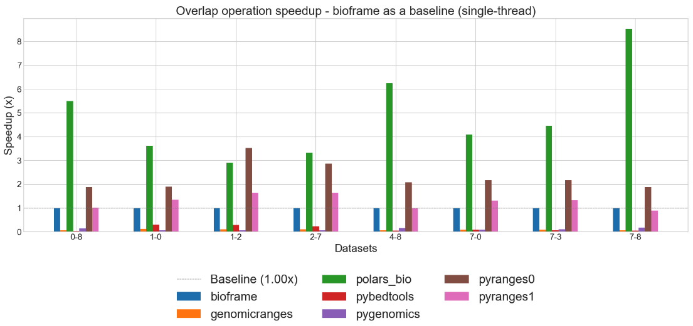
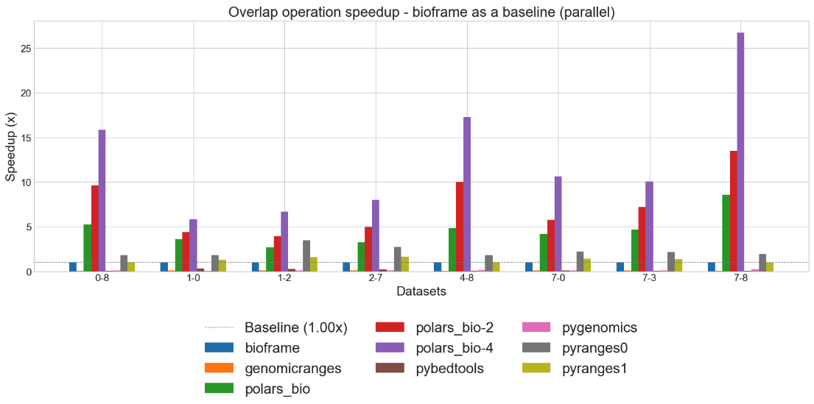
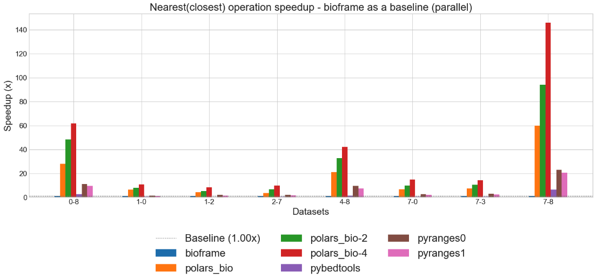

# Next-gen Python DataFrame operations for genomics!

{ align=center style="height:350px;width:350px" }


polars-bio is a :rocket:blazing [fast](performance.md#results-summary-) Python DataFrame library for genomics🧬  built on top of [Apache DataFusion](https://datafusion.apache.org/), [Apache Arrow](https://arrow.apache.org/)
and  [polars](https://pola.rs/).
It is designed to be easy to use, fast and memory efficient with a focus on genomics data.


## Key Features
* optimized for [peformance](performance.md#results-summary-) and large-scale genomics datasets
* popular genomics [operations](features.md#genomic-ranges-operations) with a DataFrame API (both [Pandas](https://pandas.pydata.org/) and [polars](https://pola.rs/))
* [SQL](features.md#sql-powered-data-processing)-powered bioinformatic data querying or manipulation/pre-processing
* native parallel engine powered by Apache DataFusion and [sequila-native](https://github.com/biodatageeks/sequila-native)
* [out-of-core/streaming](features.md#streaming-out-of-core-processing-exeprimental) processing (for data too large to fit into a computer's main memory)  with [Apache DataFusion](https://datafusion.apache.org/) and [polars](https://pola.rs/)
* support for *federated* and *streamed* reading data from [cloud storages](features.md/#cloud-storage) (e.g. S3, GCS) enabling processing large-scale genomics data without materializing in memory
* zero-copy data exchange with [Apache Arrow](https://arrow.apache.org/)
* bioinformatics file [formats](features.md#file-formats-support) with [noodles](https://github.com/zaeleus/noodles) and [exon](https://github.com/wheretrue/exon)
* pre-built wheel packages for *Linux*, *Windows* and *MacOS* (*arm64* and *x86_64*) available on [PyPI](https://pypi.org/project/polars-bio/#files)


See [quick start](quickstart.md) for the installation options.

## Example


### Discovering genomics data in VCF files
```python
import polars_bio as pb
import polars as pl
pl.Config(fmt_str_lengths=1000, tbl_width_chars=1000)
vcf_1 = "gs://gcp-public-data--gnomad/release/4.1/genome_sv/gnomad.v4.1.sv.sites.vcf.gz"
pb.describe_vcf(vcf_1).filter(pl.col("description").str.contains(r"Latino.* allele frequency"))
```
```shell
shape: (3, 3)
┌───────────┬───────┬────────────────────────────────────────────────────┐
│ name      ┆ type  ┆ description                                        │
│ ---       ┆ ---   ┆ ---                                                │
│ str       ┆ str   ┆ str                                                │
╞═══════════╪═══════╪════════════════════════════════════════════════════╡
│ AF_amr    ┆ Float ┆ Latino allele frequency (biallelic sites only).    │
│ AF_amr_XY ┆ Float ┆ Latino XY allele frequency (biallelic sites only). │
│ AF_amr_XX ┆ Float ┆ Latino XX allele frequency (biallelic sites only). │
└───────────┴───────┴────────────────────────────────────────────────────┘

```

### Interactive querying of genomics data
```python
pb.register_vcf(vcf_1, "gnomad",
                info_fields=['AF_amr'])
query = """
    SELECT
        chrom,
        start,
        end,
        alt,
        array_element(af_amr,1) AS af_amr
    FROM gnomad
    WHERE
        filter = 'HIGH_NCR'
    AND
        alt = '<DUP>'
"""
pb.sql(f"{query} LIMIT 3").collect()
```

```text
shape: (3, 5)
┌───────┬────────┬────────┬───────┬──────────┐
│ chrom ┆ start  ┆ end    ┆ alt   ┆ af_amr   │
│ ---   ┆ ---    ┆ ---    ┆ ---   ┆ ---      │
│ str   ┆ u32    ┆ u32    ┆ str   ┆ f32      │
╞═══════╪════════╪════════╪═══════╪══════════╡
│ chr1  ┆ 10000  ┆ 295666 ┆ <DUP> ┆ 0.000293 │
│ chr1  ┆ 138000 ┆ 144000 ┆ <DUP> ┆ 0.000166 │
│ chr1  ┆ 160500 ┆ 172100 ┆ <DUP> ┆ 0.002639 │
└───────┴────────┴────────┴───────┴──────────┘


```
### Creating a view and overlapping with a VCF file from another source
```python
pb.register_view("v_gnomad", query)
pb.overlap("v_gnomad", "s3://gnomad-public-us-east-1/release/4.1/vcf/exomes/gnomad.exomes.v4.1.sites.chr1.vcf.bgz" , suffixes=("_1", "_2")).collect()
```

```text
3rows [00:39, 13.20s/rows]
shape: (3, 13)
┌─────────┬─────────┬────────┬─────────┬───┬───────┬───────┬────────┬─────────────┐
│ chrom_1 ┆ start_1 ┆ end_1  ┆ chrom_2 ┆ … ┆ ref_2 ┆ alt_2 ┆ qual_2 ┆ filter_2    │
│ ---     ┆ ---     ┆ ---    ┆ ---     ┆   ┆ ---   ┆ ---   ┆ ---    ┆ ---         │
│ str     ┆ u32     ┆ u32    ┆ str     ┆   ┆ str   ┆ str   ┆ f64    ┆ str         │
╞═════════╪═════════╪════════╪═════════╪═══╪═══════╪═══════╪════════╪═════════════╡
│ chr1    ┆ 10000   ┆ 295666 ┆ chr1    ┆ … ┆ T     ┆ C     ┆ 0.0    ┆ AC0;AS_VQSR │
│ chr1    ┆ 11000   ┆ 51000  ┆ chr1    ┆ … ┆ T     ┆ C     ┆ 0.0    ┆ AC0;AS_VQSR │
│ chr1    ┆ 10000   ┆ 295666 ┆ chr1    ┆ … ┆ G     ┆ A     ┆ 0.0    ┆ AC0;AS_VQSR │
└─────────┴─────────┴────────┴─────────┴───┴───────┴───────┴────────┴─────────────┘
```
!!! note
    The above example demonstrates how to use polars-bio to query and overlap genomics data from different sources over the network.
    The performance of the operations can be impacted by the available network throughput and the size of the data being processed.

```python
pb.overlap("/tmp/gnomad.v4.1.sv.sites.vcf.gz", "/tmp/gnomad.exomes.v4.1.sites.chr1.vcf.bgz").limit(3).collect()
```

```text
3rows [00:10,  3.49s/rows]
shape: (3, 16)
┌─────────┬─────────┬────────┬─────────┬───┬───────┬───────┬────────┬─────────────┐
│ chrom_1 ┆ start_1 ┆ end_1  ┆ chrom_2 ┆ … ┆ ref_2 ┆ alt_2 ┆ qual_2 ┆ filter_2    │
│ ---     ┆ ---     ┆ ---    ┆ ---     ┆   ┆ ---   ┆ ---   ┆ ---    ┆ ---         │
│ str     ┆ u32     ┆ u32    ┆ str     ┆   ┆ str   ┆ str   ┆ f64    ┆ str         │
╞═════════╪═════════╪════════╪═════════╪═══╪═══════╪═══════╪════════╪═════════════╡
│ chr1    ┆ 10000   ┆ 295666 ┆ chr1    ┆ … ┆ T     ┆ C     ┆ 0.0    ┆ AC0;AS_VQSR │
│ chr1    ┆ 11000   ┆ 51000  ┆ chr1    ┆ … ┆ T     ┆ C     ┆ 0.0    ┆ AC0;AS_VQSR │
│ chr1    ┆ 12000   ┆ 32000  ┆ chr1    ┆ … ┆ G     ┆ A     ┆ 0.0    ┆ AC0;AS_VQSR │
└─────────┴─────────┴────────┴─────────┴───┴───────┴───────┴────────┴─────────────┘
```
The performance when reading data from local files is significantly better than reading data over the network.
If you are interested in the performance of the operations, you can enable multi-threading:

#### 1 thread
```python
pb.register_vcf("/tmp/gnomad.v4.1.sv.sites.vcf.gz", "gnomad_site_local", thread_num=1)
pb.sql("select * from gnomad_site_local").collect().count()
```

```text
2154486rows [00:10, 204011.57rows/s]
shape: (1, 8)
┌─────────┬─────────┬─────────┬─────────┬─────────┬─────────┬─────────┬─────────┐
│ chrom   ┆ start   ┆ end     ┆ id      ┆ ref     ┆ alt     ┆ qual    ┆ filter  │
│ ---     ┆ ---     ┆ ---     ┆ ---     ┆ ---     ┆ ---     ┆ ---     ┆ ---     │
│ u32     ┆ u32     ┆ u32     ┆ u32     ┆ u32     ┆ u32     ┆ u32     ┆ u32     │
╞═════════╪═════════╪═════════╪═════════╪═════════╪═════════╪═════════╪═════════╡
│ 2154486 ┆ 2154486 ┆ 2154486 ┆ 2154486 ┆ 2154486 ┆ 2154486 ┆ 2154486 ┆ 2154486 │
└─────────┴─────────┴─────────┴─────────┴─────────┴─────────┴─────────┴─────────┘

```

#### 4 threads
```python
pb.register_vcf("/tmp/gnomad.v4.1.sv.sites.vcf.gz", "gnomad_site_local", thread_num=4)
pb.sql("select * from gnomad_site_local").collect().count()
```

```text
2154486rows [00:03, 639138.47rows/s]
shape: (1, 8)
┌─────────┬─────────┬─────────┬─────────┬─────────┬─────────┬─────────┬─────────┐
│ chrom   ┆ start   ┆ end     ┆ id      ┆ ref     ┆ alt     ┆ qual    ┆ filter  │
│ ---     ┆ ---     ┆ ---     ┆ ---     ┆ ---     ┆ ---     ┆ ---     ┆ ---     │
│ u32     ┆ u32     ┆ u32     ┆ u32     ┆ u32     ┆ u32     ┆ u32     ┆ u32     │
╞═════════╪═════════╪═════════╪═════════╪═════════╪═════════╪═════════╪═════════╡
│ 2154486 ┆ 2154486 ┆ 2154486 ┆ 2154486 ┆ 2154486 ┆ 2154486 ┆ 2154486 ┆ 2154486 │
└─────────┴─────────┴─────────┴─────────┴─────────┴─────────┴─────────┴─────────┘
```

#### 6 threads
```python
pb.register_vcf("/tmp/gnomad.v4.1.sv.sites.vcf.gz", "gnomad_site_local", thread_num=4)
pb.sql("select * from gnomad_site_local").collect().count()
```

```text
2154486rows [00:02, 780228.99rows/s]
shape: (1, 8)
┌─────────┬─────────┬─────────┬─────────┬─────────┬─────────┬─────────┬─────────┐
│ chrom   ┆ start   ┆ end     ┆ id      ┆ ref     ┆ alt     ┆ qual    ┆ filter  │
│ ---     ┆ ---     ┆ ---     ┆ ---     ┆ ---     ┆ ---     ┆ ---     ┆ ---     │
│ u32     ┆ u32     ┆ u32     ┆ u32     ┆ u32     ┆ u32     ┆ u32     ┆ u32     │
╞═════════╪═════════╪═════════╪═════════╪═════════╪═════════╪═════════╪═════════╡
│ 2154486 ┆ 2154486 ┆ 2154486 ┆ 2154486 ┆ 2154486 ┆ 2154486 ┆ 2154486 ┆ 2154486 │
└─────────┴─────────┴─────────┴─────────┴─────────┴─────────┴─────────┴─────────┘
```

You can easily see the performance improvement when using multi-threading (**~205k** rows/s vs **~640k** rows/s vs **~780k** rows/s).


# Performance
## Single-thread performance 🏃‍



## Parallel performance 🏃‍🏃‍





[//]: # (* support for common genomics file formats &#40;VCF, BAM and FASTQ&#41;)
