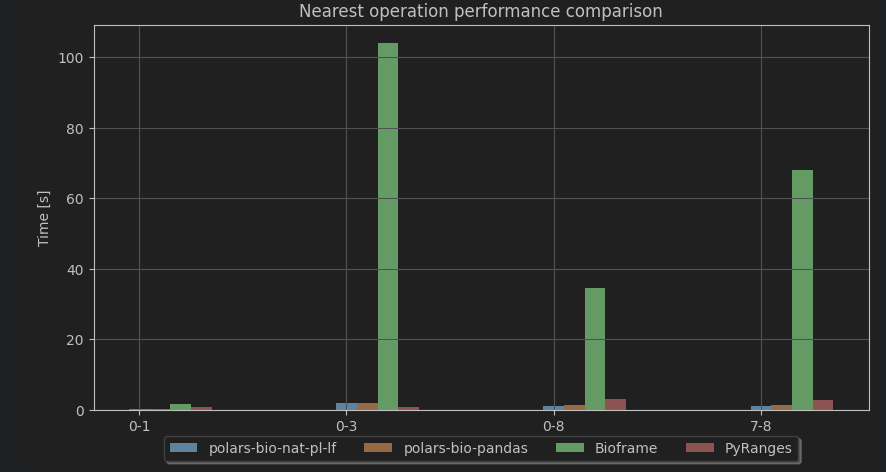

## Test environment

```python exec="on" session="benchmark"
import os
import platform
from textwrap import dedent
import polars_bio
import cpuinfo
import psutil
import numpy as np
BENCH_DATA_ROOT = os.getenv("BENCH_DATA_ROOT")
BENCH_SRC_ROOT = os.getenv("BENCH_SRC_ROOT")
OUTPUT_MD = "test.md"

print(
    dedent(
        f"""
        - cpu architecture: `{platform.machine()}`
        - cpu name: `{cpuinfo.get_cpu_info()['brand_raw']}`
        - cpu cores: `{psutil.cpu_count(logical=False)}`
        - memory: `{int(np.round(psutil.virtual_memory().total / (1024. **3)))} GB`
        - kernel: `{platform.version()}`
        - system: `{platform.system()}`
        - os-release: `{platform.platform()}`
        - python: `{platform.python_version()}`
        - polars-bio: `{polars_bio.__version__}`
        """
    )
)
```

### Overlap operation
```python exec="on" session="benchmark"
import os
import subprocess

subprocess.run(["hyperfine", "python benchmark/src/overlap/test-polars-bio.py", "--export-markdown", OUTPUT_MD, "-u", "millisecond", "--show-output"])
markdown = open("test.md").read()
print(markdown)
os.remove(OUTPUT_MD)
```


## Benchmarking
polars-bio significantly outperforms other libraries in terms of speed and memory usage.
It was benchmarked against following libraries:

- [Bioframe](https://github.com/open2c/bioframe)-0.7.2
- [PyRanges](https://github.com/pyranges/pyranges)-0.0.132
- [pybedtools](https://github.com/daler/pybedtools)-0.10.0
- [PyGenomics](https://gitlab.com/gtamazian/pygenomics)-0.1.1
- [GenomicRanges](https://github.com/BiocPy/GenomicRanges)-0.4.34

!!! todo
    1. Add more details about the benchmarking process.
    2. GenomicRanges

### Test datasets
[AIList](https://github.com/databio/AIList) dataset was used for benchmarking.

|Dataset#  |Name(.bed)        |size(x1000) |non-flatness |
|:---------|:-----------------|:-----------|:------------|
|0         |chainRn4          |2,351       |6            |
|1         |fBrain            |199         |1            |
|2         |exons             |439         |2            |
|3         |chainOrnAna1      |1,957       |6            |
|4         |chainVicPac2      |7,684       |8            |
|5         |chainXenTro3Link  |50,981      |7            |
|6         |chainMonDom5Link  |128,187     |7            |
|7         |ex-anno           |1,194       |2            |
|8         |ex-rna            |9,945       |7            |

!!! note
    Test dataset in *Parquet* format can be downloaded from:

    * for [single-threaded](https://drive.google.com/file/d/1lctmude31mSAh9fWjI60K1bDrbeDPGfm/view?usp=sharing) tests
    * for [parallel](https://drive.google.com/file/d/1Sj7nTB5gCUq9nbeQOg4zzS4tKO37M5Nd/view?usp=sharing) tests (8 partitions per dataset)
## Results
### Overlap operation


### Nearest interval operation
