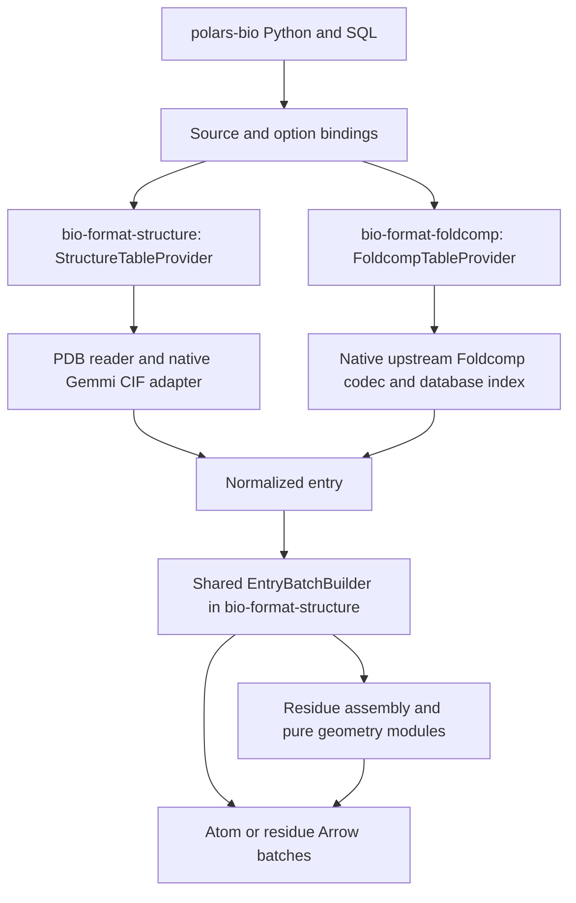

# Structural readers and residue descriptors: implementation analysis

## 1. Recommendation and scope

Implement common atom and residue output inside `datafusion-bio-formats`. PDB/mmCIF readers and the Foldcomp decoder feed a shared normalized-entry model, residue assembler, and batch builder. Keep parsing and geometry separately testable as modules within the formats workspace. `polars-bio` supplies bindings and Python/SQL APIs. This two-repository ownership is agreed with the user; no new datafusion-bio-functions component is required. The first release should cover collections of ordinary PDB and PDBx/mmCIF coordinate files, observed protein residues, and explicit subsets of local Foldcomp databases.

Use a small native adapter around Gemmi's **low-level CIF document/table API** for mmCIF, and a narrowly scoped fixed-column Rust reader for PDB coordinate records. Do not use a high-level molecular hierarchy as the only source of mmCIF identifiers. Keep this parser choice behind an adapter until the fixture and wheel spike passes. `pdbtbx` is useful comparison material, but its inspected implementation loses information required here. Detailed evidence appears in section 3.

The scope includes both ordinary three-atom bond angles and four-atom backbone torsions. The issue says “bond angles”; implementing only phi/psi would miss that distinction. Foldcomp is a separate indexed codec integration, not another filename suffix routed to the PDB parser. These are design interpretations of the [issue](https://github.com/biodatageeks/polars-bio/issues/455), which does not prescribe a schema or dependency.

Initial exclusions: structure writing, molecular dynamics trajectories, biological-assembly expansion, symmetry mates, DSSP/secondary structure, SASA, contacts, side-chain chi angles, generic small-molecule CIF, BinaryCIF, arbitrary mmCIF category tables, unobserved-residue synthesis, Foldcomp compression, and tar archive random access. These can follow without changing the atom/residue identity contract. Local Foldcomp subsets are required to finish the issue; PDB/mmCIF alone is an intermediate delivery.

## 2. Repository evidence and integration map

Inspected on 2026-09-09. These are checkout HEADs, **not clean snapshots**: existing local edits were present, especially in polars-bio's PGEN and shared scan paths. Rebase implementation against then-current code and preserve those changes.

| Repository | HEAD | Relevant current code and consequence |
|---|---|---|
| `polars-bio` | `d59db9f1ccb719aacb768dffb65ed8f327190dfa` | `src/option.rs:128` has `InputFormat`; `src/scan.rs:835` shows provider registration; `polars_bio/io.py:4505` is the Arrow/DataFusion-to-Polars lazy bridge |
| `datafusion-bio-formats` | `dbc62fb1b6b7ae7aa663002be188263802b43b1c` | `datafusion/bio-format-fasta/src/table_provider.rs` shows fixed-schema providers; core `object_storage.rs` provides streams and byte ranges; `sync_stream.rs` documents the one-worker-per-partition execution convention |

There was no structural format/provider in the inspected trees and no competing structural OpenSpec change before this proposal. The repository project documents contain old dependency versions. The actual manifests currently target DataFusion 53.0.0; polars-bio declares Arrow 58.3.0 and PyO3 0.28.3. Its formats dependencies reference `1c86f0c9d19ccc85eaf196508c26d70a220f21f9`. Resolve one compatible formats release/commit for integration rather than assuming the sibling HEAD is what the wheel builds. Existing functions dependencies serve unrelated features and need no update for this issue.

Three integration details are easy to miss:

1. `_read_file()` currently calls `set_coordinate_system(lf, zero_based)` unconditionally (`io.py:5146` vicinity). Structural readers must skip this and expose units separately; changing the global genomic default cannot change XYZ or residue identifiers.
2. `_lazy_scan()` re-registers file-backed providers during collection. Cooler already uses unique catalog identities and PGEN uses a retained source object. Two scans of the same structure with different `level`, model, or altloc options must not overwrite one another. Prefer a retained source/provider handle, with a fresh execution state per collect.
3. The lazy bridge applies predicates, projections, and limits. The format provider's residue-output path must prevent those optimizations from removing its neighboring atoms. Preserve residual filters and zero-column row counts; do not claim indexed residue filtering in unindexed text files.

Proposed dependency direction:



Put canonical schema/options/entry types, residue assembly, and pure Float64 geometry in `bio-format-structure`. `bio-format-foldcomp` depends on this crate and reuses its atom/residue `EntryBatchBuilder`; the dependency is one-way. Gate PDB/mmCIF parsing/native Gemmi behind a `text-formats` feature so a standalone Foldcomp consumer can use shared types and geometry without linking an unused text parser. Geometry functions accept ordinary Rust point values and have no Arrow or parser dependency in their signatures.

`StructureTableProvider` and `FoldcompTableProvider` each select the output schema and build complete atom/residue results according to read options. Residue assembly executes inside the provider's scan path; there is no separate public `ResidueExec`, SQL UDF, or arbitrary-DataFrame descriptor operation in this issue. This keeps neighbor handling under one provider's control while preserving modular tests. The [native module/file plan](../../../../datafusion-bio-formats/openspec/changes/add-structure-readers/design.md) defines the implementation boundary; [polars-bio tasks](tasks.md) cover only bindings, integration tests, and packaging/docs.

## 3. Parser and codec decisions

| Candidate | Strength | Material limitation | Proposed role |
|---|---|---|---|
| Gemmi low-level CIF API | Mature CIF tokenization and direct access to `_atom_site` plus entity/component metadata | Native C++ boundary; document-oriented memory use; packaging work | Recommended mmCIF production adapter and one parsing oracle |
| Gemmi `Structure` hierarchy | Convenient atom/residue traversal and geometry | Coerces author sequence IDs into numeric sequence identifiers; not a lossless raw-category model | Oracle for supported conventional structures, not exclusive schema source |
| `pdbtbx` | Rust-native PDB/mmCIF support; MIT | Inspected parser chooses author or label identity rather than retaining both, parses author residue ID numerically, and defaults absent XYZ/occupancy/B values | Evaluate only with a concrete adapter/patch; not the default |
| Biopython | Independent parser and numerical implementation | High-level structure defaults select conformers; coordinate precision and identifier restrictions differ | Independent oracle; `MMCIF2Dict` for raw fields, explicit vectors for geometry |
| Biotite | Array-oriented structure handling and convenient dihedral API | Altloc, model, units, and omega indexing need normalization | Optional third oracle and throughput baseline |
| Upstream Foldcomp C++ | Codec implementation already maintained upstream | Lossy geometry, padded/shifted angle arrays, native build/FFI obligations | Reuse decoder; do not rewrite FCZ initially |
| Python Gemmi/Foldcomp runtime | Quick prototype | Python object conversion and codec calls in the execution path; does not supply a reusable Rust provider | Research/fixture generation only; explicit fallback project if native feasibility fails |

The `pdbtbx` source inspected at [`c82e8c0`, `parser.rs`](https://github.com/douweschulte/pdbtbx/blob/c82e8c08fd539b72117f2147bf4107e125d1efcd/src/read/mmcif/parser.rs#L466) selects author identity with label fallback and provides missing-value defaults. This is source inspection of that commit, not a claim about every historical/released version. Its public documentation currently lists [0.12.0](https://docs.rs/pdbtbx/0.12.0/pdbtbx/).

The wwPDB dictionary explicitly permits [nonnumeric `auth_seq_id`](https://mmcif.wwpdb.org/dictionaries/mmcif_pdbx_v50.dic/Items/_atom_site.auth_seq_id.html). The probe replaced residue 1's author ID with `X1`: Gemmi's raw CIF API and Biopython `MMCIF2Dict` preserved it, while both high-level structure constructors raised `ValueError`. This independently establishes why `auth_seq_id` must be a string and why the low-level category path matters.

For PDB, parse fixed columns according to the [coordinate-record specification](https://www.wwpdb.org/documentation/file-format-content/format33/sect9.html), with bounded line lengths and checked conversions. Implement `ATOM`, `HETATM`, `MODEL`, `ENDMDL`, and `TER`; read `HEADER` and `MODRES` where available. Ignore unrelated records explicitly. Preserve raw atom/residue/chain identifiers and blanks before deriving normalized fields. Blank occupancy/B-factor remain null; blank/malformed Cartesian coordinates fail with record context. Treat hybrid-36 as an explicit extension decision during the parser spike; until supported, reject it descriptively rather than silently renumbering.

For mmCIF, support CIF quoting, semicolon text fields, loops spanning lines, reordered columns, comments, case-insensitive data names, numeric exponents/standard uncertainties, multiple data blocks, and absent optional categories. A whitespace/line split is not a valid CIF parser. Read Cartesian atom sites; fractional-only inputs and atomless generic CIF blocks get a clear unsupported-coordinate-data error. See [Gemmi's CIF API](https://gemmi.readthedocs.io/en/stable/cif.html).

The Gemmi adapter should expose document ownership plus borrowed row batches through a small checked C ABI or `cxx` bridge, not one FFI call per cell. Catch exceptions at the boundary, validate lengths, and release all native allocations on cancellation/error. Gemmi 0.7.5 ships under [MPL-2.0](https://raw.githubusercontent.com/project-gemmi/gemmi/v0.7.5/LICENSE.txt); include upstream notices and source provenance in the packaging spike. Foldcomp's upstream repository uses MIT. This is dependency inventory, not a request to change the project's license.

## 4. Proposed public API

These examples describe proposed APIs:

```python
atoms = pb.scan_pdb("structures/*.pdb")
residues = pb.scan_mmcif(
    ["a.cif.gz", "b.mmcif"],
    level="residue",
    model="all",
    altloc="best_backbone",
)
mixed = pb.scan_structures(["a.pdb", "b.cif.gz"], level="residue")
subset = pb.scan_foldcomp(
    "/data/afdb_swissprot_v4",
    ids=["AF-P69905-F1-model_v4", "AF-P68871-F1-model_v4"],
    level="residue",
)
result = subset.select("entry_name", "auth_seq_id", "phi_deg", "psi_deg").collect()

pb.register_structure("protein", "a.cif", level="residue")
pb.sql("SELECT auth_seq_id, phi_deg FROM protein WHERE chain_id = 'A'")
```

| Option | Proposed contract |
|---|---|
| `scan_pdb`, `scan_mmcif`, `scan_structures`, `scan_foldcomp` | Return LazyFrame; matching `read_*` functions collect the same logical source |
| `level` | `"atom"` default, retaining all atom sites; explicit `"residue"` for derived descriptors |
| File sources | Path/PathLike, explicit list, or local glob; mixed-format lists via `scan_structures`; no implicit recursive directory walk |
| `model` | `"all"` default, `"first"` means first encountered model, or a source model number; preserve both model number and ordinal |
| `altloc` | Atom level defaults to all sites; residue level defaults to documented `best_backbone`; explicit conformer ID supported |
| Residue population | Observed peptide residues by default; an explicit all-residue mode may expose other residues with null peptide descriptors |
| Error policy | Fail on malformed selected input with source/block/entry/record context; no silent file/atom dropping in the first release |
| Compression | Plain/gzip PDB and mmCIF; format detection peels `.gz` and supports `.cif`/`.mmcif`; content fallback for explicit URLs/format |
| Storage | Local files and explicit HTTP/S3/GCS/Azure paths through existing OpenDAL helpers for text structures; remote listing/globs deferred; local FCZ/database initially |
| SQL | `register_structure` and `register_foldcomp` expose the same schemas/options, through the same providers |

Do not add a generic `scan_cif` promise: the supported content is PDBx/mmCIF Cartesian molecular coordinates. `scan_structures([])` and an unmatched glob return a clear input error; Foldcomp `ids=[]` is intentionally a typed empty selection. Sorting of results is explicit, not promised across parallel partitions.

## 5. Schema and identity contract

Arrow numeric computations use Float64. Strings use Utf8 (converted through the existing Arrow/Polars bridge). Add schema metadata `bio.structure.schema_version`, `coordinate_unit=angstrom`, `angle_unit=degree`, altloc policy, connectivity policy, and source format. Never reinterpret these as genomic intervals.

### Common identity

| Columns | Type | Meaning |
|---|---|---|
| `source_path`, `source_format` | Utf8, non-null | Input file/database and detected format |
| `source_index`, `entry_index` | UInt64, non-null | Source occurrence in the immutable manifest; block ordinal or database entry ordinal before filtering |
| `entry_id`, `entry_name`, `data_block` | Utf8, nullable | Original entry/header ID, Foldcomp lookup/title name, CIF block name; none is assumed globally unique |
| `entry_key` | UInt64, nullable | Foldcomp database numeric key; distinct from entry name and index position |
| `model_id` | Int32, non-null | Source model number, synthesized as 1 only when absent |
| `model_index`, `chain_index`, `segment_index`, `residue_index` | UInt64, non-null | Stable internal ordinals that survive projection/filtering; chain segments distinguish repeated chain labels/TER |
| `chain_id` | Utf8, nullable | Convenient author-chain value when present, otherwise label chain; not a unique key |
| `auth_asym_id`, `label_asym_id`, `label_entity_id` | Utf8, nullable | Preserve both author and standardized identity systems |
| `auth_seq_id`, `label_seq_id`, `insertion_code` | Utf8 / Int64 / Utf8, nullable | Author ID remains a string, including negatives/nonnumeric values; label position is optional |

The atomic surrogate key is `(source_index, entry_index, atom_index)` with `atom_index` an entry-wide original atom-row ordinal. The residue-site key is `(source_index, entry_index, model_index, chain_index, segment_index, residue_index)`. Preserve source order as ordinals even if execution emits groups in another order. Do not identify rows by residue name/number alone or by filename stem.

PDB populates author fields from source records; label fields remain null, without invented mappings. Missing PDB `MODEL` becomes model 1. Blank PDB chain ID remains an empty author-chain string. Missing altloc/insertion codes become null. CIF unquoted `.`/`?` become null in normalized nullable fields; quoted literal values are not missing. This API is not a raw round-trip serializer and does not preserve the distinction between unknown and inapplicable in every normalized column.

### Atom view additions

| Columns | Type | Meaning |
|---|---|---|
| `atom_index`, `atom_id` | UInt64 / Utf8 | Original row ordinal and raw source atom ID/serial |
| `record_type` | Utf8 | ATOM or HETATM, preserving the file's classification |
| `atom_name`, `residue_name` | Utf8 | Normalized names, using label names if present, author names otherwise |
| `auth_atom_id`, `label_atom_id`, `auth_comp_id`, `label_comp_id` | Utf8, nullable | Raw identifier namespaces remain separately accessible |
| `alt_id`, `element` | Utf8, nullable | Alternate location and source element; ambiguous missing elements remain null |
| `x`, `y`, `z` | Float64, non-null | Cartesian coordinates in angstroms; non-finite/missing required coordinates fail parsing |
| `occupancy`, `b_factor` | Float64, nullable | Preserve source values without inventing confidence interpretation |
| `formal_charge` | Int32, nullable | Parsed source charge where available |

Atom view keeps hydrogens, waters, ligands, and alternate sites. No assembly expansion. Duplicate atom sites with the same identity/conformer/name are an ambiguity to report, not an overwrite in a map.

### Residue view additions

| Columns | Type | Meaning |
|---|---|---|
| `residue_name`, `parent_residue_name`, `one_letter_code` | Utf8, nullable as appropriate | Selected component and documented parent mapping; unknown peptide is `X`; nonpeptide letter is null |
| `residue_kind`, `selected_alt_id` | Utf8, nullable as appropriate | Peptide/nonpeptide classification and selected conformer |
| `n_x/y/z`, `ca_x/y/z`, `c_x/y/z`, `o_x/y/z` | Float64, nullable | Explicit atom coordinates; absent atom produces null triple |
| `phi_deg`, `psi_deg`, `omega_deg` | Float64, nullable | Defined below; not copied from FCZ quantized arrays |
| `angle_n_ca_c_deg`, `angle_ca_c_n_deg`, `angle_c_n_ca_deg` | Float64, nullable | Local/incoming/outgoing bond angles with explicit atom definitions |
| `peptide_link_prev`, `peptide_link_next`, `backbone_complete` | Boolean, non-null | Connectivity and atom-availability results |
| `ca_b_factor` | Float64, nullable | CA source B-factor/codec value, not automatically pLDDT |
| `geometry_status` | Utf8, non-null | Documented broad status such as complete, terminal, missing-backbone, chain-break, conformer-conflict, or degenerate |

Null masks and link flags are authoritative when several problems coexist; a single summary status cannot encode every missing-angle reason. Keep descriptor columns stable and nullable even for empty inputs or projections. More detailed per-angle status can be added if the initial fixtures establish a concrete need.

## 6. Geometry semantics

Let `i-1`, `i`, and `i+1` be connected residues in the **same original polymer segment and model**, after resolving each site's component/conformer. The row is residue `i`:

| Output | Points in order | Required link |
|---|---|---|
| `phi_deg` | C(i-1), N(i), CA(i), C(i) | previous |
| `psi_deg` | N(i), CA(i), C(i), N(i+1) | next |
| `omega_deg` | CA(i), C(i), N(i+1), CA(i+1) | next; explicitly the outgoing peptide bond |
| `angle_n_ca_c_deg` | N(i), CA(i), C(i) | none |
| `angle_ca_c_n_deg` | CA(i), C(i), N(i+1) | next |
| `angle_c_n_ca_deg` | C(i-1), N(i), CA(i) | previous |

This makes first-residue phi and incoming C-N-CA null, and last-residue psi/omega/outgoing CA-C-N null. A singleton may still have N-CA-C. Internal missing atoms null only dependent quantities. Use radians internally and convert once to degrees. Normalize torsions to `[-180, 180)`; unsigned bond angles lie in `[0, 180]`. Use an atan2-based signed dihedral calculation and finite/degeneracy checks. Zero-length bonds or undefined planes yield null, never a fabricated zero or NaN. Set a scale-aware degeneracy threshold in the numerical spike and test its boundary.

Connectivity rules, in order:

1. Never cross entries, data blocks, models, chains, explicit PDB TER boundaries, or known polymer breaks.
2. For mmCIF polymer data, use entity/asymmetry identity and label-sequence adjacency when available; a known label gap breaks the link. Author numbering gaps alone do not prove a break.
3. Require the corresponding C and N atoms, compatible selected conformers, and a finite C-N distance at most **1.8 angstroms**. This cutoff is a proposed, configurable heuristic, not a universal chemical law. Test 1.799/1.800/1.801 and record it in provenance.
4. Where standardized sequence/connectivity metadata are absent, use encountered residue order within the PDB segment plus that distance check. Do not sort strings like `"100"`, `"99A"`, `"-1"` to infer sequence. Do not create bonds between independent nonpolymer entities.

Residue classification uses entity/polymer and chemical-component metadata when available. For PDB, combine standard amino-acid knowledge and MODRES; define a pinned mapping for MSE/SEC/PYL and documented handling of ambiguous/unknown peptide residues. HETATM is not equivalent to “nonprotein” because modified peptide residues may use it. Do not turn every ligand containing atoms named N/CA/C into a peptide. Preserve the raw component even when a parent maps to one letter.

Conformer selection is a **polars-bio policy**, not something to inherit accidentally from an oracle. Proposed `best_backbone`: construct candidates from one component variant and one nonblank alt ID, sharing blank-alt atoms; maximize available N/CA/C count, then mean finite occupancy of those backbone atoms, then prefer A, then lexical alt/component ID and source ordinal. Null occupancy contributes zero for ranking. Never combine A's N with B's CA to complete a backbone. Conflicting duplicate atoms fail. Keep the chosen incomplete residue with nulls. For links, conflicting nonblank selected alt IDs conservatively disable neighbor geometry; matching labels alone are not a claim of experimentally established correlation. Explicit-alt mode uses that candidate plus shared blanks. Freeze all ties and fallbacks in synthetic fixtures.

## 7. Execution and collection design

### Source manifest and atom provider

Resolve explicit files and local globs into a manifest with stable source ordinals. Preserve explicit list occurrences, including intentional duplicates; sort glob expansion. File/block/header entry names are provenance, not cache keys. Schema discovery is fixed from options and does not parse all coordinates. Opening or collecting a source may validate file existence/headers; advertise the precise lazy behavior in tests.

Partition **whole entries/files**, balanced by available file/compressed-entry sizes, under DataFusion's existing target-partition budget. Decode each selected source once per execution. Do not arbitrarily byte-split CIF text or gzip files. Reuse core streams/ranges and the synchronous partition convention; avoid silently enabling a second Rayon/OpenMP pool.

Version one may hold one parsed CIF document/structure entry in memory per active partition. This is bounded by the largest selected entry and concurrency, not by the entire collection. It is **not** constant-memory parsing within a huge individual mmCIF file. Include configurable input/decompressed-entry size limits and a future incremental-parser gate if large-structure benchmarks require it.

The normalizer must handle interleaved atom/residue records. Assign stable identities, buffer an entry as needed, then pass grouped sites to the shared batch builder while retaining original atom ordinals. Do not assume all legal CIF input rows are already contiguous. The internal execution contract guarantees whole-entry partition ownership; residue assembly finishes inside that partition's source execution, before DataFusion can repartition output rows. Validate entry ownership and absence of cross-entry geometry with provider execution tests.

### Residue output inside the provider

`EntryBatchBuilder` consumes grouped sites from a normalized entry, resolves conformers with `ResidueAssembler`, and carries previous/current/next context while constructing residue output batches. Parser chunks or output batches may end during a residue or its lookahead; no such boundary resets biological state. The assembler adds only bounded lookahead state to source-level entry buffering. EOF/entry transitions explicitly flush terminal residues. A selected row's neighbors can be needed even when those neighboring rows are not output. The same builder runs for text and reconstructed Foldcomp entries, so polars-bio receives already-computed residue columns.

Projection uses a dependency closure: `phi` requires previous C and current N/CA/C; residue identity/count still requires grouping; CA-only output need not materialize side-chain Arrow coordinate columns, although a text/codec parser may still decode them internally. Avoid implying byte-level columnar reads for PDB/CIF or partial FCZ decompression before measured codec support exists.

### Filter and limit rules

| Predicate/operation | Earliest safe place |
|---|---|
| Exact file/entry ID selection | Manifest/index before payload read |
| Entire model/chain selection | After enough identity metadata is known; preserve segment identities |
| Atom-view row predicate | After parsing necessary predicate columns |
| Residue-number/AA/occupancy/geometry predicate | After residue geometry, unless a proved halo-aware optimization retains all dependencies |
| Residue `limit(N)` | After constructing N complete output rows, including necessary next-residue context |
| Count-only query | Preserve row counts with empty projection; atom count and residue count are different |

Report only implemented filter support as Exact/Inexact; leave unsupported expressions to DataFusion/Polars. Test optimized results against a fully collected baseline and inspect payload/decode counters. A filter may be semantically correct yet provide no file I/O reduction.

## 8. Foldcomp integration

Use the [upstream codec and database APIs](https://github.com/steineggerlab/foldcomp/tree/89e37195d3c8ade8d40ead91ad82e6cd2964a967). Build the library codec, not its executable structure reader. Its CMake source separation permits avoiding the CLI's bundled Gemmi parser when only decoding FCZ; this also avoids mixing two Gemmi versions in one wheel. Validate the actual compile/link graph in the spike.

Implement native Rust database selection over the payload file, `.index`, `.lookup`, and `.dbtype`. `.source` is optional provenance. Validate index integer conversions, offset+length overflow, range bounds, supported dbtype, duplicate keys, and lookup/key consistency. Upstream index lengths include the record terminator; raw FCZ payload length is one byte shorter in the inspected example. Validate rather than globally guessing terminator rules. Handle a standalone `.fcz` without database sidecars.

Define `ids=None` as all, `ids=[]` as zero entries and zero payload decodes, and missing IDs as errors by default. Treat requested IDs as a set (deduplicate); retain database ordinal for reproducible explicit sorting. Missing lookup is an error for name-based selection, while an explicit numeric `entry_keys` selector can work without it. Ambiguous duplicate lookup names must error for name selection rather than silently picking one. Database lookup name, internal structure title, numeric key, and positional index are distinct; keep all available provenance.

Loading an entire huge string lookup into a hash map for every query is avoidable. First implementation can stream the text lookup/index once and retain only selected keys/offsets for small subsets. This is O(N) metadata work and O(K) selection memory, with K payload decodes; do not market it as O(K) total work. Add a reusable memory-mapped/compact catalog only if repeated-query benchmarks justify it. Scope any cache by all companion-file identities; source changes must invalidate it.

The decoder adapter returns owned/batched atom arrays, names, reconstructed coordinates, and metadata; catch native errors and release buffers deterministically. Validate sizes before decoding and add sanitizer/fuzz coverage at the boundary. Do not rely on the upstream database reader's process-level error handling inside the Python extension. Decode one structure per worker invocation and bridge arrays to Arrow without PDB text serialization or Python lists.

Public Foldcomp coordinates mean **reconstructed codec coordinates**. Public geometry is recomputed from those same coordinates using the common residue kernels. Internal FCZ torsions are quantized codec parameters and not interchangeable with coordinate-derived angles. Original uncompressed PDB coordinates are useful for measuring compression loss, not for an exact decoder-parity test. The executed probe illustrates this distinction in [oracles.md](oracles.md).

Foldcomp does not reconstruct all original structural metadata. Missing occupancy, author/label mappings, altlocs, waters, and assembly metadata must stay absent unless actually available; do not fabricate fidelity. Preserve reconstructed numbering and distinguish it through source format/provenance. `b_factor`/`ca_b_factor` retains the value supplied by the codec; label it pLDDT only when a documented dataset metadata contract establishes that meaning.

Remote Foldcomp range reads are a follow-up after local selective decoding. Reuse OpenDAL range reads and test HTTP servers that ignore Range rather than downloading an entire database unexpectedly. General tar collections and database creation remain separate work.

## 9. Delivery sequence and estimates

Estimates are planning ranges in focused engineer-days, not observed throughput or commitments. One developer can deliver the stages serially; dependency spikes and cross-platform failures can extend them.

| Stage / PR | Ownership and deliverable | Gate | Estimate |
|---|---|---|---|
| 0. Contracts, oracle corpus, dependency spike | formats owns generator/corpus and native Gemmi/Foldcomp spikes; polars-bio owns binding/wheel smoke | Preserve raw identifiers/nulls; decoder to arrays; Linux/macOS/Windows feasibility; pinned oracle outputs | 3–5 days |
| 1. Atom sources | formats: structure crate, PDB/mmCIF adapters, manifest, schema | Atom parity, gz/plain equality, models/altloc/TER, malformed inputs, collection identity | 4–7 days |
| 2. Residue output | formats: geometry/residue modules and shared entry batch builder in the structure crate | Exact null masks, independent numerical parity, batch/entry boundary tests, policy fixtures | 3–5 days |
| 3. Python and SQL | polars-bio wrappers, options, retained sources, metadata | eager/lazy/SQL agreement; filters/projections/limits/counts; existing I/O regression checks | 2–4 days |
| 4. Foldcomp local subsets | formats: foldcomp crate; polars-bio entry selectors | K selected payload decodes, empty/missing IDs, codec parity, corruption and sidecar handling | 4–7 days |
| 5. Performance and release | providers, wheels, docs, benchmark integrations | collection memory bound; thread budget; wheel imports and end-to-end suite | 3–5 days |

Total rough range: 19–33 focused days. Keeping the work in two repositories reduces release coordination; it does not remove the parser, geometry, codec, or packaging work, so the estimate remains a conservative range. Publish PDB/mmCIF plus residue support after stages 0–3 if desired; keep the Foldcomp part of #455 explicitly outstanding until stage 4 passes.

Concrete PR order and local task ownership:

| PR | Repository | Prerequisite | Deliverable |
|---|---|---|---|
| BF-0 | formats | agreed contract | Pinned corpus/generator and native feasibility results |
| BF-1 | formats | BF-0 | Structure schema/options and PDB/mmCIF atom providers |
| BF-2 | formats | BF-1 | Shared residue/geometry modules and provider residue output |
| PB-1 | polars-bio | BF-2 compatible commit | Python/SQL atom and residue readers; PDB/mmCIF milestone |
| BF-3 | formats | BF-2, Foldcomp spike from BF-0 | Indexed local FCZ/database provider using the same entry builder |
| PB-2 | polars-bio | BF-3, PB-1 | Foldcomp selectors, readers, SQL and end-to-end tests |
| BF-4 / PB-3 | both, separate PRs | BF-3 / PB-2 | Measured performance, supported wheels/docs, compatible formats pin and release |

Native checklists are in [formats tasks](../../../../datafusion-bio-formats/openspec/changes/add-structure-readers/tasks.md); Python/SQL checklists are in [polars-bio tasks](tasks.md). Publish a compatible formats revision, then consume it in polars-bio. No functions release is on this dependency path. The first milestone is a tested schema and native vertical slice.

Benchmark equal work: parse-only, atom-to-Arrow, complete residue descriptors, and subset-to-DataFrame separately. Compare Gemmi plus array/DataFrame construction, Biotite where semantics match, and official Foldcomp decode plus the same descriptor computation. Use small files, many small files, a large multichain entry, NMR models, gzip, and 1/10/1000 selected database entries. Report wall time, RSS, time to first batch, bytes read, entries decoded, rows/s, and 1/2/4/8-worker scaling, with cold/warm cache and versions. No speedup claim is warranted by the research probe.

## 10. Remaining decisions with recommended defaults

- Approve the proposed atom-default/residue-explicit API and outgoing-omega convention before freezing public fixtures.
- Keep the `best_backbone` and 1.8-angstrom policies explicit and versioned; domain review may refine them.
- Native packaging and parser edge coverage decide whether the proposed Gemmi adapter remains the backend. The probe did not build that adapter.
- Confirm whether cloud text structures belong in the first release if time becomes constrained; file collections and local Foldcomp subsets remain the core requested workloads.
- Decide hybrid-36 and unusually large/fragmented Foldcomp database layouts during the spike; unsupported variants must error explicitly. Do not silently widen the advertised formats beyond validated fixtures.

None of these uncertainties prevents implementing the fixture corpus and feasibility experiments. Native gates are in [formats tasks](../../../../datafusion-bio-formats/openspec/changes/add-structure-readers/tasks.md); binding and wheel gates are in [polars-bio tasks](tasks.md). They do not expand the scope to every potential structural feature.
